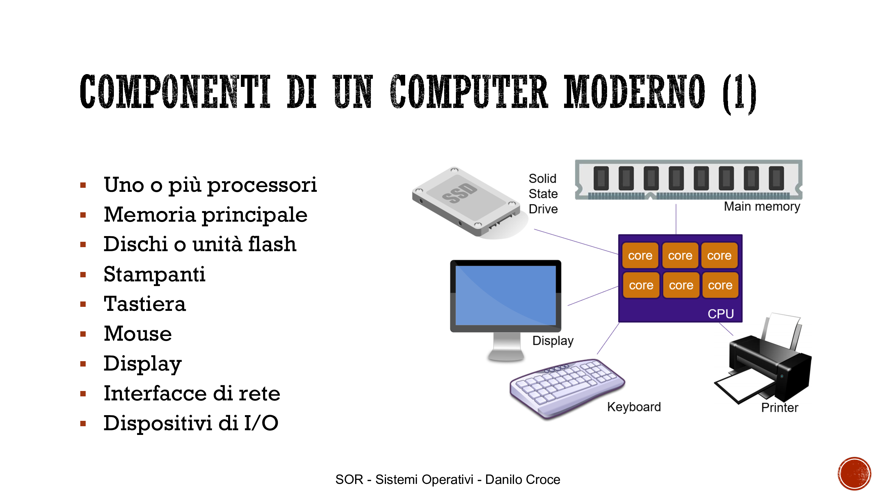
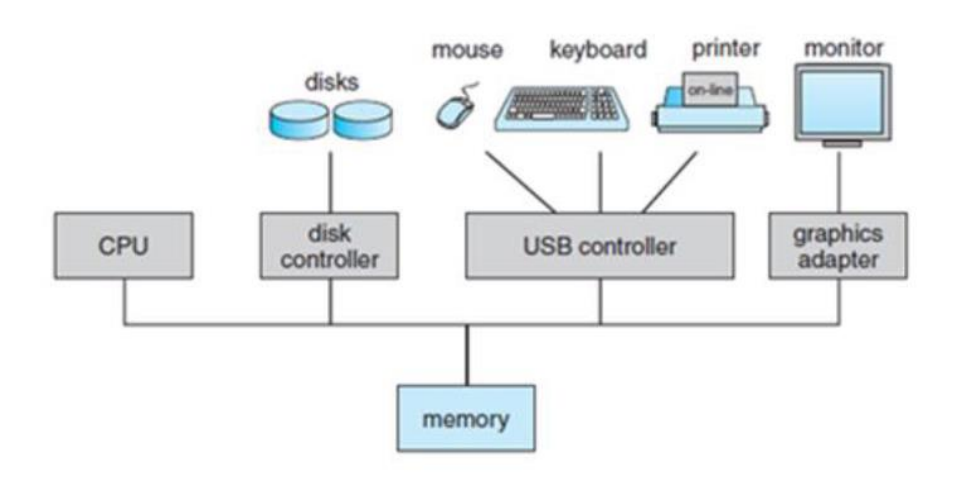
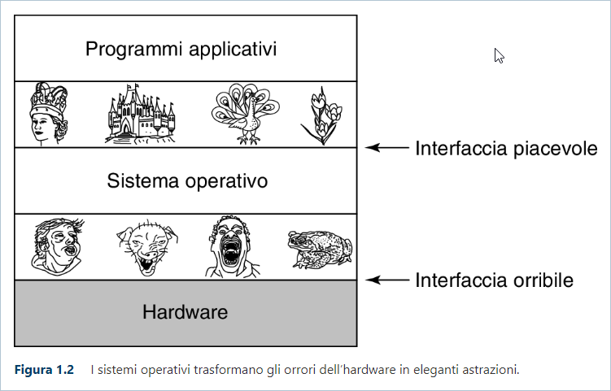

# Cap. 1  

## Cap. **1.1** - Cos’è un Sistema Operativo?  

**Riassumendo**, *i computer sono progettati come una serie di livelli, ciascuno costruito su quelli che lo precedono*.  

Ogni livello rappresenta un'**astrazione** diversa, con oggetti e operazioni proprie, consentendo di semplificare la complessità dell'intero sistema.  

L’insieme dei tipi di dati, delle operazioni e delle funzionalità di ciascun livello è chiamato **architettura**. Essa riguarda gli aspetti visibili agli utenti (come la quantità di memoria RAM disponibile per eseguire un determinato programma), ma non gli aspetti tecnici di implementazione (come la tecnologia con cui è realizzata la memoria RAM).  

L'**architettura degli elaboratori** (o calcolatori) è lo studio dell'organizzazione e del funzionamento dei componenti hardware di un computer.  

 

Serve un intermediario tra l'utente e l'hardware: il **Sistema Operativo**.  

🖥️ Un moderno calcolatore e tipicamente formato da:

  
  

<!-- QUI VOGLIO METTERCI QUELLA PARTE PER ABBREVIARE. -->

Dalla loro nascita ad oggi i calcolatori si sono complicati esponenzialmente, incrementando, fortunatamente, anche la loro potenza: basti pensare che c’era più potenza di calcolo nel [COMODOR-64](https://it.wikipedia.org/wiki/Commodore_64) (1982) che per i PC usati dalla NASA per mandare l’uomo sulla Luna (1969).  

Data la crescente complessità costruttiva della macchina, se tutti i programmatori di applicazioni dovessero essere in grado di comprendere nel dettaglio il funzionamento di tutti questi componenti, nessuno avrebbe il tempo di scrivere codice. A questo scopo, è nato il **Sistema Operativo**, uno strato di software il cui compito è di fornire ai programmi utente un modello del computer migliore, più semplice e più chiaro e di gestire tutte le risorse appena citate.  

Il SO ci mette a disposizione delle librerie che ci permettono di interagire con la macchina, attraverso le **System Call**. Quindi se dall’alto noi eseguiamo un programma, sotto c’è l’hardware, ma nel mezzo abbiamo il nostro SO, colui che si occupa di gestire le risorse e ci permette di **astrarre** dall’hardware (suo obiettivo principale).  

> ***Obiettivo di un sistema operativo***: astrarre il pezzo di ferro che sta sotto, mentre il SO si occupa della gestione di risorse e dei permessi in maniera controllata.  

- *I sistemi operativi trasformano gli orrori dell’hardware in eleganti astrazioni*.
    
