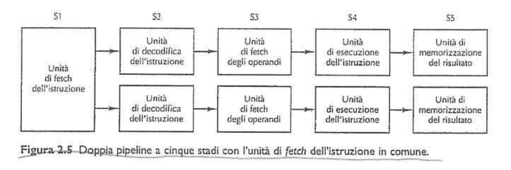

<!-- 
COLORI:
- ROSSO: #DF5452;
- GRIGIO: #252525;
- BLU: #379AD3;
- VERDE: #529E72;
- GIALLO: #FDDC5C.
-->

  

# Architettura dei Sistemi di Elaborazione  

## Indice  

- [Cap. 1](#cap-1)  
  - [1.1 - Introduzione](#11---introduzione)
  - [1.2 - Evoluzione delle macchine multilivello](#12---evoluzione-delle-macchine-multilivello)
    - [First](#first-generation-1945-1955-vacuum-tubes)
    - [Seconds](#second-generation-1955-65-transistors-and-batch-systems)
    - [Third](#third-generation-1965-1980-ics-e-multiprogramming)
    - [Fourth](#fourth-generation-1980-present-personal-computer)
    - [Fifth](#fifth-generation-1990present-mobile-computers)
- [Cap. 2](#cap-2)
  - [2.1 - Processori](#21---processori)
  - [2.2 - Memoria PRINCIPALE](#22---memoria-principale)
- [Indirizzamento (toDO)](#indirizzamento-riassunto)
- [Assembly ARM](#assembly-arm)  
- [Programma](#programma)
- [Domande per l'autovalutazione](#domande-per-lautovalutazione)
- [Strumenti software](#strumenti-software)
<br>  

## Cap. 1  

### <span style="font-weight:bold; color:#529E72;">1.1</span> - Introduzione

Il computer è una macchina elettronica digitale in grado di risolvere problemi attraverso un insieme di istruzioni assegnate (il **programma**). Queste istruzioni sono semplici:  
- sommare due numeri;  
- controllare se un numero vale zero;  
- copiare una porzione di dati da una parte all'altra della memoria.   

Il calcolatore (**M<sub>0</sub>**) utilizza il sistema di numerazione binario (0 e 1) e i programmi possono essere scritti in vari linguaggi di programmazione, quello però riconosciuto nativamente dal computer è il **linguaggio macchina**. Potremmo considerare questo linguaggio come **L<sub>0</sub>**. Il problema di base che è <u>gli utenti vogliono fare X, ma i computer possono fare soltanto Y</u>.  
Per risolverlo occorre definire un nuovo insieme di istruzioni che sia più orientato verso l'utente, rispetto al precedente: **L<sub>1</sub>**. Concettualmente, l'aver creato L<sub>1</sub> (virtuale) corrisponde ad aver creato una macchina virtuale (*virtual machine* o *livello*) in grado di comprenderlo: **M<sub>1</sub>**.  
Per eseguire L<sub>n</sub> (caso generale) su una macchina M<sub>n-1</sub>, in grado di comprendere solo L<sub>n-1</sub>, abbiamo due soluzioni:  
- <span style="font-weight:bold; background-color:#FDDC5C; color:black; padding:1px; border-radius: 4px;">Traduzione</span>: <u>sostituire</u>, in una fase iniziale, <u>ogni sua istruzione con un'equivalente sequenza di istruzioni in L<sub>n-1</sub></u>. Il programma che ne risulta è costituito interamente da istruzioni di L<sub>n-1</sub> e può essere eseguito dal computer al posto del programma L<sub>n</sub> originale.  

- <span style="font-weight:bold; background-color:#FDDC5C; color:black; padding:1px; border-radius:4px;">Interpretazione</span>**: <u>scrivere un programma</u> (detto <u>**interprete</u>) <u>in L<sub>n-1</sub> che accetta come input istruzioni in L<sub>n</sub></u>; tale programma li esegue esaminando un’istruzione alla volta e sostituendola direttamente con l’equivalente sequenza di istruzioni L<sub>n-1</sub>.  

<details style="margin-bottom: 1em; padding: 0.5em 0.5em 0; border: 1px solid #aaa; border-radius: 4px; border-bottom: 1px solid #aaa;">  
<summary style="margin: -0.5em -0.5em 0; padding: 0.5em; border-bottom: 1px solid #aaa;">🖥️ Un moderno calcolatore e tipicamente formato da:</summary>  
<div style="display: flex; justify-content: center; width: 100%;">  
    
    
</div>  
<div style="display: flex; justify-content: center; width: 100%;">  
    
  
</div>  

*I computer sono progettati come una serie di livelli, ciascuno dei quali costruito su quelli che lo precedono*. Ogni livello rappresenta un'**astrazione** diversa, con oggetti e operazioni proprie, consentendo di semplificare la complessità dell'intero sistema.  

L’insieme dei tipi di dati, delle operazioni e delle funzionalità di ciascun livello è chiamato **architettura**. Essa riguarda gli aspetti visibili agli utenti (come la quantità di memoria RAM disponibile per eseguire un determinato programma), ma non gli aspetti tecnici di implementazione (come la tecnologia con cui è realizzata la memoria RAM). L'**architettura degli elaboratori** (o calcolatori) è lo studio dell'organizzazione e del funzionamento dei componenti hardware di un computer.  

#### 🔹 Livello -1: Dispositivi Fisici (Hardware)  

Alla base si trovano i componenti **hardware**: chip, schede, unità flash, dischi, tastiera, monitor e oggetti fisici similari; come questi dispositivi siano realizzati e operino è <u>compito degli ingegneri informatici</u>.  

#### 🔹 Livello 0: Livello Logico Digitale  

Gli oggetti che vengono analizzati nel livello più basso, il livello logico digitale, sono le **porte** (gate). Queste pur essendo costruite utilizzando componenti analogici come i transistor, possono essere modellate come dispositivi digitali. Unendo più porte si può formare una memoria da 1 bit, che può memorizzare un valore fra 0 e 1. Combinando più memorie a 1 bit in gruppi si arriva a 16, 32 o 64, formando quelli che vengono chiamati *registri* (combinazioni di porte logiche).  

#### 🔹 Livello 1: Micro-architettura  

Nel gradino appena superiore abbiamo le **microarchitetture**: i dispositivi fisici sono raggruppati per formare unità funzionali. Tipicamente in questo livello si inseriscono i gruppi di **registri** (piccole memorie velocissime, in genere da 8 a 32 bit) come la **CPU** ("*Central Processing Unit*" - "*Unità Centrale di Elaborazione*") e un circuito chiamato **ALU** (*Arithmetic Logic Unit*, *unità aritmetico-logica*), capace di effettuare semplici operazioni aritmetiche.  
I registri sono connessi alla ALU per formare un **data path** (percorso dati) lungo il quale questi ultimi si spostano. L’operazione base del percorso dati consiste nel selezionare uno o due registri, permettere alla ALU di operare su di loro (per esempio sommandoli) e memorizzare infine il risultato in uno dei registri.  
Le operazioni del percorso dati sono controllate in genere da un programma chiamato **microprogramma**, mentre su alcune macchine l'operazione viene effettuata direttamente dai circuiti hardware.  
Lo scopo del data path è eseguire [insiemi di istruzioni](#livello-2-instruction-set-architecture-isa), alcune delle quali vengono completate in un ciclo di data path, mentre altre richiederne più d'uno.  

#### 🔹 Livello 2: Instruction Set Architecture (ISA)  

Il livello 2 è costituito dal cosiddetto **livello ISA** (*Instruction Set Architecture*), ovvero l’insieme delle istruzioni che un processore è in grado di eseguire direttamente (interpretate dal microprogramma).  
Ogni produttore di CPU documenta le proprie ISA, specificando:  
- il formato delle istruzioni;  
- l’insieme delle istruzioni disponibili (es. `ADD`, `MOV`, `JMP`, ecc.): aritmetiche, logiche, controllo di flusso, I/O e così via;  
- i registri utilizzabili;  
- le modalità di indirizzamento della memoria;  
- il comportamento del sistema in risposta a ciascuna istruzione.  

Se un produttore realizzasse due versioni della stessa macchina con interpreti ISA differenti, ognuna avrebbe un proprio linguaggio macchina e un proprio manuale, pur condividendo la stessa architettura fisica di base.  

L’ISA costituisce il confine tra hardware e software, ed è spesso denominata anche **linguaggio macchina** (in codice binario ovviamente), poiché è l’unico linguaggio direttamente comprensibile dal processore.  
    
#### 🔹 Livello 3: Sistema Operativo  

Il livello 3 corrisponde a quello del **Sistema Operativo** ed è spesso definito un **livello ibrido**, poiché condivide molte istruzioni con il livello precedente (l'ISA), ma introduce anche nuove funzionalità e astrazioni:  
- una **nuova organizzazione della memoria** (memoria virtuale, protezione tra processi);  
- la **concorrenza tra processi** (multiplexing);  
- meccanismi di **gestione dell’I/O**, della **sicurezza**, e **delle risorse di sistema**.  

Tali servizi non sono implementati direttamente in hardware, ma sono gestiti da un software speciale eseguito sopra l’ISA: il Sistema Operativo, che si occupa di mascherare la complessità dei livelli a lui sottostanti.  
Le **istruzioni condivise** con l'ISA (come operazioni aritmetiche o movimenti tra registri) continuano ad essere eseguite direttamente dal microprogramma o dai circuiti elettronici, **senza l’intervento del sistema operativo**; mentre quelle più complesse, invece, sono **intercettate e gestite** dal SO tramite **System Call**.  

Per garantire il corretto funzionamento e la protezione del sistema, i processori moderni distinguono due **modalità operative**:  
- la **modalità kernel** (o **supervisor**), in cui viene eseguito il codice del sistema operativo con pieno accesso all’hardware;  
- la **modalità utente**, in cui girano i programmi applicativi, che possono eseguire solo un sottoinsieme sicuro delle istruzioni ISA.  
Il passaggio da modalità utente a kernel avviene tramite System Call.  

Un'importante differenza fra sistema operativo e normale software (modalità utente) è che un utente al quale non piaccia un particolare lettore di posta elettronica sarà libero di sceglierne un altro, o di scriverne uno suo, se preferisce; non è invece libero di scrivere un suo gestore degli interrupt del clock, che è parte del sistema operativo e che è protetto tramite hardware dai tentativi di modifica da parte degli utenti. In alcuni casi, però, questa distinzione è meno rigida: *sistemi embedded/integrati* (possono non avere la modalità kernel) o nei sistemi *interpretati* (come i sistemi operativi basati su Java, che usano un interprete e non l’hardware per separare i componenti).  

Inoltre, esistono programmi utente che aiutano il sistema operativo o che eseguono funzioni privilegiate, pur non essendo parte del kernel (come un gestore di password o, in alcuni sistemi, persino un file system).  

<details>  
<summary style="margin-bottom:1em;">Profonda differenza fra sistemi operativi e programmi utente (applicazioni) è la loro grandezza, complessità e durata di vita: il codice sorgente di Windows è composto da oltre 50 milioni di righe di codice, quello di Linux da oltre 20 milioni, ed entrambi sono in continua crescita.</summary>  
Per farvi un’idea, immaginate di stampare sotto forma di libro 50 milioni di righe, con 50 righe per pagina e 1000 pagine per volume; per contenere il sistema operativo sarebbero necessari 1000 volumi. Adesso immaginate una libreria con 20 libri per ripiano e sette ripiani, ovvero 140 volumi in tutto. Per contenere tutto il codice di Windows 10 ci vorrebbero più di 7 di queste librerie.  
Immaginate quindi di essere assunti per la manutenzione di un sistema operativo, e che il vostro capo vi porti in una sala con queste 7 librerie e vi dica: "Vai e impara tutto". E questo solo per la parte eseguita nel kernel. Nessuno in Microsoft ha una comprensione completa di Windows, e probabilmente la maggior parte dei programmatori, anche del kernel, ne capisce solo una piccola parte.  
</details>  

---

Quando un computer ha molti utenti o processi attivi, *è compito del sistema operativo proteggere e gestire le risorse* del calcolatore poiché esse potrebbero interferire fra loro. Generalmente, con il termine "***risorsa***" ci si riferisce a ciascun componente (software, come file, e hardware, come memoria, processore o tastiera) di un calcolatore. La gestione delle risorse include la loro condivisione (**MULTIPLEXING**) in due modalità diverse:  
1. nel <u>tempo</u>: programmi e utenti faranno a turno nell'uso, ad esempio, della CPU.  
2. nello <u>spazio</u>.
    - Presupponendo che vi sia abbastanza RAM per gestire molti programmi, è più efficiente condividerla anziché allocarla ad un singolo programma, specialmente se questo necessita solo di una piccola frazione del totale.  
    - Lo stesso discorso vale per i dischi e le unità flash, che possono contenere contemporaneamente file di diversi utenti ed è compito del sistema operativo gestire la loro allocazione dello spazio su disco e tenere traccia di chi sta usando quali blocchi.  

#### 🔹 **Livello 4 - Linguaggio Assembly**  

Quando si scrive un programma in **linguaggio assembly**, questo non viene eseguito direttamente dalla macchina, ma è invece **tradotto** in un linguaggio di livello inferiore (1, 2 o 3) e successivamente **interpretato** (o compilato) dalla macchina virtuale o reale corrispondente. Questo processo di traduzione è gestito da un programma chiamato "**assemblatore**", il quale converte il codice assembly in istruzioni comprensibili dalla macchina sottostante.  

Ciò avviene perché i linguaggi macchina (ISA) sono **numerici** (in codifica binaria), mentre a partire dal secondo livello, i linguaggi contengono invece **parole** e abbreviazioni umanamente comprensibili.  

È una **rappresentazione simbolica e leggibile dell’[ISA](#-livello-2-instruction-set-architecture-isa)**, usata per facilitare la scrittura di programmi:  
- Ogni istruzione assembly è un mnemonico per un'istruzione ISA (es. `MOV R1, R2` invece di `100101100011`);  
- Serve solo come **strumento per l'umano**;  
- **Dipende strettamente dall’ISA sottostante**: ogni ISA ha il suo linguaggio assembly.  

#### 🔹 Livello 4+: Programmi Utente  

Il livello 5 (e successivi) definisce **linguaggi di programmazione ad alto livello** che sono più umanamente comprensibili e meno basati su numeri; vengono tradotti da un compilatore al livello 3 o al livello 4 o in casi meno frequenti, interpretati.  
</details>  

Dalla loro nascita fino ai giorni nostri, i calcolatori hanno subito una **crescita esponenziale** sia in termini di **complessità** sia di **potenza computazionale**. Per dare un'idea concreta di questo sviluppo, basti pensare che il [Commodore 64](https://it.wikipedia.org/wiki/Commodore_64), un personal computer rilasciato nel 1982, disponeva di una potenza di calcolo superiore a quella dei computer utilizzati dalla NASA nel 1969 per la missione Apollo 11 che portò l'uomo sulla Luna.  

<div style="background-color: #252525; color:white; border-radius: 10px; padding: 15px; box-shadow: 0.5px 0.5px 2px black; margin-bottom: 1em;">  

<span style="font-size: 15px; font-style: italic;">Serve un intermediario tra l'utente e l'hardware: il <strong>Sistema Operativo</strong>.</span>  

Data la crescente complessità dell'architettura hardware, se tutti i programmatori dovessero comprendere in dettaglio ogni componente per poter scrivere codice, **lo sviluppo software sarebbe estremamente rallentato**, se non impossibile. A questo scopo, è nato il **Sistema Operativo**, uno strato di software il cui compito è di fornire ai programmi utente un modello più semplice, astratto e chiaro del funzionamento del computer.  

<details>
<summary style="margin-bottom:1em;">OBIETTIVO di un Sistema Operativo: <strong>Astrazione</strong> dell’hardware e <strong>gestione controllata</strong> delle risorse.</summary>  

<div style="border: 1px solid #aaa; border-radius: 0 0 4px 4px; padding: 1em; margin-top: -1px; margin-bottom:0.5em;">

*I sistemi operativi trasformano gli orrori dell’hardware in eleganti astrazioni*.

Inoltre, forniscono agli sviluppatori un insieme di **System Call**, che costituiscono l'interfaccia principale per richiedere servizi ed interagire direttamente col sistema stesso. Molti utenti credono erroneamente che l’interfaccia con cui interagiscono - Windows, Linux o macOS - sia il Sistema Operativo, ma in realtà questa è costituita da programmi a sé stanti costruiti su di esso:  
- **Shell**: interfaccia testuale;  
- **GUI** (Graphical User *Interface*): interfaccia grafica (finestre, icone e menu).  


</div></details>  
</div>  

<!-- 
Sono a
slide 0 - pag. 18
Riassunto 1 - pag. 3
libro ASE - pag. 5
-->

### 1.2 - Evoluzione delle macchine multilivello  

Nei primissimi computer, il confine tra hardware e software era chiaro e cristallino. Nel corso del tempo, quel confine si è sfocato in modo considerevole, tanto che oggi è spesso difficile tenerli separati. Un tema centrale è che <u>*hardware e software sono logicamente equivalenti*</u>. Come ha affermato Karen Panetta Lentz: "*L’hardware non è che software pietrificato*". Ovviamente è anche vero il contrario: ogni istruzione eseguita dall’hardware può essere simulata via software.  

  

<details id="Babbage">  
<summary style="margin-bottom:0.5em;">Il primo autentico calcolatore digitale fu progettato dal matematico inglese <strong>Charles Babbage</strong> (1792-1871).</summary>  
<div style="border: 1px solid #aaa; border-radius: 0 0 4px 4px; padding: 1em; margin-top: -1px; margin-bottom:0.5em;">

> Per tutta la vita egli cercò di costruire la sua "**macchina analitica**", ma venne bloccato dalla tecnologia del proprio tempo, non ancora in grado di costruire ruote, ingranaggi e altri parti meccaniche necessarie con la precisione richiesta. La macchina che egli progetto non aveva un sistema operativo, ovviamente, tuttavia capì che sarebbe stato necessario un software per la sua gestione ed a tale scopo assunse la giovane donna **Ada Lovelace**, figlia del noto poeta britannico Lord Byron. Ella divenne la prima programmatrice del mondo ed il linguaggio di programmazione *Ada®* prende da lei il suo nome.  
 
Egli fu inventore, tra l'altro, del tachimetro e di una macchina chiamata ***difference engine*** ("*macchina differenziale*"), capace soltanto di sommare e sottrarre, come quello di Pascal; fu usata per calcolare tabelle di numeri utili per la navigazione.  
L'intera macchina poteva eseguire un solo algoritmo: il metodo matematico delle differenze finite. L'aspetto più interessante fu però la sua forma di output: i risultati venivano incisi mediante una punta d’acciaio su una lastra di rame, anticipando quindi i futuri supporti a singola scrittura quali le schede perforate e i CD-ROM.  

Sebbene la *difference engine* funzionasse in modo abbastanza soddisfacente, Babbage si stancò presto di una macchina capace di eseguire un solo algoritmo e cominciò a dedicarsi sempre più alla progettazione di una macchina che ne rappresentasse l’evoluzione: la ***analytical engine*** ("*macchina analitica*"), composta da quattro componenti:  
- il magazzino (la memoria), composto da 1000 parole da 50 cifre, utilizzate per memorizzare dati e risultati;  
- il mulino (l'unità computazionale), poteva prelevare gli operandi dal magazzino per sommarli, sottrarli, moltiplicarli o dividerli e infine memorizzarne nuovamente il risultato nel magazzino;  
- il dispositivo di input (le schede perforate);
- il dispositivo di output (output stampato e perforato).  

Anche questa macchina era interamente meccanica.  
Dato che l’*analytical engine* era programmabile mediante un semplice linguaggio assemblativo, era necessario produrre il software. A tal fine, assunse Ada Augusta Lovelace.  
**Sfortunatamente**, Babbage non riuscì mai a ottenere un hardware completamente privo di errori a causa della tecnologia del diciannovesimo secolo. Ciononostante le sue idee erano in largo anticipo sui tempi, al punto che la maggior parte dei computer moderni presenta oggi una struttura molto simile all’*analytical engine*. **Per questo motivo è giusto affermare che Babbage fu**, quantomeno il **nonno degli odierni calcolatori**.  
</div></details>  

Durante e dopo la Seconda Guerra Mondiale, si svilupparono i primi computer digitali, inizialmente basati su **relè elettromeccanici**, poi sostituiti da **valvole termoioniche**, più veloci ed efficienti.  

- In Germania, **Konrad Zuse** costruì il **Z3**, un calcolatore con relè elettromeccanici. I suoi lavori furono però distrutti nel 1944, non potendo influenzare lo sviluppo delle macchine successive.  
- In Inghilterra, fu realizzato il **COLOSSUS** (1943) per decifrare i messaggi codificati dalla macchina **ENIGMA** durante la guerra.  
  <details>
  <summary style="margin-bottom:1em; margin-top:-0.5em;">Al progetto, partecipò <strong>Alan Turing</strong>, ma rimase segreto per 30 anni.</summary>  
  <div style="border: 1px solid #aaa; border-radius: 0 0 4px 4px; padding: 1em; margin-top: -1px; margin-bottom:0.5em;">  

  Lo stimolo per lo sviluppo dei computer elettronici venne dalla Seconda Guerra Mondiale. Nella prima parte della guerra i sottomarini tedeschi stavano decimando la flotta britannica. Da Berlino gli ammiragli tedeschi spedivano i comandi via radio ai sottomarini; questi ordini potevano quindi essere intercettati dai britannici. Il problema era che i messaggi venivano codificati per mezzo di un dispositivo chiamato **ENIGMA**; il precursore di questa macchina era stato progettato da Thomas Jefferson che, oltre a essere stato il terzo presidente degli Stati Uniti d’America, fu anche un inventore dilettante.  
  All’inizio della guerra lo spionaggio britannico riuscì a procurarsi una macchina ENIGMA grazie all’aiuto dei servizi segreti polacchi che erano riusciti a rubarla ai tedeschi. Tuttavia, per poter decifrare un messaggio codificato occorreva svolgere un’enorme quantità di calcoli, ed era necessario poterlo fare molto velocemente, non appena il comando veniva intercettato, affinché ciò potesse essere di una qualche utilità. Per decodificare questi messaggi il governo britannico creò un laboratorio segretissimo per la costruzione di un computer chiamato **COLOSSUS**. Il famoso matematico inglese **Alan Turing** diede il suo aiuto alla progettazione di questa macchina. COLOSSUS divenne operativo nel 1943 ma, dato che il governo britannico tenne sotto segreto militare per 30 anni, praticamente ogni aspetto del progetto non ebbe alcun seguito. Vale la pena ricordarlo semplicemente perché fu il primo elaboratore digitale al mondo.
  </div></details>  
- Ad Harvard, nel 1944, Howard Aiken realizzò la "macchina analitica" immaginata da Babbage (attraverso relè meccanici): il **Mark I**. Tuttavia, dal momento in cui Aiken realizzò il suo successore, il Mark II, i computer basati su relè divennero obsoleti; era iniziata infatti l’era dell’elettronica.

#### **First generation** (1945-1955): Vacuum tubes  

Negli Stati Uniti, **John Atanasoff** e **Clifford Berry** (in competizione con **George Stibitz**) realizzarono quello che ad oggi è considerato il primo computer digitale funzionante, basato su aritmetica binaria e memoria a condensatori, anticipando le moderne DRAM, ma la macchina non fu mai completata a causa, come per [Babbage](#Babbage), dell’inadeguatezza tecnologica di quel tempo.  

Il computer di Stibbitz, sebbene meno evoluto di quello di Atanasoff, riuscì a funzionare e il suo inventore ne diede una dimostrazione pubblica nel 1940; vi assistette **John Mauchley**, colui che assieme a **J. Presper Eckert** sviluppò l’<abbr title ="&quot;Electronic Numerical Integrator And Computer" style="font-weight:bold; background-color:#FDDC5C; color:black;&quot;">ENIAC</abbr> nel 1946 (per uso bellico): 30 tonnellate, 18.000 valvole, 1500 relè, 140 KW di consumo, programmabile tramite cavi e interruttori. Era veloce ma complesso da usare. Dato che la guerra finì, la macchina non potè più essere utile per lo scopo originario; fu concesso a Mauchley e Eckert di organizzare una scuola estiva per presentare il loro lavoro ai colleghi. Questo evento segnò l’inizio di un’esplosione di interesse nella costruzione di grandi computer digitali, portando a numerosi progetti accademici e industriali: **EDSAC** (Cambridge), **JOHNIAC**, **ILLIAC**, **MANIAC**, **WEIZAC**. Dopo l’ENIAC, Mauchley ed Eckert iniziarono a progettarne un successore: l’<abbr title ="Electronic Discrete Variable Automatic Computer" style="font-weight:bold;">EDVAC</abbr>, ma lo abbandonarono per fondare una propria compagnia: la Eckert-Mauchley Computer Corporation.  

> Facendo una *piccola digressione*, è opportuno ricordare che Eckert e Mauchley registrarono un *brevetto* in cui sostenevano di essere gli *inventori del computer digitale*, ma dopo anni di controversie legali i tribunali decisero che il loro brevetto non era valido e che l'inventore del computer digitale, pur non avendolo mai brevettato, era stato John Atanasoff, che aveva effettivamente reso l’invenzione di dominio pubblico.  

Parallelamente, il MIT costruì **Whirlwind I**, da cui derivò la **memoria a nuclei magnetici**, inventata da **Jay Forrester**. Questo fu il primo mini-computer commerciale. Inoltre, **IBM**, inizialmente focalizzata su schede perforate, entrò nel mercato dei computer nel 1953 (dominandolo) con il **modello 701**, e poi con i modelli **704** e **709**, tutti basati su valvole termoioniche.

---

<details>  
<summary style="margin-bottom:1em;"><abbr title="Von Neumann era un genio del livello di Leonardo da Vinci. Parlava molte lingue, era un esperto di fisica e matematica e aveva la capacità di ricordare perfettamente ogni cosa avesse sentito, visto o letto; era inoltre in grado di citare a memoria e alla lettera libri che aveva letto anni prima. Nel momento in cui cominciò a interessarsi ai computer era già il più importante matematico al mondo.  
Una delle cose che gli apparvero subito evidenti fu che la programmazione dei computer mediante un gran numero di interruttori e cavi era lenta, tediosa e poco flessibile. Egli comprese che anche i programmi, al pari dei dati, potevano essere rappresentati in forma numerica all’interno della memoria del computer. Inoltre si rese conto che la contorta aritmetica decimale seriale usata nell’elaboratore ENIAC, in cui ogni cifra era rappresentata da 10 valvole (1 accesa e 9 spente), poteva essere sostituita da un'aritmetica binaria parallela, in modo simile a quanto aveva realizzato Atanasoff anni prima." style="font-weight:bold;  text-decoration:underline;">John von Neumann</abbr>, coinvolto nel progetto ENIAC, intuì che il sistema di valvole decimali (1 accesa e 9 spente), usato da Eckert-Mauchley poteva essere sostituito da un’aritmetica binaria parallela, in modo simile a quanto fatto da Atanasoff anni prima. Quindi, assieme a Goldstine realizzò <b>EDSAC</b> (<b>IAS</b>), conosciuto al giorno d'oggi come <span style="font-weight:bold; background-color:#FDDC5C; color:black;">macchina di von Neumann</span>, base dei moderni computer.  
L'influenza avuta da questo progetto è tale che vale la pena descriverlo brevemente.</summary>  

<!-- TODO -->


EDSAC fu il primo computer che memorizzava il programma in memoria.  
Era composto da **cinque** componenti principali: la memoria, l'unità aritmetico-logica, l’unità di controllo e i dispositivi di input e output.  

- La **memoria** era costituita da 4096 locazioni, ciascuna delle quali conteneva 40 bit. Ciascuna parola poteva mantenere due istruzioni da 20 bit oppure un numero da 40 bit. Le istruzioni erano composte da 8 bit, che definivano il tipo d’istruzione, e dai restanti 12 bit, che specificavano una delle 4096 parole di memoria.  
- L’**unità aritmetico-logica** (ALU o *Arithmetic Logic Unit*) e l’**unità di controllo** (CU o *Control Unit*) formavano insieme il "cervello" del computer; negli elaboratori moderni esse sono combinate in un unico chip chiamato **CPU** (*Central Processing Unit*, "*unità centrale di calcolo*"). Originariamente, l’ALU eseguiva le istruzioni più elementari, come quelle aritmetiche e logiche, mentre la CU recuperava le istruzioni in memoria secondo l’ordine stabilito dall’algoritmo e permetteva la loro esecuzione.  
- All'interno dell'unità aritmetico-logica vi era uno speciale registro da 40 bit, chiamato **accumulatore**; era una memoria interna alla CPU che veniva utilizzata per contenere gli operandi delle istruzioni eseguite dalla ALU. La tipica istruzione sommava una parola di memoria all’accumulatore oppure ne copiava il contenuto in memoria. La macchina non aveva un’aritmetica in virgola mobile dato che von Neumann riteneva che ogni matematico che si rispetti dovesse essere in grado di tener traccia a mente della posizione della virgola (per essere precisi, della virgola binaria).  
</details>

---
---
---

Praticamente nello stesso periodo in cui venne inventato l’IAS, altri ricercatori del **M.I.T.** costruirono un computer, chiamato **Whirlwind I**, che, diversamente da IAS, ENIAC e altre macchine dello stesso tipo (dotate di lunghe parole e pensate per poter elaborare numeri molto grandi), aveva parole di soli 16 bit ed era progettato per il controllo in tempo reale. Grazie a questo progetto si deve l’invenzione della memoria a nuclei magnetici da parte di Jay Forrester e, infine, la nascita del primo minicomputer commerciale.

Mentre avveniva tutto questo, **IBM** era una piccola società impegnata nel commercio di schede perforate e di macchine per il loro ordinamento. Non era fortemente interessata ai computer, sebbene avesse in parte finanziato il lavoro di Aiken. Cominciò a diventarlo dal 1953, con la produzione del modello 701, e quindi molto tempo dopo che la compagnia di Eckert e Mauchley era diventata, grazie ai computer UNIVAC, il numero uno sul mercato. Il modello 701 era dotato di 2048 parole di 36 bit, con due istruzioni per parola, e fu la prima di una serie di macchine scientifiche che in una decade cominciarono a dominare il mercato. Tre anni dopo fu il momento del modello 704, che inizialmente aveva 4096 parole di memoria centrale, istruzioni a 36 bit e un nuovo, innovativo, hardware in virgola mobile. Nel 1958 IBM cominciò la produzione del modello 709, la sua ultima macchina che utilizzava le valvole ed era in pratica una miglioria del computer 704.
    


Queste erano enormi, riempivano intere stanze con centinaia di migliaia di valvole, ma erano milioni di volte più lente del più economico degli attuali personal computer (pc). Producevano inoltre anche molto calore, si bloccavano (anche per il troppo calore) e poi ogni calcolo poteva essere fatto una sola volta nel senso che doveva essere programmata singolarmente ogni scheda. Era un problema perché mentre si scriveva o leggeva il processore era fermo, cioè si avevano parti di macchina non utilizzate.

**Tutta la programmazione veniva effettuata totalmente in linguaggio macchina**. 

> Normalmente le cose si svolgevano in questo modo: il programmatore si registrava su un foglio delle prenotazioni appeso al muro per un certo numero di ore, poi andava nella sala macchine, inseriva la propria scheda a spinotti con il programma nel calcolatore e passava le ore successive a sperare che nessuna delle circa 20000 valvole si bruciasse mentre il programma girava.
> 

La quasi totalità delle applicazioni erano semplici calcoli numerici (come produzioni di tabelle di seni, coseni e logaritmi) usati per la guerra: calcoli balistici, simulazioni di dove sarebbero arrivati i missili e per calcoli su come sarebbe evoluta l’esplosione della bomba atomica. Potevano fare circa 1900 calcoli al secondo (oggi circa 6 miliardi).

Negli anni '50 questa procedura venne migliorata con l'introduzione delle schede perforate, permettendo di scrivere programmi sulle schede e leggerli tramite il calcolatore, invece di usare le schede a spinotti (schede di collegamento); per il resto, la procedura era assolutamente la stessa.

---

**(RIASSUNTO)**
- COLOSSUS: utilizzato da Turing per decifrare i messaggi della macchina Enigma;
- ENIAC (Electronic Numerical Integrator And Computer);
- IAS (Institute for Advanced Study): costruita da J. von Neumann con l’omonima architettura alla base degli attuali computer.
È costituita da 5 componenti fondamentali: la memoria, l’ALU, l’unità di controllo (CU) e i dispositivi di input/output.
Il cervello della macchina è costituito dalla ALU e dalla CU, che negli attuali computer sono immersi in unico chip chiamato CPU (Central Processing Unit).
L’unità ALU esegue le operazioni aritmetiche e logiche attraverso un registro speciale chiamato accumulatore, mentre la CU dirige le operazioni.

**LA MACCHINA DI VON NEUMANN**
Si compone delle seguenti parti:
- *memoria*: conserva sia il programma che i dati su cui deve lavorare il programma;
- *CPU*: è l’unità di elaborazione composta da tre elementi principali:
  - *ALU* (*Arithmetic Logic Unit*): esegue le istruzioni elementari come quelle aritmetiche e logiche;
  - *CU* (*Control Unit*): recupera le istruzioni in memoria secondo l’ordine stabilito dall’algoritmo e permette la loro esecuzione;
  - *Accumulatore*: è una memoria interna della CPU che viene utilizzata per contenere gli operandi delle istruzioni eseguite dalla ALU.
- *Input/Output* (*I/O*): costituisce l’interfacciamento del calcolatore verso l’esterno;
- *bus di comunicazione*: è il canale che permette la comunicazione tra le unità appena descritte.


---

**(RIASSUNTO)** (SO)
Tutta la programmazione veniva effettuata in linguaggio macchina, predisponendo una serie di spinotti su schede particolari che servivano per controllare le funzioni elementari della macchina.  
Negli anni ’50 vennero introdotte le schede perforate, che rendevano possibile scrivere programmi sulle schede e leggerli tramite il calcolatore, invece di usare le schede a spinotti

---

**(TODO)**
All’inizio della guerra, i britannici riuscirono a procurarsi “ENIGMA” , per decodificare i codici tedeschi venne costruito “COLOSSUS”, a fine guerra non ebbe più sviluppi.

Nel ‘43 Mauchley e Eckert costruirono un computer elettronico che chiamarono “ENIAC” terminato nel ‘46 quando non poteva più essere utilizzato per lo scopo originario, venne concesso a Mauchley e Eckert di organizzare una scuola estiva per presentare il loro lavoro.

Attraverso tale scuola vari ricercatori intrapresero la costruzione di nuovi computer elettronici.

“EDSAC” , “JOHNIAC” , “ILLIAC” , “MANIAC” , “WEIZAC”. 

Eckert e Mauchley lavorarono al successore della loro macchina, “EDVAC”. 

Nel mentre Von Neuman, membro del progetto “ENIAC”, costruì la propria versione dell’ “EDVAC”, la macchina “IAS”, il primo progetto che descrisse fu la “Macchina di Von Neuman”, ancora oggi alla base di quasi tutti i computer digitali.

La Macchina di Von Neuman è composta da: 
1. Memoria
2. Unità Aritmetico -Logica
3. Unità di controllo
4. Dispositivo di input
5. Dispositivo di output

Unità aritmetico-logica e unità di controllo compongono il cervello del computer, ad oggi sono combinate in un unico chip, la CPU.

Mentre Von Neuman realizzava “IAS” altri ricercatori del M.I.T. costruivano un computer chiamato “Whirlwind I”, in tutto ciò IBM si avvicinò nel ‘53 all’ ideazione di computer attraverso la produzione del modello 701, tre anni dopo arrivò il modello 704. 

Nel ‘58 IBM cominciò la produzione del modello 709.

<!-- 
INTEGRALO NEL TESTO MAN MANO.
- Invenzione della microprogrammazione: i primi computer digitali, risalenti agli anni 40, avevano solamente due livelli: il livello ISA, in cui erano realizzati tutti i programmi, e il livello logico digitale, che li eseguiva.
- Invenzione del SO: nel 1960 fu progettato un computer con un software, sempre attivo, in grado di gestire l’hardware (il Sistema Operativo).
- Migrazione delle funzionalità verso il microcodice: a partire dal 1970 i progettisti cominciarono ad arricchire microcodice con nuove istruzioni sempre più efficienti (INC).
- Eliminazione della microprogrammazione: i microprogrammi diventarono sempre più grandi e lenti, si pensò allora di eliminare questa tecnica utilizzando solo microcodice (eseguito direttamente dall’hardware).
- Gli attuali processori si affidano di nuovo alla microprogrammazione.

> Invenzione della microprogrammazione
I primi computer (’40 ) avevano due livelli: livello ISA e livello logico digitale

> Invenzione del sistema operativo
Nel 1960 fu progettato un computer con un software, sempre attivo, in grado di gestire l’hardware (il Sistema Operativo).

> Migrazione delle funzionalità verso il microcodice
A partire dal 1970 i progettisti cominciarono ad arricchire microcodice con nuove istruzioni sempre più efficienti (INC).

> Eliminazione della microprogrammazione
I microprogrammi diventarono sempre più grandi e lenti, si pensò allora di eliminare questa tecnica utilizzando solo microcodice (eseguito direttamente dall’hardware).

---

Gli attuali processori si affidano di nuovo alla microprogrammazione.
-->

#### **Second generation** (1955-65): Transistors and batch systems

- L'introduzione dei [**transistor](https://www.notion.so/Storia-dei-processori-Intel-c6bfc5ce1ba84608a9f9baeb8ea26384?pvs=21)** durante la metà degli anni '50 cambiò radicalmente situazione. I calcolatori divennero abbastanza affidabili da poter essere costruiti e venduti, dando all'acquirente la ragionevole certezza che avrebbero funzionato abbastanza a lungo da poter svolgere un lavoro utile e, per la prima volta, ci fu una chiara separazione fra progettisti, costruttori, operatori, programmatori e personale di manutenzione.
    
     II transistor è stato inventato nel 1948 presso i Bell Labs da John Bardeen, Walter Brattain e William Shockley, per la cui scoperta ricevettero nel 1956 il premio Nobel per la fisica. In 10 anni il transistor rivoluzionò i computer al punto che nei tardi anni '50 i computer a valvole divennero obsoleti. I transistor erano molto più piccoli e efficienti delle valvole, e consumavano meno energia.
    
    Il primo computer a transistor fu costruito presso i Lincoln Laboratory del M.I.T. nel 1956. Si trattava del **TX-0** (*Transistorized eXperimental computer 0*), un computer a 16 bit che seguiva la linea dei Whirlwind I. Il TX-0 non fu un computer commerciale, ma fu utilizzato come dispositivo per testare il più evoluto TX-2.
    
    **Il successo della DEC**
    
    Nel 1957, Kenneth Olsen, uno degli ingegneri che lavoravano al Lincoln Laboratory, fondò la *Digital Equipment Corporation* (**DEC**) per produrre una macchina commerciale molto simile al modello TX-0. La macchina, chiamata [**PDP-1**](https://www.notion.so/Materiale-per-ASE-e-SO-1401b3574bb84b2a8155f222ffd2b929?pvs=21), fu finalmente lanciata sul mercato nel 1961.
    
    Il PDP-1 era dotato di 4096 parole di memoria da 18 bit e poteva eseguire 200.000 istruzioni al secondo. Era un computer molto innovativo, e fu il primo computer commerciale a essere programmabile in linguaggio macchina. Altro fattore importante fu il prezzo: il PDP-1 costava 120.000 dollari, a differenza dei milioni del IBM 7090; ciò contribuì al grande successo della DEC.
    
    Uno dei primi PDP-1 fu donato al M.I.T., attirando l'attenzione degli studenti. Una delle principali innovazioni del PDP-1 era un display visuale in grado di disegnare punti in qualsiasi punto dello schermo da 512 per 512 pixel. Gli studenti lo programmarono presto per giocare a "*spacewar*", facendo conoscere al mondo il primo videogioco della storia.
    
    La DEC continuò a produrre computer a transistor sempre più potenti e accessibili. Nel 1964, introdusse il PDP-8, un computer a 12 bit molto più economico del PDP-1 (16.000 dollari), che fu un enorme successo commerciale; la DEC ne vendette più di 50.000 unità e ciò contribuì a consolidare la posizione della DEC, rendendola leader nel mercato dei microcomputer. 
    
    ](Cap%201%201ab2944d89bc80328e94f6ffe2808909/SumatraPDF_-_2023.12.09_-_15.25.03.png)
    
    [**Figura 1.3**](https://www.notion.so/Materiale-per-ASE-e-SO-1401b3574bb84b2a8155f222ffd2b929?pvs=21)
    
    La innovazione principale del PDP-8 era l'***omnibus***, mostrato nella [**Figura 1.3**](https://www.notion.so/Materiale-per-ASE-e-SO-1401b3574bb84b2a8155f222ffd2b929?pvs=21), un unico **bus** che connetteva i diversi componenti del computer.
    
    Questa architettura divenne presto comune nei computer successivi di piccole dimensioni.
    
    **IBM e la risposta al transistor**
    
    **IBM**, che era il leader del mercato dei computer a valvole, rispose all'avvento del transistor con la produzione del modello 7090 nel 1957, un computer a transistor a 36 bit che era molto più veloce dei computer a valvole dell'epoca. Questo modello, insieme al successivo 7094, segnò la fine delle macchine come l'ENIAC e dominò il mondo dell'elaborazione scientifica degli anni '60.
    
    Nel 1964, IBM introdusse il modello **7094**, che era ancora più veloce del 7090, era il computer più potente al mondo all'epoca e fu utilizzato per una vasta gamma di applicazioni, tra cui l'analisi numerica, la simulazione e l'elaborazione di immagini.
    
    Nello stesso momento in cui, grazie al modello 7094, IBM diventava una delle principali forze del mercato, otteneva enormi profitti vendendo una piccola macchina per le aziende, chiamata **1401**. Questa macchina era in grado di leggere e scrivere nastri magnetici, leggere e perforare schede e stampare output a una velocità paragonabile a quella del modello 7094, il tutto a una frazione del prezzo. Era quindi perfetta per la gestione dei dati aziendali, ma aveva pessime prestazioni nei calcoli scientifici.
    
    L'architettura del modello 1401 di IBM era insolita: senza registri o lunghezze fisse di parola, la memoria era composta da 4000 byte da 8 bit. La macchina era perfetta per la gestione dei dati aziendali ma meno adatta per i calcoli scientifici.
    
    **La Control Data Corporation e il 6600**
    
    Nel 1964, una piccola società chiamata *Control Data Corporation* (**CDC**) introdusse il modello 6600, un computer a 36 bit che era quasi un ordine di grandezza più veloce dell’imponente 7094, il computer più potente al mondo all'epoca. Il segreto della sua velocità stava nel fatto che la CPU era, al suo interno, una macchina altamente parallela; anche se per ottenere il maggior guadagno possibile era richiesta un’attenta programmazione, con un po’ di lavoro si riusciva a far eseguire contemporaneamente anche 10 istruzioni. Era un computer a 36 bit che utilizzava un'architettura parallela, consentendo l’esecuzione di più istruzioni contemporaneamente, fino a 10, il che ne aumentava la velocità.
    
    Come se non bastasse, il modello 6600 aveva al suo interno un certo numero di piccoli computer che lo aiutavano; un po’ come i Sette Nani con Biancaneve, questo voleva dire che la CPU poteva spendere tutto il suo tempo a macinare numeri lasciando ai piccoli computer tutti i dettagli della gestione dei programmi e dell’input/output. A posteriori si può affermare che il 6600 era in anticipo di decenni sui tempi; molte delle idee chiave proprie dei computer moderni possono infatti essere ricondotte a questa macchina.
    
    Per i matematici che si occupavano di analisi numerica, spesso chiamati *number cruncher*, ‘‘masticatori di numeri", fu amore a prima vista e così il CDC 6600 fu lanciato verso il successo.
    
    Il progettista del computer 6600, **Seymour Cray**, fu una figura leggendaria del livello di von Neumann. Dedicò la sua intera vita a costruire macchine sempre più veloci, ora chiamate **supercomputer**, tra cui gli elaboratori 6600, 7600 e Cray-1. Inventò inoltre un famoso algoritmo per l’acquisto di un’autovettura (riflettendo la sua dedizione alla velocità e all'efficienza): si va dal rivenditore più vicino a casa propria, si indica la macchina più vicina alla porta e si dice: ‘‘Voglio questa". L’algoritmo impiega il minor tempo possibile per le cose non importanti (come comprare una macchina) per lasciare il maggior tempo possibile alle cose importanti (come progettare supercomputer).
    
    **Il Burroughs B5000**
    
    Nella stessa epoca, ci furono molti altri computer, ma uno si distinse per un motivo particolare e merita per questo di essere menzionato: il **Burroughs B5000**. 
    
    I progettisti di macchine come i modelli PDP-1, 7094 e 6600 si concentravano esclusivamente sull’hardware, sia nel tentativo di renderlo economico (DEC) sia in quello di renderlo veloce (IBM e CDC), mentre ignoravano quasi completamente il software. I progettisti del B5000 adottarono invece un approccio diverso, dedicandosi al software della loro macchina con il preciso intento di facilitare la programmazione in Algol 60, un precursore di C e Java, e inclusero nell'hardware molte caratteristiche finalizzate a facilitare il compito del compilatore.
    
    Il B5000 non fu un successo commerciale, MA fu importante perché fu uno dei primi computer a riconoscere l'importanza del software.
    
    ---
    
    **Conclusione**
    
    L'avvento del transistor segnò una svolta nella storia dei computer poiché erano più piccoli, efficienti e consumavano meno energia delle valvole termoioniche. Ciò permise di costruire computer più potenti, più affidabili e meno costosi, rivoluzionando il mondo dell'informatica, e contribuirono a diffondere i computer in una vasta gamma di applicazioni.
    
    
- Queste macchine, chiamate ora **mainframe**, erano chiuse in sale computer dedicate e condizionate, dotate di squadre di operatori professionali che ne gestivano il funzionamento. Solo grandi gruppi industriali, agenzie governative e università potevano permettersi i loro costi astronomici.
    
     *Riguardo al loro funzionamento…*
    
    Per eseguire un **job** (cioè un programma o un ­insieme di programmi) un programmatore doveva prima scrivere un programma su carta (in FORTRAN o in assembler), poi perforarlo sulle schede. Doveva poi portare il mazzo di schede nella sala input, passarlo a uno degli operatori e andare a bersi un caffè, in attesa che l’output fosse pronto.
    
    ](Cap%201%201ab2944d89bc80328e94f6ffe2808909/chrome_-_2023.12.09_-_11.38.54.png)
    
    [**Figura 1.4**](https://www.notion.so/Materiale-per-ASE-e-SO-1401b3574bb84b2a8155f222ffd2b929?pvs=21)
    
    Quando il computer finiva il lavoro che stava eseguendo, un operatore si recava alla stampante, estraeva l’output e lo portava nella sala output, dove il programmatore avrebbe potuto prenderlo più tardi. 
    
    L’operatore ritirava poi dalla sala input uno dei mazzi di schede che gli era stato portato e lo faceva leggere. Se era necessario il compilatore FORTRAN, l’operatore doveva prenderlo da un armadietto e farlo leggere, inserendolo; il tutto comportava un notevole spreco di tempo; nel mentre gli operatori andavano avanti e indietro per la sala macchine.
    
    Dato l'elevato costo delle macchine, è facile capire come la gente si mettesse rapidamente a cercare di ridurre il tempo sprecato: la soluzione che venne adottata nella maggior parte dei casi fu quella dei **sistemi batch** (sistemi di elaborazione a lotti). L'idea alla base era quella di raccogliere una cassetta piena di job nella sala input, per poi riversarli su nastro magnetico usando un calcolatore (relativamente) piccolo e poco costoso, come ad esempio un IBM 1401, che era abbastanza valido per leggere schede, copiare nastri e stampare output, mentre invece non era il massimo per i calcoli numerici. Altre macchine molto più costose, come l’IBM 7094, erano usate per le reali operazioni di calcolo. La situazione è mostrata nella [**Figura 1.4**](https://www.notion.so/Materiale-per-ASE-e-SO-1401b3574bb84b2a8155f222ffd2b929?pvs=21).
    
    ---
    
    Dopo circa un’ora dalla raccolta di un batch di job, le schede venivano lette e scritte su un nastro magnetico, che veniva poi portato nella sala macchine dove veniva montato su un’unità nastro. L’operatore caricava quindi un programma speciale (l’antenato dell’attuale sistema operativo) che leggeva il primo job dal nastro e lo eseguiva; i dati in uscita, anziché venire stampati, venivano registrati su un secondo nastro magnetico. Dopo la fine di ciascun job, il sistema operativo leggeva automaticamente il job successivo dal nastro e lo mandava in esecuzione. Una volta eseguito, l’operatore toglieva i nastri di input e output, sostituiva il nastro di input con il batch successivo e portava il nastro di output a un 1401 per la stampa **off line** (fuori linea, cioè senza essere direttamente collegato al calcolatore principale).
    
    : Struttura tipica di un job FMS.](Cap%201%201ab2944d89bc80328e94f6ffe2808909/11.png)
    
    [**Figura 1.5**](https://www.notion.so/Materiale-per-ASE-e-SO-1401b3574bb84b2a8155f222ffd2b929?pvs=21): Struttura tipica di un job FMS.
    
    La struttura di un tipico job di input è mostrata nella [**Figura 1.5**](https://www.notion.so/Materiale-per-ASE-e-SO-1401b3574bb84b2a8155f222ffd2b929?pvs=21); iniziava con una scheda *$JOB*, che specificava il tempo massimo di esecuzione in minuti, il numero del conto su cui doveva venire addebitato il costo dell'elaborazione e il nome del programmatore. 
    
    Poi veniva una scheda *$FORTRAN*, che indicava al sistema operativo di caricare il compilatore FORTRAN dal nastro di sistema; a questa scheda faceva seguito il programma da compilare, quindi una scheda di tipo *$LOAD*, che indicava al sistema operativo di caricare per l'esecuzione il programma oggetto appena compilato (i programmi compilati erano spesso scritti su nastri vuoti e dovevano essere caricati esplicitamente). Quindi c’era la scheda *$RUN*, che indicava al sistema operativo di eseguire il programma con i dati contenuti sulle schede immediatamente seguenti. Alla fine, la scheda *$END* sanciva la fine del job. Queste primitive schede di controllo furono i precursori dei moderni interpreti via shell o a riga di comando.
    

I grandi computer di seconda generazione furono usati principalmente per calcoli scientifici e di ingegneria, così come per risolvere equazioni differenziali parziali che spesso si incontrano in fisica e in ingegneria. Erano in larga parte programmati in FORTRAN e linguaggio assembly. Tipici sistemi operativi furono FMS (Fortran Monitor System) e IBSYS, il sistema operativo di IBM per il 7094.

---

**(RIASSUNTO)**
Il transistor rivoluzionò i computer al punto che i computer a valvole divennero obsoleti.
- TX-0 (Transistorized eXperimental computer 0): ideato semplicemente come dispositivo per testare il più evoluto TX -2;
- TX-2;
- PDP-1: poteva eseguire 200.000 istruzioni al secondo;
- PDP-8: aveva un unico bus, chiamato omnibus;
- IBM 7094: possedeva una memoria centrale di 32.536 parole da 36 bit.
- macchina 1401: era in grado di leggere e scrivere nastri magnetici, leggere e perforare schede e stampare output;
- CDC 6600: quasi un ordine di grandezza più veloce del 7094. Il segreto della sua velocità stava nel fatto che la CPU era una macchina altamente parallela: varie unità funzionali potevano lavorare contemporaneamente. Come se non bastasse, il modello 6600 aveva al suo interno un certo numero di piccoli computer che lo aiutavano: la CPU poteva spendere tutto il suo tempo a macinare numeri lasciando ai piccoli computer tutti i dettagli della gestione dei programmi e dell’input/output;
- Supercomputer: gli elaboratori 6600, 7600 e Cray-1.

---

**(RIASSUNTO)** (SO)
L’introduzione dei transistor durante la metà degli anni ’50 cambiò radicalmente la situazione. Questi calcolatori, ora chiamati mainframe, erano molto costosi e solo grosse compagnie, agenzie governative o università potevano spendere milioni di dollari.

Per far girare un job (cioè un programma o un insieme di programmi), un programmatore doveva prima scrivere i programma su carta (in FORTRAN o in assembler), poi doveva copiarlo su schede perforate (successivamente sui nastri), infine portare il pacchetto da un operatore e aspettare i dati in uscita.  
Successivamente, per velocizzare le operazione, vennero inventati i sistemi batch (sistemi di elaborazione a lotti).  
L’idea era quella di trasferire i job su nastro magnetico usando un calcolatore poco costoso, ma non adatto ad eseguire i calcoli che venivano eseguiti su calcolatori molto più costosi.


---

**(TODO)**
Il transistor venne inventato nel ‘48, fu rivoluzionario, in 10 anni sostituì completamente le macchine a valvole rendendole obsolete.

Il primo computer a transistor fu ideato dal M.I.T. macchina a 16 bit (basata su “Whirlwind I”, chiamato “TX-0”.

Nel ‘57 Kenneth Olsen fondò una società, la DEC, per produrre una macchina commerciale simile al modello TX-0, nel ‘61 apparve la “PDP-1”, dotato di 4096 parole di memoria a 18 bit, poteva eseguire fino a 200.000 istruzioni al secondo.

Il “PDP-1” aveva metà delle prestazioni dell’ “IBM 7090” ( successore del modello 709 ).

PDP-1 costava 120.000 mentre IBM 7090 milioni , fu così che DEC riuscì a vendere decine di PDP-1 rappresentando la *nascita dell’industria dei microcomputer*. 

In pochi anni DEC introdusse il modello “PDP-8”, aveva 12 bit ed era più economica della “PDP-1”

la principale innovazione introdotta fu avere un unico bus, l’ “omnibus”.  Un “bus” è un insieme di cavi paralleli per connettere i diversi componenti di un computer.

Architettura migliore rispetto alla “IAS” , che era centralizzata rispetto alla memoria, e fu adottata da quasi tutti i successivi computer di piccole dimensioni.

IBM nel mentre costruì il modello 7090, aveva un ciclo di clock di 2 microsecondi, aveva una memoria centrale di 32.536 parole da 36 bit. I modelli 7090 e 7094 dominarono il mondo dell’elaborazione scientifica degli anni ‘60. 
Contemporaneamente IBM stava vendendo una piccola macchina per le aziende, 1401.  Era simile al modello 7094, ma meno costoso, perfetta per la gestione dei dati aziendali ma aveva pessime prestazioni nei calcoli scientifici.

Nel 1964 la CDC introdusse il modello 6600, macchina quasi più veloce dell’imponente 7094 (macchina migliore fino a quel momento), 6600 era veloce per via della CPU.

Seymour Cray, il progettista di 6600, dedicò tutta la vita a costruire macchine sempre più veloci, ora chiamate supercomputer. 

Uno degli ultimi computer che si  distinse parecchio fu il “Burroughs B5000”, i progettisti di modelli come: PDP-1, 7094 e 6600 si concentravano solo sull’hardware, si nel renderlo economico (DEC) sia in quello di renderlo veloce (IBM e CDC) ignorando quasi completamente il software cosa che i progettisti del B5000 tennero in considerazione.

#### **Third generation** (1965-1980): ICs e multiprogramming

All'inizio degli anni '60, la maggior parte dei produttori di calcolatori aveva due linee di prodotti distinte e incompatibili: computer scientifici *word-oriented*, di larga scala come il 7094, usati per calcoli numerici scientifici e ingegneristici, e computer commerciali *character-oriented*, come il 1401, ampiamente usati da banche e compagnie assicurative per ordinamenti su nastro e stampe.

Sviluppare e mantenere due distinte linee di prodotti era un'attività molto dispendiosa per le ditte che costruivano calcolatori; inoltre, molti nuovi clienti richiedevano inizialmente una macchina piccola, ma in seguito arrivavano a saturarla completamente e ne richiedevano un'altra in grado di eseguire tutti i vecchi programmi, ma più rapidamente. Inoltre, era diffuso il malcontento (tra le aziende che avevano comprato entrambi i tipi di macchine) di dover avere due dipartimenti di programmazione separati senza nulla in comune.

- L'IBM tentò di risolvere tutti e due questi problemi in un colpo solo con l'introduzione del Sistema 360 (***System/360***): gruppo costituito da una serie di macchine, compatibili fra di loro a livello software, che andavano da macchine piccole, tipo 1401, a macchine molto più potenti del 7094. Queste macchine differivano unicamente nel prezzo e nelle prestazioni (memoria massima, velocità del processore, numero di unità I/O consentito e così via).
    
     Dal momento che tutte le macchine avevano la stessa architettura e lo stesso insieme d'istruzioni, almeno in teoria, i programmi scritti per una macchina potevano girare su tutte le altre; per di più, il Sistema 360 fu progettato per calcoli sia di tipo commerciale sia di tipo scientifico. In questo modo, una singola famiglia di calcolatori poteva soddisfare le esigenze di tutti i clienti.
    
    In pratica però, il software scritto per un piccolo modello funzionava senza problemi su un modello più grande, ma non valeva il viceversa: quando ci si spostava verso un modello di dimensioni inferiori il programma poteva non entrare in memoria.
    
    Una caratteristica saliente del computer 360 era un enorme (per l’epoca) spazio degli indirizzi di $2²⁴ \small$ byte (16.777.216). All’epoca, una tale quantità di memoria appariva praticamente come infinita, dato che il costo della memoria era di qualche dollaro al byte.
    
    ---
    
    Negli anni successivi, IBM rese disponibili calcolatori con tecnologia più moderna (sebbene basati essenzialmente sulla stessa architettura), che mantenevano la compatibilità con la famiglia 360, conosciuti come serie 370, 4300, 3080 e 3090.
    
    II Sistema 360 fu la prima linea di calcolatori ad adottare (su piccola scala) la tecnologia dei **circuiti integrati**, gli **IC** (*integrated ­circuits*), allora a bassa scala di integrazione, che portò vantaggi rilevanti, in termini di prezzo e di prestazioni, rispet­to alle macchine di generazione precedente, costruite con transistor individuali. Fu un successo immediato e l'idea della famiglia di calcolatori compatibili fu immediatamente adottata da tutti gli altri principali produttori di calcolatori. I discendenti di queste macchine sono tuttora in uso nei grossi centri di calcolo. Attualmente sono spesso usati per gestire grandi basi di dati (per esempio, i sistemi di prenotazione di compagnie aeree) o come server per siti World Wide Web che devono elaborare migliaia di richieste per secondo.
    
    ---
    
    L'idea di avere una singola famiglia di macchine fu contemporaneamente una grande forza, ma anche una grande debolezza. L'intenzione era che tutto il software, compreso il sistema operativo, OS/360, dovesse girare su tutti i modelli: sui piccoli sistemi e su quelli molto grossi, su sistemi con poche periferiche e su quelli con molte periferiche; doveva lavorare in ambiente scientifico ed in uno commerciale; soprattutto, doveva essere efficiente per tutti questi differenti utilizzi.
    
    Nessuno, nemmeno IBM, era in grado di scrivere software che mettesse d’accordo tutte queste esigenze contrastanti: il risultato fu un sistema operativo enorme e straordinariamente complesso, probabilmente da due a tre ordini di grandezza più grande di FMS. Consisteva di milioni di righe di linguaggio assembly scritto da migliaia di programmatori e conteneva migliaia e migliaia di errori, da cui la necessità continua di nuove versioni con l’intento di correggerli. Ogni nuova versione correggeva alcuni errori e ne introduceva di nuovi, così che probabilmente il numero di errori restava costante nel tempo.
    
    A metà degli anni ’80, infine, il limite della memoria divenne un problema reale e IBM fu costretta ad abbandonare in parte la compatibilità quando introdusse gli indirizzi a 32 bit, necessari per indirizzare una nuova memoria di $2³² \small$ byte (4.294.967.296).
    
    Con il senno di poi si potrebbe discutere sul perché non si fosse pensato fin dall’inizio all’utilizzo di indirizzi a 32 bit, dato che le macchine erano state dotate di registri e parole a 32 bit; all'epoca però nessuno avrebbe mai potuto immaginare una macchina con 16 milioni di byte di memoria.
    
    Uno dei progettisti di OS/360, Fred Brooks, scrisse in seguito un libro spiritoso e incisivo (Brooks, 1996), oggi divenuto un classico, dove descriveva le sue esperienze con l’OS/360. Sarebbe impossibile riassumere il libro in questa sede, basta però dire che la copertina mostrava un branco di animali preistorici ammassati in una caverna. La copertina di Silberschatz (ed altri, del 2012) dà una visione analoga dei sistemi operativi come dei dinosauri. Uno dei concetti espressi è che aggiungere nuovi programmatori a un progetto in ritardo lo fa tardare ancor di più; un po’ come dire che per fare un bambino ci vogliono 9 mesi, e aggiungere più donne al progetto non cambia nulla.
    
    ---
    
    Nel seguente [**articolo**](https://computerhistory.org/blog/about-the-computer-history-museums-ibm-1401-machines/) si parla in maniera molto dettagliata del modello IBM 1401.
    
    
    
- Nonostante l’enorme dimensione e i relativi problemi, OS/360 e gli altri sistemi operativi ­simili della terza generazione prodotti da altri costruttori di calcolatori riuscirono a soddisfare, in misura ragionevole, la maggioranza dei loro clienti. Essi resero anche popolari numerose tecniche chiave che non erano presenti nei sistemi della seconda generazione, la più importante delle quali, probabilmente, è la **multiprogrammazione**.
    
    <aside>
     Sul 7094, quando il job in corso si fermava in attesa di un nastro o di completare un’altra operazione di I/O, la CPU si poneva in stato inattivo finché l’I/O terminava. Con calcoli scientifici che impegnano molto la CPU (CPU-bound), l’I/O non è frequente e quindi il tempo sprecato non è significativo. Con l’elaborazione di dati commerciali, il tempo di attesa dell’I/O può essere dall’80% al 90% del totale, sicché bisognava fare qualcosa per evitare che la (costosa) CPU restasse inattiva così a lungo.
    
    ](Cap%201%201ab2944d89bc80328e94f6ffe2808909/chrome_-_2023.12.09_-_18.05.16.png)
    
    [**Figura 1.6**](https://www.notion.so/Materiale-per-ASE-e-SO-1401b3574bb84b2a8155f222ffd2b929?pvs=21)
    
    La soluzione che emerse fu di partizionare la memoria in tanti pezzi, assegnando un diverso job a ogni partizione, come mostrato nella [**Figura 1.6**](https://www.notion.so/Materiale-per-ASE-e-SO-1401b3574bb84b2a8155f222ffd2b929?pvs=21). 
    
    Mentre un job rimaneva in attesa del completamento dell’I/O, un altro poteva usufruire della CPU. Se potevano essere tenuti in memoria abbastanza job contemporaneamente, la CPU sarebbe stata occupata quasi al 100% del tempo. 
    
    Avere molteplici job al sicuro in memoria richiede un hardware speciale per proteggere ogni job dalle interferenze degli altri, ma il 360 e gli altri sistemi di terza generazione erano equipaggiati con questo hardware.
    
    </aside>
    

Un'altra caratteristica importante dei SO della terza generazione era quella di permettere la lettura dei job dalle schede al disco non appena queste venivano portate in sala macchine. Così che, appena terminato un job in esecuzione, il sistema operativo potesse caricarne uno nuovo dal disco nella partizione che si era resa disponibile e mandarlo in esecuzione. Questa capacità viene chiamata **spooling** (da *Simultaneous Peripheral Operation On Line*, operazioni simultanee sulla periferica in linea) e fu usata anche per gestire l'output dei risultati. Con lo spooling, i 1401 non furono più necessari e il trasporto di nastri divenne superfluo.

Sebbene i SO della terza generazione fossero adatti alle grandi elaborazioni scientifiche ed alle elaborazioni di carattere commerciale, essi erano ancora in buona sostanza **sistemi batch**. Molti programmatori rimpiangevano i tempi della prima generazione, quando potevano avere la macchina tutta per loro per qualche ora e controllare i loro programmi rapidamente. Con i sistemi di terza generazione, tra l’inserimento in coda di un job e la ricezione dell’output potevano passare parecchie ore, e una sola virgola in un posto sbagliato poteva far fallire la compilazione e causare al programmatore la perdita di mezza giornata di lavoro.


- L’esigenza di un tempo rapido di risposta spianò la strada al **timesharing** (condivisione di tempo), una variante della multiprogrammazione nella quale ogni utente aveva a disposizione un terminale in linea. Se in un sistema timesharing ci fossero 20 utenti collegati contemporaneamente e 17 di loro stessero pensando, bevendo caffè o parlando, la CPU poteva essere assegnata, a turno, ai tre job che la richiedono.
    
    <aside>
     Poiché le perso­ne che eseguono il debug dei programmi generalmente eseguono comandi brevi (per esempio, "*compila una procedura di cinque pagine*") anziché lunghi (ordinare file di milioni di record), il computer può fornire un servizio veloce e interattivo a numerosi utenti e magari anche smaltire grossi job batch in background, nei momenti in cui la CPU sarebbe altrimenti inattiva.
    
    Il primo vero sistema di timesharing generico, **CTSS** (*Compatible Time Sharing System*), fu sviluppato al M.I.T., su un 7094 appositamente modificato (Corbató ed altri, 1962). Tuttavia, il timesharing non prese realmente piede fino a quando l’hardware di protezione necessario non si diffuse durante la terza generazione.
    
    </aside>
    
- Dopo il successo del sistema **CTSS**, il M.I.T., Bell Labs e General Electric (uno dei principali costruttori di calcolatori, all’epoca) decisero di imbarcarsi nello sviluppo di una *computer utility*, cioè una macchina che fosse in grado di supportare centinaia di utenti in timesharing: il **MULTICS** (***MULTiplexed Information and Computing Service***, sistema informativo e di calcolo multiplexato).
    
    <aside>
     I loro progettisti immaginarono una macchina molto grande che mettesse a disposizione capacità di calcolo per tutti gli abitanti di Boston e che fosse accessibile attraverso il sistema elettrico: quando si ha bisogno di elettricità, semplicemente si infila una spina nella presa a muro e si ottiene, nei limiti, tutta l’energia che si desidera.
    
    All'epoca, l'idea che macchine molto più potenti (anche di 10.000 volte) del loro mainframe GE-645 sarebbero state vendute a milioni, per un migliaio di dollari, solo 40 anni più tardi, era pura fantascienza.
    
    ---
    
    Il MULTICS fu un successo solo parziale. Fu progettato per supportare centinaia di utenti su di una macchina poco più potente di un PC 386 Intel e mille volte più lenta di un moderno smartphone e con una memoria un milione di volte inferiore, sebbene con maggior capacità di I/O. È folle solo fino a un certo punto: a quel tempo si riuscivano a scrivere programmi piccoli ed efficienti, un’abilità che si è persa nel tempo. 
    
    ---
    
    Le ragioni per cui il MULTICS non sfondò nel mondo sono molte, non ultimo per il fatto che era scritto in PL/I, un compilatore in ritardo di anni e quando finalmente arri­vò funzionava a malapena. Inoltre, il MULTICS era estremamente ambizioso per i suoi tempi, molto più di quanto lo fosse il motore analitico di Charles Babbage per il XIX secolo.
    
    In breve, il MULTICS introdusse molte idee fondamentali nella letteratura dei calcolatori, ma tramutarle in un prodotto serio e in un successo commerciale di vasta scala fu molto più difficile di quanto ci si aspettasse. 
    
    I Bell Labs abbandonarono il progetto e General Electric abbandonò il mercato dei computer. Il M.I.T., tuttavia, persistette e infine riuscì a far funzionare il MULTICS. Alla fine fu venduto come prodotto commerciale dall’azienda (Honeywell) che rilevò il settore informatico di General Electric quando questa decise di disfarsene, e fu installato da circa 80 gran­di aziende e università in tutto il mondo. Erano pochi, gli utenti del MULTICS, ma erano anche fedelissimi. General Motors, Ford e l’Agenzia di Sicurezza Nazionale degli Stati Uniti, per esempio, spensero i loro MULTICS solo alla fine degli an­ni ’90, trent’anni dopo che il MULTICS era stato rilasciato e dopo aver implorato per anni Honeywell di aggiornare l’hardware. L’ultimo sistema MULTICS fu spento tra fiumi di lacrime nell’ottobre 2000. Riuscite a immaginare l’idea di tenervi stretto un PC per 30 anni perché ritenete che sia molto meglio di tutto il resto in circolazione? Questo è il tipo di fedeltà ispirato da MULTICS, e per buone ragioni. È stato enormemente importante.
    
    ---
    
    Alla fine del XX secolo, il concetto di "computer come servizio" aveva perso un po’ di fascino, ma è tornato alla ribalta sotto forma di **cloud computing**, in cui una serie di computer relativamente piccoli (fra cui anche smartphone, tablet e simili) sono connessi a dei server che si trovano in enormi data center posti a grande distanza che eseguono tutte le operazioni di elaborazione, mentre il computer locale gestisce principalmente l’interfaccia utente. La motivazione in questo caso è che la maggior parte degli utenti non ha voglia di amministrare un sistema sempre più complesso e in continua evoluzione, e preferisce delegare il tutto a un team di professionisti che lavorano per la società che gestisce il data center.
    
    Il commercio elettronico si sta già evolvendo in questa direzione, con varie aziende che hanno collezioni di negozi virtuali su server multi-processore, ai quali si connettono le macchine più semplici dei clienti, il tutto con uno spirito molto simile a quello del progetto MULTICS.
    
    </aside>
    

Nonostante il suo insuccesso commerciale, il MULTICS ebbe un'enorme influenza sui sistemi operativi successivi (soprattutto UNIX e i suoi derivati Linux, macOS, iOS e Free­BSD), descritta in molte pubblicazioni e in un libro (Corbató e Vyssotsky, 1965; Daley e Tennis, 1968; Organick, 1972; Corbató et al., 1972 Saltzer, 1974). Ha tuttora un sito web attivo, all’indirizzo ­[*www.multicians.org*](http://www.multicians.org/), contenente moltissime informazioni sul sistema, sui suoi progettisti e sui suoi utenti.

- Un’altra tappa fondamentale della terza generazione, fu la crescita fenomenale dei **minicalcolatori** (o minicomputer), a partire dal [**PDP-1**](https://www.notion.so/Materiale-per-ASE-e-SO-1401b3574bb84b2a8155f222ffd2b929?pvs=21) della DEC, nel 1961.
    
    <aside>
     Il PDP-1 aveva solo 4K di parole a 18-bit, ma si vendette come il pane a 120.000$ per macchina (meno del 5% di un 7094).
    
    Per alcuni tipi di elaborazioni non numeriche era veloce quasi come un 7094 e dette l’avvio a un’intera nuova industria. Fu rapidamente seguito da una serie di nuovi PDP (diversamente dalla famiglia IBM, furono tutti incompatibili) che culminarono nel PDP-11.
    
    </aside>
    
- Uno degli informatici dei Bell Labs, che aveva collaborato precedentemente al progetto di MULTICS, **Ken Thompson** (assieme a **Dennis Ritchie**), trovò in seguito un piccolo PDP-7 inutilizzato e si mise a scrivere una versione ridotta (singolo utente) del MULTICS. Questo lavoro si sviluppò e più tardi divenne il sistema operativo **UNIX®**, che divenne popolare nel mondo accademico, in molte agenzie governative e in molte aziende.
    
    <aside>
     **FUN FACTS:**
    
    
    
    La storia di UNIX è stata narrata in altri testi (per esempio Salus, 1994), e sarà riportata in parte nel Capitolo 10. 
    
    Per ora basti dire che, poiché il codice sorgente era ampiamente disponibile, molte organizzazioni svilupparono le loro personali (e incompatibili) versioni, il che portò al caos.
    
    Emersero due versioni principali, **System V** di AT&T e **BSD** (*Berkeley Software Distribution*) dell’Università della California a Berkeley, anch’esse con varianti minori. 
    
    
    
    
    
    Per far sì che fosse possibile scrivere programmi che girassero su tutti i sistemi UNIX, IEEE sviluppò uno standard chiamato **POSIX**, attualmente supportato da molte versioni di UNIX. 
    
    POSIX definisce un'interfaccia minima per le chiamate di sistema che i sistemi UNIX, conformi allo standard, devono supportare. Di fatto, oggi anche altri sistemi operativi supportano l’interfaccia POSIX.
    
    - POSIX rappresenta uno dei vari **PROCESSI DI STANDARDIZZAZIONE** indetti in quel periodo per portare ogni software in ogni architettura.
        
        <aside>
        ☝🏻 Si dice che ogni SO è basato su UNIX, ma poi le sue implementazioni sono sempre diverse tra SO e SO.
        Tutti i SO che girano su queste macchine sono nati dallo stesso codice sorgente: UNIX.
        
        </aside>
        
    
    ---
    
    <aside>
    🧑🏻‍💻 Per inciso, vale la pena ricordare che, nel 1987, **Tanenbaum** rilasciò un piccolo clone di UNIX, chiamato **MINIX**, principalmente a scopi didattici. Dal punto di vista funzionale, MINIX è molto simile a UNIX, incluso il supporto POSIX. Da allora, la versione originale si è evoluta in MINIX3, altamente modulare e focalizzato sull’alta affidabilità; è disponibile gratuitamente (compreso tutto il suo codice sorgente) dal sito [*www.minix3.org*](http://www.minix3.org).
    
    
    
    Il sistema ha la capacità di individuare e sostituire "al volo" moduli (come i driver di un dispositivo di I/O) non funzionanti o addirittura andati in crash, senza riavvio e senza disturbare i programmi in esecuzione. 
    
    È anche disponibile un libro che descrive le sue operazioni interne e presenta in appendice il listato del codice sorgente (Tanenbaum e Woodhull, 2006).
    
    </aside>
    
    
    
    Evolutione dei sistemi UNIX nel corso del tempo.
    
    ---
    
    <aside>
    ☝🏻 **RIASSUNTO:**
    
    Il vero SO che tutti usiamo oggi è **UNIX**. Ken Thompson e Dennis Ritchie volevano un sistema **Open Source** in modo che tutti lo potessero leggere e dare un contributo, ma non lo fecero per galanteria, ma perché erano talmente complicati che una mano in più faceva comodo.
    
    A partire dal linguaggio B venne progettato il linguaggio di programmazione C. Con questo linguaggio si decise di creare UNIX, descritto per la prima volta nel 1974 durante i Turing Award (tipo un premio Nobel per un informatico). 
    
    UNIX divenne importante in ambito accademico e da qui si diffuse e nacquero altri SO. Il suo obiettivo era quello di essere **multi-piattaforma**, quindi ci fu lo sforzo di normare le System Call per far in modo che si potesse prendere un programma da un pc e compilarlo anche in un altro pc di un’altra tipologia.
    
    Proprio a questo scopo di multi-piattaforma, nacque anche **POSIX**, per motivi didattici e per fare in modo che che le cose funzionino allo stesso modo, ad esempio sia su Mac che su Linux.
    
    Durante la successiva creazione di **MINIX**, **Tanenbaum** scrisse circa 11.000 righe di codice e 1000 righe in ASSEMBLEY. Nasce in ambito didattico e venne definito con un approccio modulare ed estremamente sicuro per l’accesso alle risorse.
    
    </aside>
    
    </aside>
    
- Il desiderio di una versione di produzione (anziché didattica) di MINIX spinse uno studente finlandese, **Linus Torvalds**, a scrivere **Linux**.
    
    <aside>
    ☝🏻 Questo sistema fu direttamente ispirato e sviluppato partendo da MINIX e in origine supportava diverse caratteristiche di MINIX (per esempio il file system MINIX). È stato poi sviluppato in molti modi, ma tuttora conserva una struttura sottostante comune a MINIX e UNIX.
    
    
    
    È interessante notare come sia Linux che MINIX siano molto diffusi.
    
    **Linux** gira su un’altissima percentuale dei server nei data center e costituisce la base di Android, che domina il mercato degli smartphone. 
    
    **MINIX** fu adattato da Intel per un processore di "gestione" distinto e un po’ segreto incorporato praticamente in tutti i chipset dal 2008. In altre parole, se avete una CPU Intel, nelle viscere del processore gira MINIX anche se il vostro sistema operativo principale è Windows o Linux.
    
    I lettori interessati alla storia dettagliata di Linux e al movimento *open source* apprezzeranno il libro di Glyn Moody (2001). Gran parte di ciò che diremo in questo libro riguardo a UNIX vale anche per System V, MINIX, Linux e altre versioni e cloni di UNIX.
    
    ---
    
    Linux puntava ad essere ottimizzato anche per essere usato in ambito industriale. Questo venne talmente apprezzato anche fuori dall’ambito accademico da portare alla realizzazione coesa di un nucleo (kernel) del sistema operativo per renderlo accessibile da quante più macchine possibili, ponendo come base una CPU Intel.
    
    (Prima del mercato di massa degli anni 80’, HP produceva mainframe)
    
    Uno dei concetti chiave di Linux, che ritroviamo anche in Java, è la **Portabilità**. 
    La SUN, attraverso **JAVA**, fu tra tutte le aziende quella che puntò maggiormente su questo aspetto poiché il suo linguaggio era basato sull’introduzione di una macchina virtuale che virtualizzasse il SO sottostante.
    
    </aside>
    

<aside>
🧑🏻‍💻 **RIASSUNTO:**

Tra i concetti chiave compresi in questa generazione vi fu la necessità di creare un calcolatore più universale, poiché iniziava ad essere costoso mantenere diverse linee di produzione incompatibili fra loro, e la comprensione che la potente e costosa CPU dovesse essere utilizzata maggiormente, introducendo i concetti di spooling e di timesharing (culminato con il MULTICS).

Tralasciando quest’ultimo, poiché più intuitivo, vale la pena ripetere il concetto di **spooling**: concettualmente, pensarono che, data la maggior capacità di spazio sul disco di memoria, convenisse caricare lì più jobs in modo che poi la costosa CPU li potesse eseguire in successione. 

Unica accortezza onorevole di essere menzionata riguardo al **timesharing** è che, dato lo stesso spazio di memoria usato dalla stessa CPU, era ESSENZIALE che tutti gli utenti fossero attenti a non sovrascrivere il job di un altro utente, per ovvi motivi.

In conclusione, riguardo al sistema **Multiplexing**, voglio sottolineare che trai motivi del suo insuccesso abbiamo il fatto che: vennero sviluppate migliaia di righe di codice; aveva una complessità enorme; ed infine, richiedeva metà del tempo di un job dedicato solo ed unicamente a programmare righe di codice inutili e ripetitive.

</aside>

---

**(RIASSUNTO)**
Decine di transistor su un singolo chip:
- IBM System/360;
- PDP-11.

---

**(RIASSUNTO)** (SO)
Nasce l’IBM System/360, che utilizza i circuiti integrati, ed il sistema operativo OS/360 che permette la multiprogrammazione (la zSeries è un suo discendente).  
Questi sistemi possono leggere i programmi dal disco attraverso una tecnica denominata di spooling (poi utilizzata per l’output).  


Nasce il primo sistema timesharing, CTSS (Compatible Time Sharing System) sviluppato al M.I.T. e, successivamente, il MULTICS. Da una versione derivata e ridotta, utilizzata su un minicomputer PDP-7, si gettano le basi per la progettazione del sistema UNIX

---

**(TODO)**
Nel 1958 ci fu una svolta: l’invenzione dei circuiti integrati su silicio, che permise di realizzare su un unico chip decine di transistor. 

Questo metodo di assemblaggio rese possibile la costruzione di computer più piccoli, veloci e economici rispetto ai loro predecessori.

Dal ‘64 in poi IBM era la società leader nel mondo dei computer, ma aveva un grande problema: le sue macchine principali, 7094 e 1401 non erano compatibili.

IBM sostituì i modelli radicalmente, introducendo una linea di prodotti: il “System360”, basata su circuiti integrati e progettati per 

Calcoli scientifici

Calcoli commerciali

360 poteva essere eseguito su software diversi: 

    per un modello piccolo funzionava

   quando ci si spostava verso un modello di dimensioni inferiori, il programma non entrava in               memoria

Oltretutto supportava la multiprogrammazione, poteva anche emulare altri computer, un modello più piccolo emulava il 1401  mentre uno più grande riusciva ad emulare il 7094.

Per far funzionare l’emulazione IBM doveva scrivere 3 microprogrammi: 

1. Uno per le istruzioni native del 360
2. Uno per quello del modello 1401
3. Uno per il modello 7094

Un’altra caratteristica di 360 era legata all’enorme quantità di spazio degli indirizzi di 2^24

Nel mentre DEC sviluppò quello che fu il fratellino di 360, PDP-11.

#### **Fourth generation** (1980-present): Personal Computer

[[**Storia dei processori Intel**](https://it.wikipedia.org/wiki/Microprocessori_Intel)](https://www.notion.so/Storia-dei-processori-Intel-c6bfc5ce1ba84608a9f9baeb8ea26384?pvs=21)

> Dal 1980, grazie allo sviluppo dei circuiti **VLSI** (*Very Large Scale Integration*, integrazione su larga scala), chip contenenti migliaia di transistor su un centimetro quadrato di silicio, i prezzi crollarono al punto che anche i privati potevano permettersi di possedere un calcolatore: ebbe così inizio l'era dei **personal computer** (**pc**, inizialmente chiamati **microcalcolatori**).
> 
- In termini di architettura, non erano molto diversi dai minicalcolatori della classe dei PDP-11, ma erano certamente diversi in termini di prezzo. Così come i minicalcolatori consentirono a un reparto di un’azienda o di un’università di avere il proprio computer, così i chip dei microprocessori permisero a un singolo individuo di possedere un personal computer.
    
    
    <aside>
    📣 **La nascita di Intel**
    
    L'impegno maggiore nella ricerca e progettazione dei processori è venuto sicuramente dalla **Bell Telephone**, una società di Boston da sempre all'avanguardia nella ricerca e sperimentazione di nuove tecnologie elettroniche. 
    
    Alcuni scienziati, provenienti dalla Bell Telephone, intorno al **1965** fondarono, in California, la **Fairchild Semiconductor** e nel **1968** nacque la **Integrated Electronics**, più nota come **Intel**, ad opera di **Robert Noyce** (inventore dell’integrazione dei circuiti su silicio), **Gordon Moore** (famoso per la [legge omonima](https://www.notion.so/Materiale-per-ASE-e-SO-1401b3574bb84b2a8155f222ffd2b929?pvs=21)) e **Arthur Rock** (un imprenditore di San Francisco). Durante il loro primo anno di attività il fatturato fu di soli 3000 dollari, ma da allora gli introiti sono decollati ed oggi Intel detiene il titolo di più grande produttore di CPU al mondo.
    
    Si lavorava ad un primo prototipo di microprocessore Intel **4000-1**, l'idea che portò al **4004** era venuta a un gruppo di ingegneri della Intel, tra i quali l'italiano **Federico Faggin** che perfezionò così il suo prototipo 4000-1: lavorando a una serie di 12 chip di calcolo per una compagnia giapponese di computer, misero a punto un'unità centrale di calcolo (CPU) su un singolo chip di silicio. Con una dimensione di circa 42 x 32 mm, il **4004** conteneva **2300 transistor** e aveva una potenza di calcolo paragonabile a quella del primo computer elettronico, l'**ENIAC**, che aveva bisogno di circa 19.000 tubi a vuoto e occupava un'intera stanza di dimensioni cospicue.
    
    </aside>
    
    <aside>
    🧑🏻‍💻 Vennero inventati da un team di ricercatori della **Fairchild Semiconductor**, guidati da Federico Faggin. Tra di loro vi erano anche Jack Kilby e Robert Noyce, che sono considerati i co-inventori del circuito integrato (nonostante lavorarono in maniera indipendente anche tra di loro). I due inventori hanno ricevuto il Premio Nobel per la fisica nel 2000 per la loro invenzione.
    
    
    
    I circuiti inventati da Jack Kilby e Robert Noyce erano relativamente semplici e consistevano in un numero relativamente piccolo di componenti. Il circuito di Kilby era composto da un transistor, un resistore e un condensatore, mentre il circuito di Noyce era composto da due transistor, un resistore e un condensatore.
    
    I circuiti della Fairchild Semiconductor, invece, erano molto più complessi e potevano contenere centinaia o addirittura migliaia di componenti. Il primo circuito LSI della Fairchild, il Fairchild 9311, era composto da ben 130 transistor.
    
    Questa differenza di complessità è dovuta al fatto che i circuiti della Fairchild Semiconductor utilizzavano un nuovo processo di produzione, chiamato **planarizzazione**, che consentiva di realizzare circuiti più complessi e compatti.
    
    Inoltre, i circuiti della Fairchild Semiconductor utilizzavano un nuovo materiale, il **silicio**, che era più resistente e affidabile del germanio, che era stato utilizzato da Kilby e Noyce.
    
    </aside>
    

<aside>
📣 Generalmente i primi personal computer venivano venduti in scatole di montaggio.
Ciascun kit conteneva una scheda con circuito stampato, vari chip, tra cui di solito vi era un Intel 8080, alcuni cavi, un trasformatore e talvolta un floppy disk da 8 pollici. Era compito dell’acquirente montare le parti per costruire il computer, e il software non era incluso: se si voleva un qualsiasi programma occorreva scriverlo.

Il giovane mercato dei personal computer fece nascere anche il desiderio, fino ad allora senza precedenti, di avere **computer portatili**. A quel tempo un computer portatile aveva senso quanto può averne oggi un frigorifero portatile. Il primo vero personal computer portatile fu l’**Osborne-1**,che con i suoi 11 Kg fu più che altro un "*computer da bagagliaio*". Eppure, dimostrò che era possibile realizzare computer portatili. L’Osborne-1 ebbe un successo commerciale modesto, ma un anno dopo **Compaq** produsse il suo primo clone di PC IBM portatile e divenne rapidamente il leader di tale mercato.

</aside>

- Nel 1974, quando [**Intel](https://www.notion.so/Storia-dei-processori-Intel-c6bfc5ce1ba84608a9f9baeb8ea26384?pvs=21)** mise sul mercato l'**8080**, la prima CPU a 8 bit per utilizzo generico, essa volle un SO per questo processore, anche solo per poterlo collaudare, e incaricò uno dei suoi consulenti, Gary **Kildall**, di scriverne uno (**CP/M**).
    
    <aside>
     Kildall e un ami­co costruirono dapprima un controller per il nuovo floppy disk a 8 pollici della Shugart Associates (appena rilasciato) e collegarono il floppy disk all’8080, realizzando quindi il primo **microcalcolatore con disco**; quindi, Kildall scrisse un sistema operativo basato sul floppy disk, chiamato **CP/M** (*Control Program for Microcomputer*).
    
    Si trattava di un vero sistema operativo (su floppy disk), con un file system e una serie d’istruzioni che l’utente doveva scrivere con la tastiera per farle leggere da un interprete di comandi (*shell*).
    
    ---
    
    Poiché Intel non credette che i microcalcolatori basati su disco potessero avere un futuro, quando Kildall chiese i diritti di CP/M, Intel glieli accordò. Kildall allora fondo una ditta, la **Digital Research**, per promuovere lo sviluppo e la vendita di CP/M.
    
    Nel 1977, Digital Research riscrisse CP/M per adeguarlo ai molti microcomputer che usavano l’8080, lo Zilog Z80 e altri tipi di CPU. Molti programmi applicativi furono scritti per girare su CP/M, e ciò gli permise di dominare il mercato dei microcomputer per i successivi 5 anni.
    
    </aside>
    

Dopo il successo dell’**8088**, Intel continuò a realizzarne versioni via via migliori e più potenti. Particolarmente degno di nota fu il processore a 32 bit **80386**, introdotto nel 1985, che fu seguito da una versione potenziata, chiamata naturalmente 80486. Le versioni successive sono andate sotto il nome di Pentium e Core e sono quelle utilizzate in quasi tutti i moderni PC.

- Nei primi anni '80, **IBM** progettò il PC IBM valutò attentamente il software da eseguire su di esso. Contattò un certo **Bill Gates** perché cedesse la licenza del suo interprete BASIC e gli si chiese se fosse a conoscenza di un sistema operativo adatto al loro PC. Gates suggerì loro di contattare la Digital Research, la ditta che allora deteneva il dominio mondiale dei SO. Prendendo quella che fu sicuramente la peggiore decisione aziendale a memoria d'uomo, Kildall rifiutò di incontrare IBM, mandando al suo posto un dipendente e, per peggiorare la situazione, il suo legale rifiutò di firmare con IBM l’accordo di non divulgazione riguardante il PC non ancora annunciato. Di conseguenza, IBM ritornò da Gates richiedendogli di realizzare un sistema operativo per loro.
    
    <aside>
     Quando IBM si rifece viva, Gates si rese conto che un produttore locale di computer, Seattle Computer Products, aveva un sistema operativo adattabile, il **DOS** (*Disk Operating System*). Contattò l’azienda e propose di acquistare il sistema (per 75.000 dollari, a quanto pare), e la proposta fu accettata di buon grado.
    
    Poi, Gates offrì a IBM un pacchetto DOS/BASIC, che venne accettato. IBM richiese alcune modifiche, e per realizzarle Gates assunse nella sua nuova azienda (MicroSoft) l’autore del DOS, **Tim Paterson**. Il siste­ma rivisto fu chiamato [**MS-DOS](https://turbolab.it/windows-10/storia-windows-origini-ms-dos-1398)** (*MicroSoft Disk Operating System*) e rapidamente andò a dominare il mercato dei PC IBM. 
    
    In questo caso il fattore chiave fu la decisione (decisamente lungimirante) di Gates di vendere MS-DOS ai produttori di computer affinché lo distribuissero insieme al loro hardware, diversamente da Kildall che (almeno inizialmente) cercava di vendere il CP/M ai singoli utenti finali. Quando tutto ciò trapelò, Kildall morì improvvisamente e inaspettatamente per cause ancor oggi misteriose.
    
    ---
    
    Quando nel 1983 uscì il successore del PC IBM, l’IBM PC/AT, con una CPU Intel 80286, MS-DOS era saldamente consolidato e il CP/M si andava ormai estinguendo. MS-DOS fu poi largamente usato sulle CPU 80386 e 80486. 
    
    La versione iniziale di MS-DOS era abbastanza primitiva, ma le versioni successive includevano molte caratteristiche avanzate, tra le quali alcune prese da UNIX. (Microsoft conosceva bene UNIX, anche perché, nei primi anni di vita della società, ne vendeva una sua versione per microcomputer chiamata **XENIX**.)
    
    ---
    
    <aside>
    📣 **FUN FACT riguardo a Microsoft, Intel e IBM:**
    
    Il primo successore di MS-DOS, chiamato OS/2, non ebbe successo e **fra IBM e Microsoft vi fu un'accesa e pubblica disputa**; così, Microsoft decise di continuare per la propria strada, facendo di Windows un enorme successo. 
    
    Come la piccola Intel e la ancora più piccola Microsoft abbiano potuto detronizzare IBM, una delle più grandi, ricche e potenti società nella storia del mondo, è senza dubbio una lezione che viene attentamente studiata in tutte le scuole di economia del mondo.
    
    </aside>
    
    </aside>
    
    <aside>
    📣 **SPIN-OFF sulla realizzazione del PC IBM:**
    
    IBM, la forza principale dell’industria dei computer, dopo aver osservato a lungo e consideralo a fondo che cosa stavano facendo le aziende concorrenti, decise infine di entrare nel mercato dei personal computer. 
    
    Dato che progettare da zero una nuova macchina usando solo componenti proprietarie, costruite con transistor proprietari fatti di materiali di proprietà, avrebbe richiesto troppo tempo, IBM scelse una strada alternativa e piuttosto inusuale. Diede a un suo dirigente, **Philip Estridge**, una grande borsa carica di soldi e gli affidò l’incarico di andare a costruire un personal computer lontano dalle interferenze dei burocrati della sede centrale di Armonk, nello stato di New York.
    
    Estridge iniziò a fare acquisti a 2000 Km di distanza, a Boca Raton (Florida), scelse come CPU l’[**Intel 8088**](https://www.notion.so/Storia-dei-processori-Intel-c6bfc5ce1ba84608a9f9baeb8ea26384?pvs=21) e costruì il **Personal Computer IBM** utilizzando componenti commerciali. Il PC IBM fu introdotto nel mercato nel 1981 e divenne subito il computer più venduto nella storia. Quando il PC ha compiuto i 30 anni sono apparsi diversi articoli sulla sua storia, tra cui quelli a firma Bradley (2011). Goth (2011), Bride (2011) e Singh (2011).
    
    ---
    
    IBM fece anche qualcos’altro d’inusuale di cui in seguito si sarebbe pentita. Diversamente dal solito, invece di mantenere completamente segreto il progetto della macchina (o almeno di proteggerlo con un muro enorme e impenetrabile di brevetti) pubblicò, in un libro venduto a soli 49$, tutti gli schemi al completo, compresi i diagrammi dei circuiti.
    
    L’idea era quella di permettere ad altre società di realizzare delle schede aggiuntive per il PC IBM, in modo da aumentarne la flessibilità e la popolarità. Sfortunatamente per IBM numerose altre società cominciarono a realizzare dei cloni del PC, dato che il progetto era completamente pubblico e i componenti facilmente reperibili sul mercato. Spesso questi computer erano molto più economici di quelli IBM; in questo modo prese il via una nuova industria.
    
    Nonostante altre compagnie, tra cui Commodore, Apple e Atari, realizzassero personal computer senza utilizzare le CPU Intel, la forza del mercato dei PC IBM era talmente grande che gli altri ne vennero schiacciati. Solo in pochi sopravvissero e soltanto in mercati di nicchia.
    
    Uno dei sopravvissuti, seppur a mala pena, fu il Macintosh di Apple.
    
    </aside>
    


CP/M, MS-DOS e gli altri sistemi operativi per i primi microcalcolatori erano tutti basati sull’inserimento dei comandi da parte degli utenti tramite tastiera. Questa situazione, alla fine, mutò grazie alla ricerca avanzata da **Doug Engelbart** allo Stanford Research Institute negli anni ’60. Engelbart inventò le **GUI** (*Graphical User Interface*, o Interfaccia utente grafica) con tanto di finestre, icone, menu e mouse. Queste idee vennero adottate dai ricercatori dello Xerox PARC e incorporate nelle loro macchine.

- Un bel giorno, **Steve Jobs**, [coinventore (assieme a Steve Wozniak), nel suo garage, del calcolatore **Apple** e in seguito dell’Apple II [**⁽¹⁾**](https://www.notion.so/Materiale-per-ASE-e-SO-1401b3574bb84b2a8155f222ffd2b929?pvs=21)], visitò PARC, vide una GUI e istantaneamente ne realizzò il valore potenziale, che ai dirigenti di Xerox era notoriamente sfuggito: questa svista madornale ispirò un libro intitolato *Fumbling the future* (Smith e Alexander, 1988).
    
    <aside>
    📣 Jobs si avventurò quindi nella costruzione di un Apple con una GUI. Questo progetto portò ad Apple Lisa, che si rivelò troppo costoso e fallì commercialmente. Il secondo tentativo di Jobs (nel 1984), l’Apple **Macintosh**, ebbe un enorme successo, non solo perché molto più economico di Lisa, ma anche perché fu più **user-friendly**, ossia pensato per utenti che non solo erano del tutto a digiuno di computer, ma che non avevano nemmeno alcuna intenzione di imparare qualcosa al riguardo.
    
    ---
    
    I Macintosh si diffusero nel mondo creativo di progettazione grafica, fotografia digitale e produzione video ­digitale professionali, e gli utenti li amavano. Nel 1999, Apple adottò un kernel derivato dal microkernel Mach della Carnegie Mellon University, originariamente sviluppato per sostituire il kernel di BSD UNIX. Apple **macOS** è pertanto un sistema operativo basato su UNIX, anche se con un’interfaccia originale.
    
    </aside>
    
    1. Questa macchina ebbe un’enorme diffusione tra i privati e nelle scuole, rendendo la Apple dall’oggi al domani un serio concorrente sul mercato.
- Quando [**Microsoft](https://turbolab.it/windows-10/ms-dos-oggi-storia-completa-windows-432)** decise di costruire un successore per l’MS-DOS fu fortemente influenzata dal successo del Macintosh. Produsse un sistema basato sulla GUI chiamato **Windows** che originariamente girava sopra a MS-DOS (era cioè più simile a una shell che a un vero e proprio sistema operativo).
    
    <aside>
    📣 Così, per circa 10 anni, dal 1985 al 1995, Windows è stato solo un ambiente grafico al di sopra di MS-DOS.
    
    
    
    Tuttavia, a partire dal 1995 fu rilasciata una versione a sé stante di Windows, **Windows 95**, che includeva parecchie caratteristiche di un sistema operativo e che usava il sottostante sistema MS-DOS solo per l’avvio e l’esecuzione dei vecchi programmi MS-DOS.
    
    Nel 1998, venne rilasciato **Windows 98**, una versione leggermente modificata del predecessore. Tuttavia, sia Windows 95 che Windows 98 contenevano ancora una grossa quantità di linguaggio assembly Intel a 16 bit.
    
    ---
    
    Microsoft, dunque, riscrisse da zero gran parte del sistema operativo per il nuovo **Windows NT** (NT sta per New Technology), un sistema completamente a 32 bit. 
    Il capo progettista di Windows NT fu **David Cutler**, uno dei progettisti del sistema operativo VAX VMS, così alcune idee di VMS furono adottate in NT. In effetti, NT è così somigliante a VMS che il proprietario di VMS, DEC, citò in giudizio Microsoft. Il caso si risolse in via extragiudiziale con un importo di parecchi zeri. 
    
    Microsoft si aspettava che la prima versione di NT, essendo un sistema enormemente superiore, avrebbe eliminato MS-DOS e tutte le altre versioni di Windows, ma così non fu. Solo con la versione 4.0, alla fine, Windows NT riuscì a prendere piede, in particolare presso le reti aziendali. 
    
    All'inizio del 1999, la versione 5 di Windows NT venne ribattezzata **Windows 2000**. Nelle intenzioni, questo sistema avrebbe dovuto rappresentare il successore sia di Windows 98 che di Windows NT 4.0, ma non andò così e Microsoft rilasciò un'altra versione di Windows 98, **Windows Me** (Millennium edition, edizione del millennio).
    
    Successivamente, nel 2001, fu rilasciata una versione leggermente aggiornata di Windows Me, denominata **Windows XP** che ebbe una vita molto più lunga e aveva l’intendo di rivoluzionare l’e**XP**erience degli utenti Windows.
    
    ---
    
    Dopo Windows 2000, Microsoft suddivise la propria famiglia di prodotti Windows in **sistemi client** e **sistemi server**. La linea di sistemi client era basata su XP e sui suoi successori, mentre quella di sistemi server comprendeva Windows Server (2003-2019) e l’attuale **Windows Server vNext**. In seguito, Microsoft introdusse una terza linea di prodotto per il mondo **embedded**. Tutte queste versioni di Windows ebbero poi una serie di varianti, sotto forma di **service pack**, e il numero di versioni era tale da far ammattire gli amministratori di sistema (e anche alcuni autori di testi sui sistemi operativi).
    
    ---
    
    Nel gennaio 2007, Microsoft finalmente rilasciò il successore di Windows XP, chiamato **Vista**, con una nuova interfaccia grafica, miglioramenti della sicurezza e molti programmi nuovi e aggiornati. Fu un disastro. Gli utenti si lamentarono dei requisiti di sistema eccessivi e dei termini di licenza troppo rigidi. 
    
    Il suo successore, **Windows 7**, era molto meno avido di risorse e sostituì Vista in breve tempo. 
    
    Nel 2012 uscì Windows 8, che aveva un look and feel completamente nuovo mirato alla gestione degli schermi tattili. L’azienda sperava che il nuovo design divenisse il sistema operativo dominante su una varietà di dispositivi: computer desktop e notebook, tablet, telefoni e PC home theater. Niente da fare. Windows 8 (e soprattutto Windows 8.1) ebbero successo, ma la loro popolarità si limitò principalmente ai PC. 
    
    In effetti il nuovo design non piacque esattamente a tutti, e Microsoft decise di tornare sui suoi passi nel 2015, con **Windows 10**. In pochi anni Windows 10 superò Windows 7 e divenne la versione di Windows più diffusa. **Windows 11** è stato rilasciato nel 2021.
    
    </aside>
    
- L’altra realtà importante nel mondo del personal computer è la famiglia **UNIX** (e i suoi vari derivati, con particolare attenzione a **Linux**); è molto radicata sulle workstation e sugli altri calcolatori di fascia alta (ambito dei server di rete e aziendali), ma è diffusa anche su computer desktop, notebook, tablet, sistemi embedded e smartphone.
    
    <aside>
    📣 **FreeBSD** è un popolare derivato di UNIX, che trae origine dal progetto BSD di Berkeley. Tutti i moderni computer Mac eseguono una versione modificata di FreeBSD (**macOS**). I derivati di UNIX sono ampiamente utilizzati su dispositivi mobili sotto forma di **iOS** e **Android**. Inoltre, sui calcolatori con processore Pentium, Linux si sta affermando, sia fra gli studenti ma anche fra le aziende, sempre più come un'alternativa a Windows.
    
    ---
    
    Molti utenti UNIX, specialmente tra i programmatori esperti, preferiscono l’interfaccia a riga di comando alla GUI, così quasi tutti i sistemi UNIX supportano un sistema a finestre chiamato **X Window System** (anche noto come **X11**) prodotto dal M.I.T. Questo sistema controlla la gestione di base delle finestre, allo stesso modo di Apple e Windows. 
    
    Per gli utenti UNIX che lo desiderano, spesso è disponibile un ambiente desktop basato su GUI come **Gnome**, **Motif** o **KDE** eseguito sopra X11, che conferisce a UNIX un aspetto simile a Macintosh o Microsoft Windows.
    
    </aside>
    
- Un interessante sviluppo che iniziò a metà degli anni ’80 fu lo sviluppo di **sistemi operativi di rete** (network operating system) ****e **sistemi operativi distribuiti** (distributed operating system).
    
    (Van Steen e Tanenbaum, 2007)
    
    📣 In un sistema operativo di rete gli utenti sono consapevoli dell’esistenza di molteplici computer, possono connettersi a macchine remote e copiare file da una macchina a un’altra. Ogni macchina esegue il suo sistema operativo locale e ha il suo utente (o utenti) locali. Questi sistemi fondamentalmente non sono diversi da un sistema operativo a singolo processore. Ovviamente hanno bisogno di un’interfaccia di rete e di software di basso livello che la controlli, nonché di programmi per permettere la connessione remota e l’accesso remoto ai file, ma queste aggiunte non modificano la struttura essenziale del sistema operativo.
    
    ---
    
    Un sistema operativo distribuito, invece, si presenta agli utenti come un sistema tradizionale a singolo processore anche se è composto da molti processori. Gli utenti non dovrebbero sapere dove sono eseguiti i loro programmi né dove risiedono i loro file; tutto dovrebbe essere gestito automaticamente e con efficienza dal sistema operativo.
    
    I veri sistemi operativi distribuiti richiedono ben più di una piccola aggiunta di codice a un sistema operativo monoprocessore, dato che i sistemi centralizzati e quelli distribuiti si differenziano in alcuni aspetti critici. I sistemi distribuiti, per esempio, spesso consentono alle applicazioni di essere eseguite su parecchi processori allo stesso tempo, richiedendo algoritmi di scheduling del processore ben più complessi per ottimizzare tutto il parallelismo. Inoltre, i ritardi di comunicazione con la rete spesso comportano che questi (e altri) algoritmi vengano eseguiti con informazioni incomplete, obsolete o addirittura sbagliate. Questa situazione è radicalmente diversa da un sistema a singolo processore, in cui il sistema operativo dispone di informazioni complete sullo stato del sistema.
    
    

> Alla metà degli anni ’80 iniziò ad affermarsi un nuovo tipo di progettazione chiamata **RISC**, che consisteva nel sostituire le complicale architetture esistenti con altre molto più semplici (e più veloci). Queste macchine erano in grado di eseguire più istruzioni allo stesso tempo, spesso in un ordine diverso da quello in cui apparivano nel programma.
> 
> - Sempre alla metà degli anni 80, **Ross Freeman** sviluppò con alcuni colleghi di Xilinx un approccio intelligente per costruire circuiti integrati senza bisogno di montagne di soldi né di un impianto di produzione di silicio. Questo nuovo tipo di circuito, chiamato **FPGA** (*Field-Programmable Gate Array*), conteneva una grande quantità di porte logiche generiche che potevano essere "programmate" in un qualsiasi circuito incorporabile nel dispositivo.
>     
>     🗣 Questo nuovo straordinario approccio al progetto di circuiti rese l’hardware FPGA malleabile come il software.
>     
>     Con l’utilizzo di un FPGA, al costo variabile da poche decine ad alcune centinaia di dollari, divenne possibile costruire sistemi informatici specializzati per applicazioni uniche al servizio di un numero ristretto di utenti.
>     
>     Fortunatamente, le imprese di fabbricazione di silicio potevano ancora produrre chip più veloci, con consumo ridotto e meno costosi per le applicazioni che richiedevano milioni di chip. Ma per applicazioni con pochi utenti, come la prototipazione, le applicazioni di progettazione a bassi volumi e l’istruzione, i componenti FPGA rimangono uno strumento importante per la costruzione di hardware.
>     
> 
> ---
> 
> I computer restarono a 8, 16 o 32 bit fino al 1992, quando DEC presentò il rivoluzionario **Alpha**, una vera macchina a 64 bit di tipo RISC che surclassava di gran lunga le prestazioni degli altri computer. La macchina ebbe un successo limitato, ma dovette passare un decennio prima che le macchine a 64 bit cominciassero ad affermarsi su grande scala, soprattutto fra i server di fascia alta.
> 
> - Per tutti gli anni ‘90 i sistemi di calcolo sono diventali sempre più veloci grazie a una varietà di ottimizzazioni microarchitetturali, molte delle quali saranno esaminate in questo libro. Gli utenti di questi sistemi sono stati coccolati dai produttori di computer, perché ogni nuovo sistema comprato sarebbe stato in grado di eseguire i loro programmi molto più velocemente del loro vecchio sistema. Tuttavia, verso la fine degli anni ‘90 questa tendenza cominciava a svanire a causa di due importanti ostacoli di progetto: gli architetti erano a corto di trucchi per rendere i programmi più veloci e il raffreddamento dei processori stava diventando troppo costoso.
>     
🗣 Nel disperato tentativo di continuare a costruire processori più veloci, la maggior parte delle società di computer ha iniziato a virare verso architetture parallele per ricavare maggiori prestazioni dai propri chip. Nel 2001 IBM ha introdotto l’architettura **dual-core** POWER4, il primo caso di CPU che incorporava due processori sullo stesso chip.
>     
>     Oggi la maggior parte dei processori di classe desktop e server, e anche alcuni processori integrati, incorporano più processori su un singolo chip. Le prestazioni di questi multiprocessori si sono rivelate purtroppo tutt’altro che stellari per l'utente medio, perché (come vedremo nei capitoli successivi) macchine parallele richiedono ai programmatori di paralizzare esplicitamente i programmi, un compito difficile e soggetto a errori.

*Questo argomento può essere approfondito quando in [questa pagina](https://www.notion.so/Storia-dei-processori-Intel-c6bfc5ce1ba84608a9f9baeb8ea26384?pvs=21) ho parlato del **Pentium D** di Intel.*

---

**(RIASSUNTO)**
Con la tecnologia VLSI si riescono a stampare milioni di transistor su un singolo chip:  
- IBM PC;
- Apple Lisa;
- Intel 8080/8088/80386.

---

**(RIASSUNTO)** (SO)
Digital Research riscrive il CP/M (Control Program for Microcomputers) per utilizzare il processore Zilog Z80.  
IBM progetta il primo PC con il DOS (Disk Operating System) e il linguaggio Basic.  
Apple progetta Lisa (troppo costoso) e Macintosh, il primo ambiente user-friendly.  
Microsoft, influenzata dal successo di Macintosh, realizza Windows e Apple MacOS.  
Iniziano ad essere utilizzate alcune versioni di UNIX sui PC: Linux, FreeBSD, ...  

---

**(TODO)**
Negli anni ‘80 la tecnologia VLSI (Integrazione a larghissima scala) permise di inserire in un unico chip prima decine di migliaia, poi centinaia di migliaia e infine milioni di transistor.

Prima e post PDP-1: 

Prima: Aziende e università dovevano avere un centro di calcolo per utilizzare un calcolatore.

Dopo: Con i microcomputer ogni persona poteva disporre di un personal computer.

Iniziò così l’era dei personal computer.

I pc venivano utilizzati per: elaborazione dei testi, amministrazione domestica e applicazioni interattive

I primi pc venivano venduti in scatole di montaggio, era compito dell’utente costruire il computer, aveva tutto l’hardware possibile ma non il software. Per quello successivamente arrivò per l’ Inter 8080 il S.O. CP/M era un vero S.O. con un file system e una serie di istruzioni che l’utente scriveva su tastiera per farle leggere da un interprete di comandi (la shell).

Anche Apple creò un pc, “Apple” seguito da “Apple II”, IBM arrivò poco dopo nel mercato dei personal computer. Utilizzò componenti commerciali, facendo diventare il suo PC il più venduto della storia, talmente grande da sopraffare molti costruttori.  

Alcuni sopravvissuti del PC IBM furono il “Macintosh” di Apple e  l’ “OSBORNE I” .

Nel mentre Intel continuava a realizzare versioni via via migliori e più potenti per i processori, a metà degli anni ‘80 nacque un nuovo tipo di progettazione, la “RISC” che sostituiva le architetture complicate in altre più semplici e veloci. 

Tali macchine era in grado di eseguire più istruzioni contemporaneamente anche in ordine diverso rispetto a come apparivano nel programma.

Sempre verso questo periodo Ross Freeman sviluppò un approccio intelligente per costruire circuiti integrati, l’ “FPGA” (field-programmable gate array) conteneva grandi quantità di porte logiche generiche, programmabili in un qualsiasi circuito incorporabile nel dispositivo.

Grazie a FPGA si riuscirono a costruire sistemi informatici specializzati per applicazioni uniche per pochi utenti.

Per tutti gli anni ‘90 i sistemi di calcolo diventarono sempre più veloci grazie a varie ottimizzazioni micro-architetturali, ogni nuovo sistema poteva eseguire programmi più velocemente rispetto al vecchio sistema.

Questa tendenza cominciò a svanire a causa di 2 grandi ostacoli: 

Pochi trucchi per rendere i programmi ancora più veloci

Raffreddamento dei computer costoso

Si cominciò a virare sul costruire architetture parallele per ricavare maggiori prestazioni per i PC.

#### **Fifth generation** (1990–present): Mobile Computers

Fin dai tempi in cui il detective Dick Tracy inizio a parlare al suo "orologio ricetrasmettitore" nel fumetto degli anni ’40, un sistema di comunicazione che si poteva portare in giro ovunque si andasse è stato il sogno di tutti. Il primo vero telefono mobile apparve nel 1946 e pesava 40 chili. Lo si poteva portare dove si desiderava, purché si avesse un’automobile con cui portarselo in giro.

Il primo vero telefono portatile apparve negli anni ’70 e, con il suo peso di circa un chilogrammo, era un vero peso piuma; il suo affettuoso nomignolo era "*il mattone*". Ben presto tutti ne vollero uno. Oggi la penetrazione dei telefoni mobili è prossima al 90% della popolazione del globo. Possiamo fare chiamate non soltanto con telefoni mobili e orologi da polso, ma anche con occhiali e altri oggetti indossabili. La parte di telefonia, oltretutto, non è nemmeno quella più interessante: possiamo infatti ricevere e-mail, navigare sul Web, inviare messaggi agli amici, giocare, muoverci nel traffico, e praticamente senza nemmeno pensarci.

- Mentre l’idea di combinare telefonia e capacità di elaborazione in un oggetto simile a un telefono era nell’aria fin dagli anni ’70, il primo vero smartphone apparve sul mercato solo alla metà degli anni ’90, quando **Nokia** presentò il suo **N9000**, che combinava insieme due apparecchi separati: un telefono e un **PDA** (*Personal Digital Assistant*). Nel 1997, Ericsson coniò il termine "*smartphone*" per il proprio apparecchio GS88 "Penelope".
    
    🗣 Nel **1981** il governo giapponese annunciò di voler stanziare 500 milioni di dollari per aiutare le società locali nella costruzione della quinta generazione di computer, che si sarebbe **basata sull’intelligenza artificiale** e che avrebbe rappresentato un enorme balzo in avanti rispetto alla "stupida" quarta generazione.
    
    I produttori di computer americani, ed europei, avendo visto le compagnie giapponesi prendere piede in molti mercati, come quello delle telecamere, degli stereo e dei televisori, piombarono improvvisamente nel panico più totale e cominciarono a chiedere, tra le altre cose, finanziamenti ai rispettivi governi. Il progetto giapponese di quinta generazione, nonostante tanta enfasi, sostanzialmente fallì e venne abbandonato nel silenzio. 
    
    In un certo senso fu come per l’[*analytical engine*](https://www.notion.so/Materiale-per-ASE-e-SO-1401b3574bb84b2a8155f222ffd2b929?pvs=21) di Babbage; si trattò di un'idea visionaria talmente avanti rispetto ai tempi che la tecnologia necessaria non era neanche prevedibile.
    
    > Quella che può essere definita la **quinta generazione di computer** vide comunque la luce, seppur in un modo inaspettato: i computer si rimpicciolirono.
    > 
    > 
    > Nel 1989 la **Grid Systems** rilasciò il primo tablet computer, chiamato *GridPad*. Si trattava di un piccolo schermo su cui gli utenti potevano scrivere con una speciale penna. Sistemi come il GridPad hanno mostrato che i computer non avevano bisogno di essere allocali su una scrivania o in una sala macchine, ma potevano essere inseriti in un supporto facile da trasportare, con touchscreen e riconoscimento della scrittura per dargli un valore aggiunto.
    > 
    > ---
    > 
    > L’Apple Newton, prodotto nel 1993, mostrò che un computer poteva essere costruito con dimensioni non più grandi di quelle di un lettore di cassette audio. Come il Grid Pad, anche il Newton utilizzava come dispositivo di input la scrittura a mano libera, e questo rappresentò un grande ostacolo al suo successo: in seguito però altre macchine della
    > stessa tipologia, ora chiamate **PDA** (*Personal Digital Assistants* o "assistente digitale personale"), hanno migliorato rinterracela utente e hanno avuto un'enorme diffusione.
    > 
    > *L’evoluzione di questi dispositivi ha portato agli attuali smartphone*.
    > 
    
    🗣 L'interfaccia di scrittura del **PDA** fu messa a punto da **Jeff Hawkins**, che aveva fondato una società denominata **Palm** per sviluppare PDA economici rivolti al mercato di massa.
    
    Hawkins era un ingegnere elettronico di formazione, ma aveva un vivo interesse nel campo delle neuroscienze, la disciplina che studia il cervello umano. Si rese conto che il riconoscimento della scrittura a mano libera poteva essere reso più affidabile insegnando agli utenti a scrivere in un modo più facilmente leggibile dai computer, una tecnica di input che Hawkins ha chiamato "*Graffiti*". Era necessario un breve periodo di formazione per l'utente, ma alla fine la scrittura diventava più veloce e affidabile. Il primo PDA della Palm, chiamato *Palm Pilot*, è stato un enorme successo, assieme alla tecnica dei "*Graffiti*". Gli utenti di PDA avevano piena fiducia nei loro dispositivi e li utilizzavano religiosamente per gestire appuntamenti e contatti. 
    
    Quando i telefoni cellulari iniziarono a guadagnare popolarità nei primi anni ’90, IBM colse al volo l'opportunità di integrare il telefono cellulare con il PDA, creando così lo "*smartphone*". Il primo smartphone, chiamato *Simon*, utilizzava un touchscreen per la gestione dell'input e offriva all’utente tutte le funzionalità di un PDA, con la possibilità di poter gestire il telefono, i giochi e l'email. 
    
    Le dimensioni sempre più piccole dei componenti e il costo sempre più contenuto hanno portato a una grande diffusione degli smartphone, rappresentati dai popolari Apple iPhone e dalle piattaforme Google Android.
    
    

Ora che gli smartphone si trovano davvero dappertutto, la competizione fra i diversi sistemi operativi è feroce quanto nel mondo dei PC. Mentre stiamo scrivendo, il sistema operativo dominante è Google Android, con Apple iOS in seconda posizione, ma non è così dappertutto e nel giro di pochi anni la situazione potrebbe cambiare profondamente. Se c’è qualcosa di chiaro nel mondo degli smartphone è che non è facile rimanere a lungo in cima alle classifiche.

Dopotutto, la maggior parte degli smartphone nel primo decennio della loro esistenza eseguivano **Symbian** OS, il sistema operativo preferito da produttori come Samsung, Sony Ericsson, Motorola e soprattutto Nokia. Altri sistemi operativi, come Blackberry OS di **RIM** (introdotto per gli smartphone nel 2002) e **Apple iOS** (rilasciato per il primo **iPhone** nel 2007) iniziarono a rosicchiare quote di mercato di Symbian. Molti si aspettavano che il mercato business sarebbe stato dominato da RIM, mentre iOS sarebbe stato il re del mercato consumer. La quota di mercato di Symbian finì per sparire. Nel 2011, Nokia abbandonò Symbian e annunciò che si sarebbe concentrata su Windows Phone come piattaforma principale. Per un certo periodo, Apple e RIM furono gli attori principali (anche se non dominavano il mercato come Symbian a suo tempo), ma in breve tempo **Android**, un sistema operativo basato su Linux prodotto da Google nel 2008, superò tutti i rivali.

Per i produttori di telefoni, Android aveva il vantaggio di essere open source e disponibile con una licenza molto permissiva, quindi potevano modificarlo e adattarlo con facilità al proprio hardware. Inoltre, Android ha un’immensa comunità di sviluppatori che scrivono app, per la maggior parte nel linguaggio di programmazione Java. Eppure, gli ultimi anni hanno dimostrato che una posizione di dominio può anche non durare e i concorrenti di Android non vedono l’ora di prendersi un po’ delle sue quote di mercato. Affronteremo Android in dettaglio nel Paragrafo 10.8 del libro [I MODERMI SISTEMI OPERATIVI - 5Ed. - Tanenbaum](https://www.hemoodle.it/course/view.php?id=16508#section-0).

---

Tuttavia, neanche i PDA e gli smartphone possono essere considerati veramente rivoluzionari.

- Molto più importanti sono invece i computer cosiddetti "invisibili", poiché integrati in elettrodomestici, orologi, carte di credito e numerosi altri dispositivi.

 In un ampio spettro di applicazioni questi processori garantiscono grandi funzionalità a basso costo. Anche se si può discutere sul fatto che questi processori siano veramente una nuova generazione (dato che sono in circolazione dagli anni ’70), è indubbio che stiano rivoluzionando il funzionamento di migliaia di elettrodomestici e altri dispositivi. Stanno già cominciando ad avere un forte impatto sul mondo e nei prossimi anni la loro influenza crescerà rapidamente.

Un aspetto non comune di questi computer integrati è che l’hardware e il software sono spesso coprogettati.


Se la prima generazione è rappresentata dalle macchine a valvole (per esempio l’[ENIAC](https://www.notion.so/Materiale-per-ASE-e-SO-1401b3574bb84b2a8155f222ffd2b929?pvs=21)), la seconda dalle macchine a transistor (per esempio, l’[IBM 7094](https://www.notion.so/Materiale-per-ASE-e-SO-1401b3574bb84b2a8155f222ffd2b929?pvs=21)), la terza dalle macchine a circuiti integrati (per esempio, l’[IBM 360](https://www.notion.so/Materiale-per-ASE-e-SO-1401b3574bb84b2a8155f222ffd2b929?pvs=21)) e la quarta dai personal computer (per esempio, le [CPU Intel](https://www.notion.so/Materiale-per-ASE-e-SO-1401b3574bb84b2a8155f222ffd2b929?pvs=21)), *la quinta generazione è in realtà caratterizzata più da un cambiamento di modello che da una specifica nuova architettura*.
> 
> In futuro i computer si troveranno ovunque e saranno integrati in ogni oggetto, in poche parole essi saranno invisibili: faranno parte dei comuni gesti della vita di ogni giorno, come aprire porte, accendere luci, spendere denaro e migliaia di altre azioni. Questo modello, ideato dallo scomparso Mark Weiser, venne originariamente chiamato [*ubiquitous computing*](https://it.wikipedia.org/wiki/Ubiquitous_computing) ("computazione onnipresente"), anche se spesso ci si riferisce a esso con il termine *pervasive computing* ("computazione pervasiva"): cambierà profondamente il mondo, così come lo fece la rivoluzione industriale.

---

**(RIASSUNTO)**
Computer invisibili che sono integrati in elettrodomestici, orologi, carte di credito, giocattoli.  

---

**(TODO)**
La quinta generazione venne pensata dai Giapponesi includendo nei computer l’intelligenza artificiale, progetto che fallì, la vera quinta generazione ebbe luce sottoforma di rimpicciolimento dei dispositivi.

Vennero ideati i PDA (assistente digitale personale) la cui evoluzione portò agli attuali smartphone (creati per la prima volta da IBM). 

La vera rivoluzione la portarono i computer “invisibili”, integrati in elettrodomestici, orologi, carte di credito ecc. .

### 1.3 - Tipologie di computer  

  
- **Computer usa e getta**: Sono chip inseriti all’interno di cartoline di auguri che emettono melodie. I chip RFID (Radio Frequency IDentification) sono i più famosi e vengono utilizzati in molteplici campi per il loro basso costo.  
- **Microcontrollor**: Computer che sono integrati in apparecchiature che non sono vendute come elaboratori (elettrodomestici, strumenti medicali, giocattoli, armi).  
- **Dispositivi mobili e da gioco**: Computer con speciali capacità grafiche e sonore, non espandibili e non programmabili dall’utente.
- **Personal Computer**: Con il termine PC si intende un’ampia gamma di macchine destinate generalmente all’informatica individuale (desktop, laptop, notebook, tablet, trasformabili).  
- **Server**: Spesso vengono impiegate versioni potenziate dei personal computer come server di rete, sia per reti locali (di solito all’interno di un’azienda) sia per Internet. Esistono configurazioni mono o multiprocessore, dotate di centinaia di GigaByte di spazio su hard disk e connessioni di rete ad alta velocità.  
- **Mainframe**: Sono computer con molte CPU ed alte capacità elaborative (milioni di MIPS), affidabilità, sicurezza e costo.
  Hanno maggiore potenza di calcolo (partizionabile) rispetto ai server e superiori capacità sull’I/O. Sono utilizzati per
  applicazioni mission critical di enti governativi (previdenziali) e grandi aziende (banche, assicurazioni). Il primo
  mainframe fu creato dall’IBM negli anni ’60 (System/360) e gli attuali MF ne hanno ereditato le caratteristiche

---

**(TODO)**
> 1.3.1  Forze tecnologiche ed economiche / Legge di Moore

L’industria dei computer più velocemente di tutte le altre. 

La forza trainante è la capacità di integrare sempre più transistor all’interno dei chip nel tempo.

A proposito di questo, un tale Moore in un suo discorso evidenziò il fatto che ogni generazione di chip veniva introdotta 3 anni dopo quella precedente.

Dato che ogni nuova generazione ha una quantità di memoria quattro volte maggiore della precedente, comprese che il numero di transistor in un chip aumentava a velocità costante, predicendo che tale crescita sarebbe continuata allo stesso modo per decenni.

Questa osservazione si riduce a quella che è conosciuta come “Legge di Moore”. 

Con il termine legge di Moore si intende il fatto che il numero di transistor raddoppia ogni 18 mesi, equivale a dire che il numero di transistor aumenta circa del 60% ogni anno.


Tipologie di Computer


- Computer usa e getta: sono i chip inseriti all’interno di cartoline di auguri, uno sviluppo importante in quest’area è rappresentato dai chip ***RFID*** (identificazione a radiofrequenza).  
- Microcontrollore: sono i computer integrati in apparecchiature che non sono vendute come elaboratori. I computer integrati in un dispositivo, lo comandano e ne gestiscono l’interfaccia utente. Composti da CPU, memoria e capacità di I/O.  
- Dispositivi mobili e da gioco: sono normali computer spesso dotati di speciali capacità grafiche e sonore, poco espandibili e forniti di software limitato.  
- Server: vengono usati dai **Client** e possono gestire milioni di transazioni al secondo.  
- **Clusters:** sono degli insiemi di Server (anche oltre 100.000) connessi insieme da reti ad alta velocità per lavorare insieme allo stesso problema, un tipico utilizzo sarebbe per realizzare un internet web server.  
- **Mainframes:** sono Computer con molte CPU ed alte capacità elaborative, affidabilità, sicurezza, costo, sono migliori in tutto rispetto ai server, anche in fatto di capacità spaziale, vengono utilizzati per cose importanti da enti governativi e grandi aziende, (banche, assicurazioni, etc..). Il primo mainframe fu creato negli anni ‘60 dall’IBM (System/360).  

### La storia di Intel (RIASSUNTO)

Nel 1968 la Intel Corporation incominciò a costruire chip di memoria utilizzando il silicio.  
  
«La complessità di un microcircuito, misurata ad esempio tramite il numero di transistor per chip, raddoppia ogni 18 mesi (e quadruplica quindi ogni 3 anni).»  
È importante notare che la legge di Moore associata al numero di bit delle memorie, può essere applicata anche alle CPU Intel:  

La legge non è più vera: l’utilizzo di transistor sempre più piccoli richiede una maggiore tensione (V) che, a sua volta, produce maggiore calore nel chip difficile da smaltire.

### 1.6 - Unità metriche  

**(RIASSUNTO)**  
  
Quando si fa riferimento ai dati si utilizza la base 2 poiché lo spazio di indirizzamento è sempre una potenza di due.  
Quindi 1 kB di memoria contiene 1024 Byte (= 216) e non 1000 Byte.  

---

**(TODO)**  
Nella seguente tabella vengono mostrate le principali unità metriche utilizzate nei sistemi informatici comuni:

Con i simboli KB,MB,GB,TB utilizziamo rispettivamente: 2^10, 2^30, 2^30, 2^40 byte.
Mentre con i simboli Kbps, Mbps, Gbps, Tbps utilizziamo: 10^3, 10^6, 10^9, 10^12 bit/s.

## Cap. 2  

### 2.1 - **PROCESSORI**  

La CPU è il cervello del computer, ed è composta dall’unità di controllo (CU), l’unità aritmetica e logica (ALU) e alcuni registri (piccole memorie ad altissima velocità).  
Tra i registri sono molto importanti:  
- Program Counter (PC): punta alla prossima istruzione da prelevare per l’esecuzione;  
- Instruction Register (IR): mantiene l’istruzione corrente in fase di esecuzione.  
Le componenti di un computer sono collegate attraverso un bus: una collezione di cavi paralleli utilizzati per trasferire indirizzi, dati e segnali di controllo.  

#### Organizzazione della CPU  

Il percorso dati (data path) di una tipica CPU di von Neumann è composta dai registri (da 1 a 32), dalla ALU e da alcuni bus che connettono fra loro le diverse parti.  
I registri alimentano due registri di input della ALU che mantengono i dati di ingresso della ALU mentre questa è occupata nell’esecuzione di alcune computazioni.  

La ALU esegue alcune semplici operazioni sui suoi input, come addizioni, sottrazioni e altre semplici operazioni, generando un risultato che viene memorizzato in un suo apposito registro di output.  
Questo valore può essere successivamente immagazzinato in uno dei registri della CPU che, volendo, può essere copiato in memoria in un secondo momento.

La maggior parte delle istruzioni può essere divisa in due categorie principali:  
- istruzioni registro-memoria (necessita di una fase di caricamento delle parole della memoria nei registri): permettono di prelevare parole di memoria per portarle all’interno dei registri (o viceversa), dove sono utilizzabili, per esempio, come input della ALU per effettuare istruzioni successive.
- istruzioni registro-registro (gli operandi sono già pronti nei registri): preleva due operandi dai registri, li porta all’interno dei registri di input della ALU, esegue su di loro una qualche operazione e ne memorizza il risultato in uno dei registri.

#### Esecuzione dell’istruzione

La CPU esegue ogni istruzione compiendo una serie di passi:  
1. prelevare la successiva istruzione dalla memoria per portarla nell’IR;  
2. aggiornare il PC per farlo puntare all’istruzione seguente;  
3. determinare il tipo dell’istruzione appena prelevata (decodifica dell’istruzione);  
4. se l’istruzione usa una parola in memoria, determinare dove si trova;  
5. se necessario, prelevare la parola per portarla in un registro della CPU;  
6. eseguire l’istruzione;  
7. tornare al punto 1 per iniziare l’esecuzione dell’istruzione successiva.  

Spesso ci si riferisce a questa sequenza di passi con il termine di ciclo esecutivo delle istruzioni, o ciclo di prelievodecodifica-esecuzione (fetch-decode-execute).  

#### Strategie di progettazione delle CPU  

- **CISC** (Complex Instruction Set Computer): la CPU è in grado di comprendere molte istruzioni complesse nativamente (è il più alto livello di astrazione riconosciuto dalla macchina);  
- **RISC** (Reduced Instruction Set Computer): si basa sull’idea che se le istruzioni sono semplici e poche, esse possono essere eseguite rapidamente (è necessario un solo ciclo nel datapath);  
- Ibrido: a partire dal x486, le CPU intel contengono un sottoinsieme di istruzioni RISC (quelle più comuni) che possono essere eseguite in un singolo ciclo nel datapath, mentre le altre complesse sono interpretate secondo la classica modalità CISC.  

#### Principi di progettazione dei calcolatori moderni  

Esiste un insieme di principi di progettazione, talvolta chiamati principi di progettazione RISC, che i progettisti delle CPU cercano di seguire il più possibile.  

- **Tutte le istruzioni devono essere eseguite direttamente dall’hardware**:  
  Le istruzioni non devono essere interpretate. Per le architettura CISC, quelle istruzioni più complesse (e più rare) possono essere suddivise in parti ed eseguite, successivamente, come sequenze di microistruzioni.  
- **Massimizzare la frequenza di emissione delle istruzioni**:  
  Il parallelismo gioca un ruolo essenziale nelle prestazioni di un computer. Infatti è possibile emettere un gran numero di lente istruzioni in un breve intervallo di tempo solo se si riescono a eseguire più istruzioni allo stesso tempo.  
- **Le istruzioni devono essere facili da decodificare**:  
  Un limite critico sulla frequenza di emissione delle istruzioni è dato dal processo di decodifica, che deve essere effettuato per ogni singola istruzione allo scopo di determinare le risorse necessarie. Bisogna rendere le istruzioni regolari, di lunghezza fissa e con pochi campi. Meno formati di istruzioni ci sono, meglio è.  
- **Solo le istruzioni Load e Store fanno riferimento alla memoria**:  
  L’operazione di spostamento degli operandi dalla memoria ai registri può essere compiuta separatamente mediante apposite istruzioni. Dato che l’accesso alla memoria può richiedere un tempo considerevole, queste operazioni possono essere efficientemente sovrapposte all’esecuzione di altre istruzioni. Tale osservazione porta alla conclusione che soltanto le istruzioni LOAD e STORE dovrebbero far riferimento alla memoria, mentre tutte le altre dovrebbero operare esclusivamente sui registri.  
- **Molti registri disponibili**:  
  Dato che l’accesso alla memoria è relativamente lento occorre prevedere molti registri (almeno 32) di modo che, una volta prelevata la parola, possa essere mantenuta nel registro fintanto sia necessario. È particolarmente inefficiente trovarsi senza registri liberi, in quanto obbliga a scaricare in memoria tutti i valori dei registri per poi ricaricarli.  

#### Parallelismo a livello di istruzione  

Poiché l’incremento del clock del processore ha raggiunto un limite fisico, i progettisti di CPU guardano al parallelismo (più istruzioni nello stesso tempo) per incrementare le prestazioni.  

Il parallelismo si può ottenere in due diversi modi:  
- Parallelismo a livello di istruzione: il parallelismo è sfruttato all’interno delle istruzioni per ottenere un maggior numero di istruzioni al secondo;  
- Parallelismo a livello di processore: più CPU collaborano per risolvere lo stesso problema.  

#### Pipelining  

Una limitazione nella velocità di esecuzione delle istruzioni è rappresentato dal prelievo delle istruzioni dalla
memoria.  
Per alleviare questo problema, i calcolatori sono stati dotati della capacità di poter prelevare in anticipo le istruzioni dalla memoria, in modo da averle già a disposizione nel momento in cui dovessero rendersi necessarie. Le istruzioni venivano memorizzate in un insieme di registri chiamati buffer di prefetch, dai quali potevano essere prese nel momento in cui venivano richieste, senza dover attendere che si completasse una lettura della memoria.  
In pratica la tecnica di prefetching divide l’esecuzione dell’istruzione in due parti: il prelievo dell’istruzione e la sua
esecuzione effettiva.  

Il pipeline divide l’esecuzione di un’istruzione in un numero maggiore di parti che possono essere eseguite in parallelo; ciascuna di queste parti è gestita da componenti hardware dedicati.  
  

Durante il primo ciclo di clock lo stadio S<sub>1</sub> sta lavorando sull’istruzione 1, prelevandola dalla memoria. Durante il ciclo di clock 2 lo stadio S<sub>2</sub> decodifica l’istruzione 1, mentre lo stadio S<sub>1</sub> preleva l’istruzione 2. Durante il ciclo 3 lo stadio S<sub>3</sub> preleva gli operandi per l’istruzione 1, lo stadio S2 decodifica l’istruzione 2 e lo stadio S<sub>1</sub> preleva la terza istruzione. Durante il quarto ciclo lo stadio S<sub>4</sub> esegue l’istruzione 1, S<sub>3</sub> preleva gli operandi per l’istruzione 2, S<sub>2</sub> decodifica l’istruzione 3 e S<sub>1</sub> preleva l’istruzione 4. Infine, durante l’ultimo ciclo S<sub>5</sub> scrive il risultato dell’istruzione 1, mentre gli altri componenti lavorano sulle istruzioni successive.  
Il pipelining permette di bilanciare la latenza (quanto dura l’esecuzione di una istruzione) con la banda del processore (quanti MIPS la CPU è in grado di emettere). Una CPU, senza pipeline, che opera con clock di T ns ed emette una istruzione per ciclo di clock ha una banda di 10<sup>3</sup>/T MIPS.  
Supponendo di disporre di una CPU con un clock di T ns e una pipeline a P stadi (in cui ogni stadio necessita di un ciclo di clock per essere completato), la latenza totale è pari a P $\cdot$ T ns mentre la banda è P $\cdot$ 10<sup>3</sup>/T MIPS, cioè P volte rispetto alla banda di una CPU senza pipeline con medesima latenza.  

#### Processori con più pipeline  

Avere due pipeline è sicuramente meglio di averne una sola.  
Questa architettura è stata utilizzata inizialmente dall’Intel x486.  

Affinché le due istruzioni possano essere eseguite in parallelo, non devono però esserci conflitti nell’uso delle risorse (cioè i registri) e nessuna delle due istruzioni deve dipendere dal risultato dell’altra.  
Inoltre, non tutte le istruzioni possono essere svolte in parallelo (l’input di una istruzione può dipendere dal risultato della precedente) e sarebbero necessarie troppe componenti hardware per le varie unità che andrebbero poi sincronizzate.

#### Architetture superscalari  


Viene utilizzata inizialmente da Intel Core. Il processore dispone di una sola pipeline con più unità funzionali in corrispondenza di alcuni stadi.  

Affinché l’architettura abbia senso è necessario che la velocità di emissione della fase S<sub>3</sub> sia più alta rispetto a quella della fase S<sub>4</sub>.  
La fase S<sub>4</sub> può avere delle unità ALU duplicate

#### Parallelismo a livello di processo  

Il parallelismo nel chip aiuta a migliorare le performance della CPU: con il pipelining e le architetture superscalari si può arrivare ad un fattore di miglioramento da 5 a 10.  
Però per incrementare drasticamente le performance di un calcolatore occorre progettare sistemi con molte CPU, in questo caso si può arrivare ad ottenere un incremento di 50, 100, o anche più.  
Esistono tre differenti approcci: computer con parallelismo sui dati, multiprocessori, multicomputer.  

#### Computer con parallelismo sui dati  

Ci sono due schemi differenti:  
- Processori SIMD (Single Instruction-stream Multiple Data-stream): sono costituiti da un vasto numero di processori identici che eseguono la stessa sequenza di istruzioni su insieme differenti di dati;  
- Processori vettoriali: un processore vettoriale esegue la stessa sequenza di operazioni su coppie di dati, ma tutte le addizioni sono svolte da un unico sommatore strutturato in pipeline.  

Entrambe le architettura lavorano su array di dati, mentre il primo utilizza tanti sommatori quanti gli elementi del vettore, il secondo utilizza un solo sommatore e un unico registro vettoriale.  

#### Multiprocessori  

È un’architettura costituita da più CPU che condividono una memoria comune.  
Poiché ciascuna CPU può leggere o scrivere qualsiasi zona della memoria comune, le CPU devono sincronizzarsi via software.  
In questo caso le CPU hanno la necessità di interagire in modo così profondo che il sistema è detto fortemente accoppiato (tightly coupled).  

#### Multicomputer  

Multiprocessori con molte CPU sono difficili da realizzare, per via del problema delle connessioni di ciascuna CPU verso la memoria comune.  
I progettisti hanno superato il problema abbandonando il concetto di memoria comune e realizzando un elevato numero di CPU interconnesse, ciascuna con la propria memoria privata.  
Le CPU in un multicomputer sono accoppiate in modo lasco (loosely coupled) e comunicano attraverso scambi di messaggi.  
In architetture grandi la completa interconnessione non è fattibile così sono utilizzate topologie differenti come la griglia, l’albero o l’anello.  

### 2.2 - Memoria principale  

La memoria è quella parte del calcolatore in cui sono depositati programmi e dati.  

#### Bit  
L’unità base della memoria è il bit (BInary digiT): una variabile che assume solo due stati (0 o 1).  
Un computer ragiona unicamente interpretando gruppi di bit, cioè comandi rappresentati da sequenze di “zero” e "uno".  
1 byte = 8 bit.  

#### Indirizzi di memoria  
La memoria è organizzata in celle (o locazioni) identificabili da una posizione (l’indirizzo della cella). La cella rappresenta l’unità più piccola indirizzabile.  

In ogni cella c’è lo stesso quantitativo di informazione binaria (espresso in byte).  
Se una memoria ha $n$ celle, i suoi indirizzi varieranno da $0$ a $n-1$.  
Se una cella è costituita da k bit, essa può contenere una qualsiasi delle $2^k$ diverse combinazioni di bit.  

I byte possono essere raggruppati in parole.  
<!-- pag. 2 - file 2 -->

---
---
---

<!-- Riassunti: Architettura 5, pag. 8 -->
## INDIRIZZAMENTO (RIASSUNTO)  

Molte istruzioni contengono operandi e si pone il problema di come specificarne la posizione.  
Esistono diverse modalità di indirizzamento:  
- **IMMEDIATO**: il modo più semplice con cui un’istruzione può specificare un operando è di contenere, nel campo riservato al suo indirizzo, l’operando stesso invece che un indirizzo o qualunque altra informazione che ne descriva la posizione. Un operando così specificato si dice immediato, poiché viene recuperato automaticamente dalla memoria nello stesso momento in cui viene effettuato il fetch dell’istruzione; dunque è immediatamente disponibile all’uso. La *Figura 5.16* mostra una possibile istruzione immediata per il caricamento della costante 4 nel registro R1. L’indirizzamento immediato ha la virtù di non richiedere un riferimento supplementare in memoria per effettuare il fetch dell’operando. Presenta però lo svantaggio di poter fornire un solo operando per volta; inoltre, l’entità del valore è limitata dalla dimensione del campo.  
    
- **DIRETTO**: un metodo per specificare un operando in memoria è darne l’indirizzo completo. Questa modalità si chiama indirizzamento diretto. Al pari di quello immediato, l’indirizzamento diretto presenta alcune limitazioni: l’istruzione accederà sempre alla stessa locazione di memoria. Se da una parte il valore contenuto può cambiare, la locazione non può. Per questa ragione l’indirizzamento diretto serve solo ad accedere a variabili globali il cui indirizzo è noto in fase di compilazione.  
- **A REGISTRO**: l’indirizzamento a registro è concettualmente analogo all’indirizzamento diretto, ma specifica un registro invece di una locazione di memoria. Si tratta della modalità di indirizzamento di gran lunga più utilizzata nella quasi totalità dei computer, dato che i registri sono veloci in accesso e hanno indirizzi brevi. Molti compilatori si sforzano di prevedere quali variabili saranno richiamate più spesso (per esempio gli indici di ciclo) e le destinano ai registri.  
- **A REGISTRO INDIRETTO**: in questa modalità l’operando in esame proviene o è destinato alla memoria, ma il suo indirizzo non è incorporato nell’istruzione, come nel caso dell’indirizzamento diretto: l’indirizzo è contenuto in un registro. Quando un indirizzo è usato in questa maniera prende il nome di puntatore. Un grande vantaggio dell’indirizzamento a registro indiretto è che può referenziare la memoria senza dover necessariamente incorporare un intero indirizzo di memoria all’interno dell’istruzione.  
  Per di più è anche possibile usare diverse parole di memoria in occasione di esecuzioni diverse della stessa istruzione. Per capire perché può essere utile indirizzare una parola diversa a ogni esecuzione, immaginate un ciclo che passi in rassegna i 1024 elementi di un vettore di interi e calcoli la loro somma nel registro R1. Altri due registri, poniamo R2 e R3, sono usati fuori dal ciclo per puntare rispettivamente al primo elemento dell’array e all’indirizzo immediatamente successivo all’ultimo elemento dell’array. Se l’array comincia all’indirizzo A ed è composto da 1024 interi di 4 byte ciascuno, il primo indirizzo dopo l’array sarà A + 4096. Un codice assemblativo tipico per un calcolo del genere su una macchina a due indirizzi è riportato nella *Figura 5.17*.  
  
    
  
  In questo semplice programma ci avvaliamo di parecchie modalità di indirizzamento. Le prime tre istruzioni usano la modalità a registro per il primo operando (la destinazione) e la modalità immediata per il secondo operando (una costante denotata dal simbolo #). La seconda istruzione copia l’indirizzo di A in R2, non il suo contenuto, il che è specificato all’assembler tramite il simbolo #. Allo stesso modo la terza istruzione copia in R2 l’indirizzo della prima parola oltre l’array. È interessante notare che il ciclo vero e proprio non contiene nessun indirizzo di memoria. La quarta istruzione usa le modalità a registro e quella a registro indiretto; la quinta usa la modalità a registro e quella immediata; la sesta usa due volte la modalità a registro. L’istruzione BLT potrebbe usare un indirizzo di memoria, ma è più probabile che specifichi l’indirizzo del salto con uno spiazzamento di 8 bit relativo a se stessa. Il rifiuto totale di utilizzare indirizzi di memoria ha prodotto un ciclo conciso e veloce.  
  
  Facciamo notare che, in teoria, esiste un’altra soluzione per svolgere questa computazione, che non usa l’indirizzamento a registro indiretto: il ciclo avrebbe dovuto contenere un’istruzione per sommare A a R1, quale ADD R1, A dopodiché, a ogni iterazione del ciclo, l’istruzione stessa potrebbe venire incrementata di 4, di modo che dopo una sola iterazione diventi ADD RI, A+4 e così via fino alla fine del ciclo. Un programma che modifica se stesso si dice un programma auto-modificante. L’idea poteva essere sensata sui primi computer, che non disponevano di indirizzamento a registro indiretto. Oggigiorno i programmi auto-modificanti sono considerati di pessimo stile e difficili da capire. Inoltre non sono condivisibili da processi diversi.

<!-- TODO -->  

diretto     fornisco come operandi    indirizzi (somma 0X e 0A)
immediato                             valori (somma 3 e 2)
indiretto                             posizione registro
registro                              registro (dentro il registro ci sta il valore)

## [**Assembly ARM**](https://computerscience.chemeketa.edu/armTutorial/index.html)

L’Assembly ARM è il linguaggio a basso livello usato dai microprocessori ARM; esprime direttamente le istruzioni eseguite dalla CPU, fornendo il massimo controllo sull’hardware. Per esercitarsi, si possono usare emulatori online come **[VisUAL](#https://salmanarif.bitbucket.io/visual/index.html)** o **[CPUlator](https://cpulator.01xz.net/?sys=arm)** che permettono di scrivere e simulare codice ARM, visualizzando registri, memoria e bit di stato.  

### 1. Formato delle istruzioni  

Ogni istruzione ARM ha generalmente la forma: `OP RD, RN, <operand2>`:  
* **RD** (*destination register*): il registro di destinazione dove viene salvato il risultato;  
* **RN**, **RM** (*source registers*): registri sorgente;  
* **operand2**: può essere un registro o un valore immediato (preceduto da `#`).  

Esempio di istruzione che somma un immediato al registro `R1`:  
```x86asm  
ADD   R1, R1, #10    @ R1 = R1 + 10
```  

Qui `ADD` è l’operazione (somma), il primo operando `R1` è sia destinazione sia uno degli operandi sorgente, e `#10` è il valore immediato da aggiungere. I registri ARM sono `R0`, `R1`, …, `R15` (dove `R15` è il Program Counter, PC). Gli immediati possono essere scritti in decimale (`#10`), esadecimale (`#0xFF`) o binario (`#0b1010`).

**Riepilogo:** L’istruzione ARM ha la forma `OP RD, RN, RM/#imm`. `RD` è il registro destinazione, `RN` e `RM` i sorgenti. I valori immediati vanno preceduti da `#` (es. `#5`, `#0xA`). Ad esempio `ADD R2, R3, #1` somma 1 a `R3` e mette il risultato in `R2`.

### 2. Commenti

In ARM Assembly si possono inserire commenti per rendere il codice più leggibile. I commenti **su singola riga** iniziano con `@` (oppure `;` in alcuni assemblatori). I commenti **multilinea** si delimitano con `/* ... */`. Ad esempio:

```x86asm
@ Questo è un commento su una linea
MOV R0, #0     @ Esempio di istruzione con commento finale

/* Questo è un commento 
   su più righe, utile per descrivere
   sezioni più lunghe di codice */
MOV R1, #5     @ R1 = 5
```

Tutto ciò che segue `@` su quella riga viene ignorato dal processore. I commenti aiutano a capire il significato di vari registri o di una sezione di codice.

**Riepilogo:** I commenti ARM possono essere su **singola riga** (iniziano con `@`) o **multilinea** (`/* commento */`). Servono a descrivere il funzionamento del codice senza influenzare l’esecuzione.

### 3. MOV e MVN (Data Movement)

Le istruzioni `MOV` e `MVN` servono a spostare o trasformare dati tra registri.

* **MOV RD, RN** copia il valore dal registro `RN` a `RD`.
* **MOV RD, #imm** carica il valore immediato `imm` (preceduto da `#`) in `RD`.
* **MVN RD, RN** carica in `RD` il valore **bitwise negato** (`NOT`) di `RN`.
* **MVN RD, #imm** carica in `RD` il bitwise negato di un immediato.

Esempi:

```x86asm
MOV R1, #100     @ R1 = 100 (decimale)
MOV R2, #0xFF    @ R2 = 255 (0xFF esadecimale)
MOV R3, R1       @ R3 = R1 (copia il contenuto di R1 in R3)
MOV R4, #'A'     @ R4 = codice ASCII di 'A' (65)

MOV R5, #0x0F    @ R5 = 0x0F (binary 0000...1111)
MVN R6, R5       @ R6 = NOT R5 (binary 1111...0000)
MVN R7, #0x0F    @ R7 = NOT 0x0F (stessa operazione con immediato)
```

Dopo `MOV R1, #100`, il registro `R1` conterrà 100. L’istruzione `MVN` è come `MOV` ma nega tutti i bit del valore di partenza. Ad esempio, se `R5` contiene `0x0F`, dopo `MVN R6, R5` il registro `R6` conterrà `0xFFFFFFF0` (bitwise NOT di 0x0F nei 32 bit).

**Riepilogo:** `MOV RD, RN` o `MOV RD, #imm` copia i dati in `RD` (da registro o immediato). `MVN RD, RN/#imm` è simile a `MOV`, ma carica il *bitwise NOT* del valore sorgente in `RD`.

### 4. Aritmetica: ADD, SUB, ADDS, SUBS

Le istruzioni aritmetiche combinano valori con somma o sottrazione. Tutte hanno la forma `OP RD, RN, <reg/#imm>`.

* **ADD RD, RN, RM/#imm:** `RD = RN + RM` o `RD = RN + imm`.
* **SUB RD, RN, RM/#imm:** `RD = RN - RM` o `RD = RN - imm`.
* Se aggiungiamo la lettera **S** (es. `ADDS`, `SUBS`), i bit di condizione (NZCV) nel registro di stato vengono aggiornati in base al risultato.

Esempi:

```x86asm
MOV R1, #5
MOV R2, #3
ADD  R0, R1, R2    @ R0 = 5 + 3 = 8
SUB  R0, R1, #1    @ R0 = 5 - 1 = 4
ADDS R0, R0, R0    @ R0 = 4 + 4 = 8; setta flag (NZCV)
SUBS R0, R0, #8    @ R0 = 8 - 8 = 0; setta flag zero (Z)
```

Dopo `ADDS R0, R0, R0` il risultato 8 viene messo in `R0` e il bit zero (Z) rimane 0 perché il risultato non è zero. Dopo `SUBS R0, R0, #8`, `R0` diventa 0 e il bit Z (zero flag) viene impostato a 1. Senza la `S`, l’istruzione non modifica i flag. Notare che l’immediato `#imm` può comparire solo come ultimo operando (es. `SUB R1, #5, R2` **non è valido**; va usata eventualmente `RSB` per sottrazioni invertite).

**Riepilogo:** `ADD`/`SUB` eseguono somma e sottrazione tra registri o immediati. Gli stessi operatori con `S` (`ADDS`, `SUBS`) aggiornano i bit di condizione NZCV. Il valore immediato (preceduto da `#`) deve essere l’ultimo operando.

### 5. Accesso alla memoria con LDR e STR

ARM è un’architettura load/store: solo le istruzioni specifiche caricano e salvano dati da/verso la memoria. Le principali sono `LDR` e `STR`:

* **LDR Rd, \[Rn]**: carica in `Rd` la parola di memoria all’indirizzo contenuto in `Rn`.
* **STR Rd, \[Rn]**: salva nella memoria all’indirizzo contenuto in `Rn` il valore di `Rd`.

Tipicamente per accedere ad un’etichetta si usa prima `LDR R, =label` per caricarne l’indirizzo. Esempio completo:

```x86asm
.data
val:    .word 42        @ definisce una variabile val=42
result: .word 0         @ spazio per il risultato

.text
LDR R0, =val     @ R0 = indirizzo di 'val'
LDR R1, [R0]     @ R1 = 42 (caricamento del valore in memoria)
LDR R2, =result  @ R2 = indirizzo di 'result'
STR R1, [R2]     @ memorizza 42 in 'result'
```

Alla fine `R1` contiene il valore letto (42) e l’istruzione `STR` salva questo valore nella variabile `result`. In sintesi, **LDR** prende dati dalla memoria ai registri, **STR** scrive dati dei registri nella memoria.

**Riepilogo:** `LDR` (Load Register) legge dalla memoria usando l’indirizzo in un registro (`LDR Rdest, [Rsrc]`). `STR` (Store Register) scrive sulla memoria (`STR Rsrc, [Rdest]`). Spesso si usa `LDR Rx, =label` per ottenere l’indirizzo di una variabile.

### 6. Modi di indirizzamento

ARM supporta vari modi per specificare gli operandi in memoria:

* **Registro (Register addressing):** l’operando è già in un registro (`MOV R0, R1`).
* **Immediato (Immediate):** usa un valore letterale con `#` (`MOV R0, #10`).
* **Indiretto semplice (Register indirect):** usa un registro come puntatore (`LDR R1, [R2]`).
* **Indirizzo diretto (Direct):** accede direttamente a un’etichetta (`LDR R0, =array`).
* **Base + spiazzamento (Offset):** somma un offset immediato a un registro indirizzo (`LDR R0, [R1, #4]`).
* **Pre-indexed (con aggiornamento pre):** `[Rn, #offset]!` aggiorna `Rn` prima dell’uso (`LDR R0, [R1, #-4]!` aggiorna prima `R1 = R1-4`).
* **Post-indexed (con aggiornamento post):** `[Rn], #offset` aggiorna `Rn` dopo l’operazione (`LDR R0, [R1], #4` usa l’indirizzo in `R1`, poi fa `R1 = R1+4`).

Esempi:

```x86asm
LDR R3, [R4, #8]    @ carica da indirizzo (R4+8)
LDR R5, [R6], #4    @ post-index: carica da R6, poi R6 = R6+4
LDR R7, [R8, #-8]!  @ pre-index: R8 = R8-8, poi carica da R8
```

Questi modi di indirizzamento sono utili per scorrere array o strutture in memoria. Ad esempio l’esempio nel codice somma elementi di un array usa il post-indirizzo per scorrere l’array avanzando il puntatore di 4 byte ad ogni iterazione.

**Riepilogo:** Gli indirizzamenti comuni sono tramite registro indiretto `[Rn]`, con offset `[Rn, #imm]`, con aggiornamento pre o post (usando `!` o la sintassi post). In pratica si specifica la base (`Rn`) e facoltativamente uno spiazzamento immediato prima o dopo la memoria.

### 7. Confronti e salti: CMP, CMN, B, BEQ, BGT ecc.

Per il controllo di flusso si usano confronti e salti condizionali.

* **CMP RN, RM/#imm:** confronta `RN` con `RM` sottraendo `RM` da `RN`. Aggiorna i flag NZCV (ma non salva il risultato).
* **CMN RN, RM/#imm:** confronta sommando (`RN + RM`). Aggiorna i flag come se fosse una somma (`C` riflette il carry).
* **B label:** salta incondizionato all’etichetta `label`.
* **BCOND label:** salta se una condizione è vera (es. `BEQ` = branch if equal, `BGT` = branch if greater than). Le condizioni usano i flag NZCV settati da istruzioni come CMP.

Esempio:

```x86asm
CMP R1, #0        @ confronta R1 con 0 (imposta bit di zero se R1==0)
BEQ zero_case     @ salta a zero_case se R1==0
B end_loop        @ altrimenti salta a end_loop

zero_case:
    MOV R2, #100  @ se R1==0, faccio qualcos'altro
    B end_loop

end_loop:
```

In questo codice, `CMP R1, #0` controlla se `R1` è zero. Se sì, `BEQ` salta a `zero_case`. Altrimenti, il flusso prosegue e poi esce con un salto incondizionato. Altre istruzioni condizionali comuni sono `BNE` (not equal), `BGT` (signed greater), `BLT` (signed less), `BGE`, `BLE`, ecc. L’istruzione `CMN R1, R2` invece confronta aggiungendo, per esempio `CMN R3, #5` imposta i flag basandosi su `R3 + 5`.

**Riepilogo:** `CMP` e `CMN` aggiornano i flag NZCV confrontando (per sottrazione o somma). `B label` salta sempre, mentre codici condizionali come `BEQ` (equal), `BGT` (greater), `BNE` (not equal) utilizzano i flag impostati da `CMP`/`CMN` per decidere se saltare o meno.

### 8. Registri speciali (SP, LR, PC)

Alcuni registri ARM hanno ruoli particolari:

* **PC (R15):** il Program Counter, contiene l’indirizzo della prossima istruzione. Viene aggiornato automaticamente dal flusso di controllo.
* **LR (R14):** il Link Register, usato per salvare l’indirizzo di ritorno quando si chiama una subroutine.
* **SP (R13):** lo Stack Pointer, punta alla cima della pila in memoria.

Esempio d’uso:

```x86asm
MOV SP, #0x1000   @ inizializza lo stack pointer a 0x1000
```

Dopo una chiamata con `BL`, il registro `LR` contiene l’indirizzo di ritorno. Per esempio, se eseguo `BL subroutine`, il programma salterà a `subroutine` e salverà in `LR` l’indirizzo da cui ripartire al ritorno. Il registro `PC` contiene sempre l’indirizzo dell’istruzione corrente o successiva, ed è implicito in salti e branch.

**Riepilogo:** `R13 (SP)` è il puntatore di pila, `R14 (LR)` è il registro link (ritorno), e `R15 (PC)` è il program counter. `BL` salva in `LR` l’indirizzo di ritorno; per tornare, generalmente si fa `MOV PC, LR`. Il `PC` si aggiorna con il flusso normale o con i salti.

### 9. Chiamate a sottoprogrammi (BL, MOV PC, LR)

Le subroutine si invocano con `BL` (Branch with Link), che salta a un’etichetta e salva l’indirizzo di ritorno in `LR`. Alla fine della subroutine si ritorna con `MOV PC, LR`.

Esempio:

```x86asm
    BL funzione       @ chiama 'funzione'; LR = indirizzo di ritorno
    B   fine_programma

funzione:
    MOV R0, #1       @ corpo della subroutine
    MOV PC, LR       @ ritorno al chiamante

fine_programma:
    @ esecuzione continua qui dopo la subroutine
```

In questo esempio, eseguendo `BL funzione`, il processore salta all’etichetta `funzione` e memorizza in `LR` l’indirizzo subito successivo a `BL`. All’interno di `funzione`, l’istruzione `MOV PC, LR` restituisce l’esecuzione al punto di chiamata (dato che `PC` riceve il valore in `LR`). Notare che `BL` è usato per chiamare sottoprogrammi, mentre `B` normale non salva l’indirizzo di ritorno.

**Riepilogo:** `BL label` chiama una subroutine (aggiornando `LR` con l’indirizzo di ritorno). All’interno della subroutine si recupera l’esecuzione originale con `MOV PC, LR`. `LR` funge da registro di link per tornare dal chiamante.

### 10. Gestione della pila (PUSH/POP con STM/LDM)

La pila (stack) è usata per salvare temporaneamente registri o variabili locali. In ARM, non esistono istruzioni **PUSH/POP** native nella versione ARMv7 base, ma si usano le istruzioni **STMFD**/ **LDMFD** (store multiple/full descending) o i loro alias **PUSH/POP** in alcuni assemblatori.

* **PUSH {Rlist}** è equivalente a `STMFD SP!, {Rlist}`: decrementa `SP` e salva i registri `Rlist` sulla pila.
* **POP {Rlist}** è equivalente a `LDMFD SP!, {Rlist}`: carica dalla pila i registri `Rlist` e incrementa `SP`.

Esempio di push/pop:

```x86asm
STMFD SP!, {R4-R7}   @ equivalente a PUSH {R4-R7}, salva R4,R5,R6,R7 sulla pila
...                  @ eseguo istruzioni che possono modificare R4-R7
LDMFD SP!, {R4-R7}   @ equivalente a POP {R4-R7}, ripristina i registri e SP
```

Qui `SP!` indica che `SP` viene aggiornato (pre-decremento o post-incremento). In questo modo, i registri R4-R7 vengono memorizzati in memoria partendo dall’indirizzo `SP` (che poi viene aggiornato di conseguenza). Quando si fa `LDMFD SP!, {R4-R7}`, i valori vengono ripresi dalla pila e `SP` torna al valore precedente.

**Riepilogo:** Lo stack (gestito dal registro `SP`) utilizza le istruzioni di memoria multiple: `STMFD SP!, {...}` (push) scrive vari registri sulla pila, `LDMFD SP!, {...}` (pop) li legge. In pratica, `PUSH {Rlist}` e `POP {Rlist}` sono alias per queste istruzioni, semplificando il salvataggio temporaneo dei registri.

### 11. Esercizio: Somma degli elementi di un array

**Obiettivo:** Scrivere un programma ARM che sommi tutti gli elementi di un array di interi e memorizzi il risultato in memoria.

**Esercizio:** Supponiamo di avere in memoria il numero di elementi `N` e gli elementi dell’array `array[]`. Calcolare la somma di tutti gli elementi e scrivere il risultato in una variabile `result`.

```x86asm
.data
N:      .word 5              @ Numero di elementi
array:  .word 2, 3, 4, 1, 5  @ Array con 5 elementi
result: .word 0              @ Spazio per il risultato

.text
    LDR R1, =N           @ R1 = indirizzo di N
    LDR R2, [R1]         @ R2 = N (numero di elementi)
    LDR R3, =array       @ R3 = indirizzo primo elemento
    MOV R4, #0           @ R4 = 0 (accumulatore somma)

loop:
    LDR R5, [R3], #4     @ carica array[i] in R5 e poi R3 = R3 + 4
    ADD R4, R4, R5       @ accumula: R4 += R5
    SUBS R2, R2, #1      @ decrementa contatore (N = N - 1) e setta flag
    BGT loop             @ se R2 > 0, continua il loop

    LDR R6, =result      @ R6 = indirizzo di result
    STR R4, [R6]         @ salva in memoria il risultato (somma)
    END                  @ fine programma
```

**Spiegazione della soluzione:**

1. **Preparazione:** Carichiamo in `R2` il numero di elementi `N` e in `R3` l’indirizzo del primo elemento dell’array. Impostiamo `R4 = 0` come accumulatore della somma.
2. **Ciclo di somma:** All’etichetta `loop` usiamo `LDR R5, [R3], #4` che fa due operazioni: carica in `R5` il valore corrente di `array[i]` (l’indirizzo in `R3`) e poi incrementa `R3` di 4 byte per puntare all’elemento successivo. Quindi facciamo `ADD R4, R4, R5` per sommare il valore appena caricato all’accumulatore `R4`.
3. **Aggiornamento contatore:** Con `SUBS R2, R2, #1` riduciamo il contatore degli elementi rimanenti e aggiorniamo il flag Zero. Se `R2` era maggiore di zero, `BGT loop` (branch if greater) salta nuovamente a `loop` per sommare il prossimo elemento.
4. **Fine:** Quando `R2` arriva a zero, esce dal ciclo. Infine carichiamo l’indirizzo di `result` in `R6` e usiamo `STR R4, [R6]` per memorizzare nella variabile `result` la somma totale.

Questo esempio utilizza diversi concetti studiati: accesso in memoria con `LDR`/`STR`, modo di indirizzamento post-indirizzo (`[R3], #4`), istruzioni aritmetiche (`ADD` e `SUBS`) e salti condizionali (`BGT`). L’accumulatore `R4` tiene la somma parziale, che al termine viene scritta in memoria.

---

Sito per esercitarsi: [CPUlator ARMv7](https://cpulator.01xz.net/?sys=arm).  

Ogni codice dovrebbe iniziare con:  
```x86asm  
.text              @identifies this is code
.global _start     @declare _start symbol to be globally visible
_start:            @identify this location as entry point for the program
```  
### 1. Basics  

#### 1.1. Instruction format  

ARM instructions generally take the form:  
```x86asm  
ADD   rd, rn, #
```  

Things like `rd` or `rn` are shorthand for **register**. They may normally be any of the general purpose registers like r1, r2, r3,…. `rd` stands for "destination" register - it is typically the register that gets modified by the instruction. The other letters, like n or m in rn or rm are meaningless placeholders. It is usually possible for the destination register to be the same as one (or multiple) of the source registers.  

The `#` stands for an **immediate** value - a literal number. Litterals always start with a # and may be written as:  
- Signed integers : #10, #-5  
- Hexadecimal values : #0xFF  
- Binary values : #0b110
- ascii chars : #’A’  

Esempi:
```x86asm  
ADD   r1, r1, #10
ADD   r3, r4, #0xFF
ADD   r5, r5, #0b11111111
ADD   r6, r6, #'A'
```

##### 1.1.1. Comments  

Multiline comments are surrounded by `/* */` and single line comments start with `@`:  
```x86asm  
/* This is a
   multiline comment
*/

ADD   r1, r2, #10  @line comment
@line comment
ADD   r1, r2, #10
```  

#### 1.2. Data Movement  

The MOV and MVN instruction copy (move) data from into registers.
```x86asm  
MOV   rd, rn
```  
MOVe. Copy data from register **rn** to register **rd**. Does not modify **rn**.

```x86asm  
MOV   rd, #
```  
Copy the immediate value **#** into register **rd**.  

```x86asm  
MOV   r1, #100      @Place 100 base 10 in r1
MOV   r2, #0xff     @Place hex ff (255) in r2
MOV   r3, #0b1100   @Place 1100 binary in r3 (12 in deciamal, 0xC in Hex)
MOV   r4, #'A'      @Place char 'A' or 65 in r4
MOV   r5, r3        @Copy value in r3 into r5
```  

```x86asm  
MVNrd, rn / #
```  
MoVe Negated. Places the bitwise negation of the source register or immediate **rn** / **#** into register **rd**.  

```x86asm  
@Load r1, then load its negation into r2
MOV   r1, #1        @ r1 = 0000 0000 ... 0001
MVN   r2, r1        @ r2 = 1111 1111 ... 1110

@Load r3, then load its negation into r4
MOV   r3, #0xA3     @ r3 = 0000 0000 ... 1010 0011
MVN   r4, r3        @ r4 = 1111 1111 ... 0101 1100

@Load the negation of 0000 0000 0000 ... 1111 into r5
MVN   r5, #0xF      @ r5 = 1111 1111 ... 0000
```  

#### 1.3. Arithmetic  

Arithmetic instructions combine two values via addition or subtraction, placing the results into a destination register.  
> **Tip**
> All of the arithmetic instructions only support an immediate value as the last parameter.

## Programma

- **INTRODUZIONE SULLE ARCHITETTURE** (Cap 1 – Architettura dei calcolatori)
  - Dominio digitale e analogico
  - Linguaggi, livelli e macchine virtuali
  - Evoluzione delle architetture di computer
  - Approccio strutturale
  - Pietre miliari nell’architettura dei computer
  - Tipologie di computer
  - Unità metriche

- **PROCESSORI E MEMORIA PRINCIPALE** (Cap 2 – Architettura dei calcolatori)
  - **PROCESSORI**
    - Organizzazione della CPU
    - Esecuzione dell’istruzione
    - RISC contro CISC
    - Principi di progettazione dei calcolatori
    - Parallelismo a livello di istruzione
    - Parallelismo a livello di processore
  - **MEMORIA PRINCIPALE**
    - Bit
    - Sistemi di numerazione
    - Indirizzi di memoria
    - Ordinamento dei byte
    - Codici di correzione di errore
    - Memoria cache
    - Memoria principale
  - **MEMORIA SECONDARIA** 
    - Gerarchie di memorie
    - Dischi magnetici
    - Floppy disk
    - Dischi IDE
    - Dischi SCSI
    - RAID
    - Dischi a stato solido
    - CD-ROM
    - CD-Registrabili
    - CD-Riscrivibili
    - DVD
  - **INPUT/OUTPUT**
    - Il bus
    - Direct Memory Access (DMA)
    - Tastiere
    - Monitor LCD
    - RAM della scheda video (VRAM)
    - Dispositivi di puntamento
    - Stampanti
    - Apparati di Telecomunicazioni
    - Codifica dei caratteri

- **LIVELLO LOGICO DIGITALE** (Cap 3 – Architettura dei calcolatori)
  - Algebra di Boole
  - Trasformazioni nel dominio di Boole
  - Circuiti logici digitali elementari
  - Circuiti Integrati
  - CIRCUITI COMBINATORI
    - Multiplexer
    - Decoder
    - Comparatori
    - Programmable Logic Arrays (PLA)
    - Shifter
    - Adder
    - Arithmetic Logic Units (ALU)
  - Clock
  - MEMORIA
    - Flip-flop
    - Registri
    - Organizzazione della Memoria
    - Buffer
    - Chip di memoria
    - Random Access Memory
    - Memorie Non-volatili (ROM, PROM, EPROM, EEPROM)
  - Chip di CPU
  - BUS
    - Ampiezza del bus
    - clock del bus
    - Bus sincroni/asincroni
    - Arbitraggio del bus
    - Interrupt handling
  - ESEMPI DI CPU
    - Intel Pentium 4
    - Intel Core i7
    - UltraSPARC III
    - Intel 8051
  - ESEMPI DI BUS
    - Bus ISA
    - Bus PCI
    - PCI Express
    - USB
  - INTERFACCE
    - Interfacce di I/O
    - Interfacce PIO
    - Decodifica dell’indirizzo

- **IL LIVELLO DI MICROARCHITETTURA** (Cap 4 – Architettura dei calcolatori)
  - Un esempio di microarchitettura
    - Il modello di esecuzione
    - Data path (o percorso dati)
    - Formato delle microinstruzioni
    - Microarchitettura Mic-1
  - Esempio di ISA: IJVM
  - Lo stack
  - Il modello della memoria 
  - Insieme delle istruzioni

- **IL LIVELLO DI MACROARCHITETTURA** (Cap 5 – Architettura dei calcolatori)
  - Overview del livello ISA
  - Tipi di dati
  - Formati di istruzioni
  - Modalità di indirizzamento
  - Tipi di istruzioni
  - Controllo del flusso
  - Architetture Intel IA-32 e IA64

- **IL LIVELLO DEL LINGUAGGIO ASSEMBLATIVO** (Cap 7 – Architettura dei calcolatori)
  - Introduzione al linguaggio assemblativo
  - Le macroistruzioni
  - Il processo di assemblaggio
  - Linker e loader

- **INTRODUZIONE AI SISTEMI OPERATIVI** (Cap 1 – I moderni sistemi operativi)
  - Che cos’è un sistema operativo? 
  - Storia dei sistemi operativi
  - Panoramica dei SO
  - Concetti di base dei SO
  - Le chiamate di sistema
  - Struttura di un sistema operativo
  - Introduzione al linguaggio C

- **PROCESSI E THREAD** (Cap 2 – I moderni sistemi operativi) 
- **GESTIONE DELLA MEMORIA** (Cap 3 – I moderni sistemi operativi) 
- **FILE SYSTEM** (Cap 4 – I moderni sistemi operativi)
- **INPUT/OUTPUT** (Cap 5 – I moderni sistemi operativi)

- **ARCHITETTURE PER IL CALCOLO PARALLELO** (Cap 8 – I moderni sistemi operativi e Cap 8 – I moderni sistemi operativi)
  - INTRODUZIONE
  - PARALLELISMO NEL CHIP
  - COPROCESSORI
  - MULTIPROCESSORI
  - MULTICOMPUTER
  - VIRTUALIZZAZIONE

## Domande per l'autovalutazione  

**ARCHITETTURE DI CALCOLATORI**
1) Il teorema del campionamento assicura che l'approssimazione discreta di un segnale analogico a banda limitata, è senza perdita di informazione utile se...
2) La macchina di von Neumann è composta da? 
3) Quanti byte ci sono in 1 KB di memoria? 
4) Cosa sono il Program Counter e l'Instruction Register? 
5) Da quanti passaggi si compone il ciclo fetch-decode-execute ? 
6) Quali sono i principi di progettazione per i computer moderni? 
7) Un processore SIMD è costituito da? 
8) Per calcolare la distanza di Hamming tra due parole, quale operazione si deve utilizzare? 
9) In un hard disk le prestazioni dipendono da? 
10) In un CDROM un settore è costituito da quanti frame? Cosa contengono? 
11) Quali sono la principale differenza tra DVD e CD? 
12) Per quali valori di A e B l'uguaglianza A+B = A B è verificata? 
13) Quando si può utilizzare un multiplexer per realizzare una qualsiasi funzione logica?
14) Un decoder è un circuito combinatorio che può essere utilizzato per? 
15) In un circuito digitale è possibile collegare due uscite insieme? 
16) Elencare le caratteristiche delle ROM 
17) Per incrementare la larghezza di banda di un bus occorre? 
18) In un Pentium 4 i principali segnali di risposta del bus sono? 
19) Descrivere lo schema adottato dalla CPU UltraSPARC III per la gestione della cache 
20) Descrivere l'integrato 8051 
21) Descrivere il memory-mapped I/O 

**SISTEMI OPERATIVI**
22) Quali funzioni ha un Sistema Operativo? 
23) In un Sistema Operativo le principali astrazioni sono? 
24) Un processo è un concetto chiave presente in ogni Sistema Operativo, si può definire come? 
25) I File in UNIX sono protetti con tre bit, a che servono? 
26) In UNIX ogni processo ha uno spazio di memoria assegnato diviso in tre segmenti, quali? 
27) Che cos'è un Sistema monolitico? 
28) In quale circostanza sono creati nuovi processi? E in quale altra termina un processo? 
29) Quali sono gli stati di un processo? 
30) Quali informazioni non possono essere condivise tra processi? 
31) Quando accade una corsa critica? 
32) In un ambiente concorrente per evitare le corse critiche si possono definire delle condizioni, quali? 
33) In quale circostanza è conveniente avviare lo scheduling? 
34) Gli algoritmi di scheduling posso essere divisi in due categorie, quali? 
35) Quali sono gli algoritmi di scheduling nei sistemi batch? 
36) Supponendo di disporre dei seguenti tempi di esecuzione T0, T1, T2 e T3 nell'algoritmo shortest process next con tecnica di aging, quale sarà la stima per T4? 
37) Per consentire a più applicazioni di essere in memoria allo stesso tempo senza interferire devono essere risolti due problemi, quali? 
38) Quali sono i metodi per tenere traccia dell'utilizzo della memoria? 
39) Qual è la struttura di una riga della tabella delle pagine? 
40) Nell'algoritmo Not Recently Used (NRU) la classe 0 è.. 
41) Quando il sistema operativo non è coinvolto con la paginazione? 
42) I programmatori sanno che tecnica di gestione della memoria (paginazione o segmentazione) è utilizzata? 
43) Perché è stata inventata la paginazione? 
44) Perché è stata inventata la segmentazione? 
45) Quali sono le strutture di file più comuni? 
46) Qual è la corretta sequenza dell'intestazione all'interno di un file eseguibile binario nelle prime versioni di UNIX? 
47) Qual è la chiamata di sistema UNIX per leggere gli attributi di un file? 
48) Qual è il separatore per i file utilizzato in MULTICS? 
49) In un sistema di gestione del file system, qual è la voce speciale che permette di riferirsi alla directory corrente? 
50) In UNIX, qual è la chiamata che permette di creare una directory vuota? 
51) In un programma C, i parametri passati al programma principale, main(), sono passati attraverso? 
52) Nel layout del file system, il master boot record è? 
53) Nel layout del file system, il blocco di boot è fatto di.. 
54) Che cos'è l'i-node in un sistema UNIX? 
55) I cambiamenti nella tecnologia spingono l'evoluzione dei file system: le CPU diventano più veloci; i dischi, le memorie e le cache sono sempre più grandi e economiche. Il collo di bottiglia diventa così il tempo di ricerca su disco (per quelli meccanici). Quali file system sono stati progettati per ridurre questo problema? 
56) Quali sono le principali categorie di dispositivi di I/O? 
57) Quali sono gli svantaggi del port-mapped I/O? 
58) Quali sono gli svantaggi del memory-mapped I/O? 
59) Quali sono le 4 proprietà di un interrupt preciso? 
60) Quali sono i principali obiettivi del software di I/O? 
61) Quali sono le tecniche di gestione degli I/O? 
62) Quali sono i livelli software per la gestione dell'I/O? 
63) Quali sono i fattori che compromettono il tempo necessario a leggere o scrivere un blocco del disco? 
64) Quali sono le modalità di funzionamento di un clock programmabile? 
65) In un computer con un clock di 10 GHz che distanza possono percorrere i segnali elettrici? 
66) Per incrementare drasticamente le performance di un calcolatore che architetture occorre progettare? 
67) In un'architettura UMA con rete di commutazione a più stadi di tipo omega con n CPU, n memorie and log2n stadi, con n/2 switch per stadio, complessivamente di quanti switch abbiamo bisogno? 
68) Quali sono le caratteristiche chiave di una macchina con accesso non uniforme alla memoria? 
69) Quali sono gli approcci per il Sistema Operativo adottati dai multiprocessori? 
70) Qual è un potenziali problema in un algoritmo di scheduling a condivisione del tempo su un multiprocessore? 
71) Che cosa si intende per diametro in un multicomputer? 
72) Qual è il vantaggio di utilizzare un'architettura di multicomputer ad ipercubo? 
73) Quali sono i vantaggi della virtualizzazione? 

**ESERCIZI**
74) convertire in binario i numeri in base 10: 255, 127, 15 , 1023, 4095 
75) convertire in ottale i numeri in base 10: 255, 127, 15 , 1023, 4095 
76) convertire in esadecimale i numeri in base 10: 255, 127, 15 , 1023, 4095 
77) convertire in decimale i numeri esadecimali: FF, FFE, 1A09, 2001, 1FA 
78) convertire in decimale i numeri ottali: 77, 775, 1702, 2001, 17679) convertire in decimale i numeri binari: 1111, 1000, 10, 11001, 11111111, 10001111, 111111111111, 111111111110

**ESERCIZI IN ASSEMBLY**
Suggerimento: descrivere prototipo, pre-condizioni e post-condizioni prima dell'algoritmo (preferibilmente in DNS)
79) Dati X e Y interi calcolare X/Y senza utilizzare l'istruzione DIV
89) Dati X e Y interi calcolare X*Y senza utilizzare l'istruzione MULTICS
90) Dato un array di interi calcolare la media dei suoi elementi
91) Dato un array di interi calcolare il massimo dei suoi elementi
92) Dato un array di interi calcolare il minimo dei suoi elementi
93) Dati due array di interi calcolare l'AND delle celle in medesima posizione e l'OR dei risultati
94) Dati due array di interi calcolare l'OR delle celle in medesima posizione e l'AND dei risultati
95) Dato un valore intero X calcolare il suo fattoriale
96) Dati X e Y interi calcolare X^Y

## Strumenti software  

TOOL PER ALGEBRA DI BOOLE
https://www.dcode.fr/boolean-expressions-calculator
https://www.trutabgen.com/

AMBIENTE DI PROGETTAZIONE DNS 
https://structorizer.fisch.lu/

COMPILATORI ARM

VisUAL
https://salmanarif.bitbucket.io/visual/index.html

CPUlator (online!)
https://cpulator.01xz.net/?sys=arm

Professional

KEIL uVision (MDK for STM32F0, STM32G0, and STM32L0)
https://www2.keil.com/stmicroelectronics-stm32/mdk

GNU
https://developer.arm.com/tools-and-software/open-source-software/developer-tools/gnu-toolchain/gnu-rm/downloads

## Bibliografia:

- *Architettura dei calcolatori. Un approccio strutturale* - Tanenbaum (6ed);
- ***I moderni sistemi operativi.* - Tanenbaum (5ed)**;
- *Introduzione alla programmazione su ARM. Circuiti, architettura e sistema operativo dei calcolatori elettronici* - Simonetta (1ed);
- CdL triennale 2024/2025 "Architettura dei sistemi di elaborazione" tenuto da Alessandro Simonetta;
- [ARM Tutorial](https://github.com/ascholerChemeketa/armTutorial?tab=readme-ov-file).