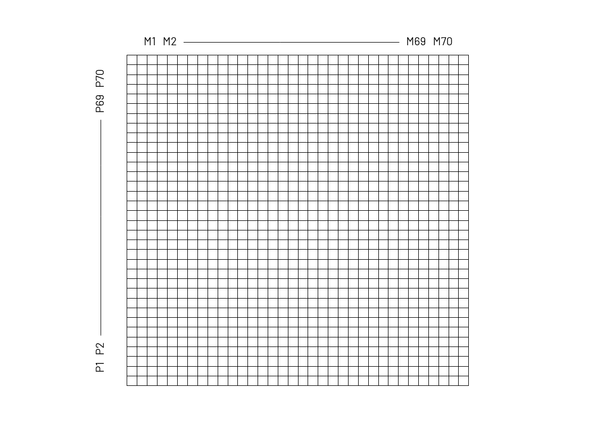
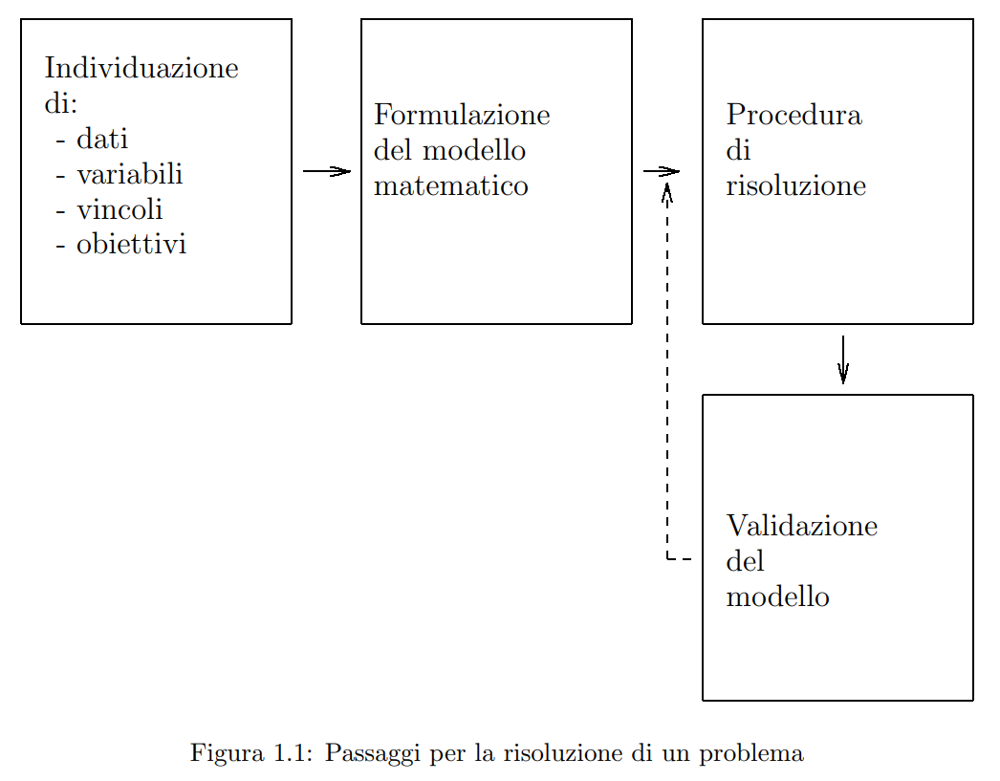
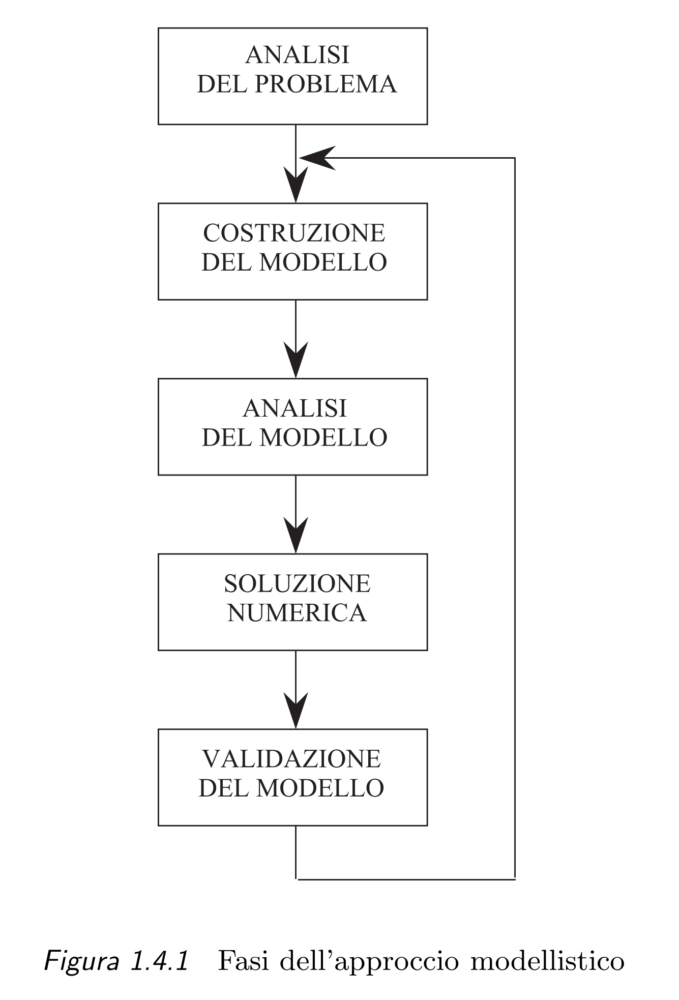

<!-- 
COLORI:
- ROSSO: #DF5452;
- GRIGIO: #252525;
- BLU: #379AD3;
- VERDE: #529E72;
- GIALLO: #FDDC5C.
-->

# Ricerca Operativa  

## Indice  

- [Introduzione](#introduzione)  
  - Formulazione di problemi decisionali in termini di programmazione matematica.
  - ~~Classificazione dei problemi di programmazione matematica~~.
  - Teoria della programmazione lineare.
  - [MODELLI della Ricerca Operativa](#modelli-della-ricerca-operativa)
- [La Programmazione Matematica](#la-programmazione-matematica)
- [Il metodo del **SIMPLESSO PRIMALE**](#il-metodo-del-simplesso-primale)
- Il metodo delle VARIABILI ARTIFICIALI.
- Teoria della dualità nella programmazione lineare.
- Il metodo del **SIMPLESSO DUALE**.
- Il metodo PRIMALE-DUALE.
- Il linguaggio AMPL.
- La libreria di algoritmi CPLEX.
- [Bibliografia](#bibliografia)  

## Introduzione  

> "*OR can help you in make better decision and it is clear that there are many, many people and companies out there in the real world that need to make better decision*."  
> - J. E. Bearsley  

  

La <abbr style="font-weight:bold;" title="dall’inglese Operational Research, OR, o Management Science, MS, o Decision Science, DS">Ricerca Operativa</abbr> si occupa di studiare e <u>gestire i processi decisionali</u> (com’era intuibile dal nome) per valutarne le conseguenze e individuare le decisioni che ottimizzano le loro prestazioni attraverso l’applicazione del metodo scientifico.  

In altre parole, si occupa di trovare la <i>migliore</i> soluzione <i>possibile</i> di un dato problema reale.  

- il termine «***possibile***» richiede di poter distinguere una soluzione che possa essere utilizzata nella pratica, detta «soluzione ammissibile», da una che non può esserla.  
- il termine «***migliore***» richiede di poter confrontare due soluzioni ammissibili, distinguendo la migliore dalla peggiore, o stabilendo che le due soluzioni sono equivalenti.  

  

PERCHÉ e QUANDO è nata?
  

  > Riassumendo potremmo dire che questa disciplina nasce negli anni appena precedenti alla WWII con la formazione di un team di scienziati (*OR-Team*) per studiare problemi tattici e strategici in operazioni militari.  

  ---

  La RO nasce come disciplina autonoma al fine di progettare e gestire sistemi complessi facendo uso di **strumenti matematici e informatici** anche molto avanzati che permettono di **determinare soluzioni efficienti** nelle diverse realtà applicative.  

  **L’origine e l’etimologia del nome è bellica ed ha sede britannica**:  

  
  
  
La sua prima iterazione si ebbe nel 1936, pochi anni prima dello scoppio delle bombe atomiche in Giappone, per merito della Royal Air Force (RAF) britannica che stava conducendo un esperimento (<i>Biggin Hill Experiment</i>) sull’uso del radar per la difesa aerea, provando ad integrare i dati ottenuti dai radar con quelli osservati a terra.
  

  > Successivamente, nel 1937 vi fu la prima esercitazione e i **risultati** furono abbastanza **soddisfacenti per la parte tecnica** del radar, ma non lo furono per la parte gestionale. L’intuzione che si ebbe per migliorare la copertura di questi radar fu quella di aggiungere altre 4 stazioni radar nel 1938, anno della seconda esercitazione. Da questa scelta, indirettamente, **aumentò la difficoltà** di integrare la mole di dati che adesso avevano a disposizione, ovvero gli **aspetti operativi**.
  > 
  > Colui che redasse in seguito la relazione conclusiva del progetto utilizzò l’espressione "*Operational Research*" e questa fu la prima volta nella storia che questa espressione venne utilizzata. Nella sua mente ciò doveva significare "*Ricerca nelle Operazioni* (militari)".  
  >    
  > L’ultima esercitazione pre-bellica la si fece nel 1939, con l’ausilio di una buona integrazione dei dati che venivano sia dai radar che dai velivoli. Nel 1940 poi grazie agli studi realizzati dall’***O.R.-Team*** (un gruppo di studiosi appartenenti a tante branchie diverse, a dimostrazione del fatto che questa è una scienza molto interdisciplinare) vennero salvati molti piloti e aerei, riconoscendo definitivamente gli importanti contributi strategi di questa tecnica nel conflitto mondiale. Nel 1941, poi, con la nascita formale della "***Operational Research Section***" abbiamo il primo tentativo di integrare, in un unico gruppo di ricerca, scienziati di origini e competenze diverse, aventi tutti un unico scopo finale. Il successo fu tale da far nascere nuovi gruppi simili anche negli altri paesi e si stima che nel corso della Seconda Guerra Mondiale furono complessivamente impegnati tra Gran Bretagna, USA e Canada oltre 700 scienziati.  
  

  
  
  
Al termine del conflitto vi fu una «riconversione» dell’approccio verso altri settori diversi da quello militare, ma il suo sviluppo e la sua espansione non furono uniformi poiché richiedevano un alto investimento iniziale in termini di costi dovuti all’acquisito dei <a href="./Architettura.md/#first-generation-1945-1955-vacuum-tubes">primi calcolatori</a>
.  

  > In particolare, vi furono differenze abissali nella sua diffusione tra l’Italia e gli USA (che prendiamo come riferimento per indicare il resto del mondo):  
  > 
  > - In **Italia** si resero conto dell’utilità del modello quantitativo, ma non essendoci persone particolarmente esperte della disciplina questi sistemi informativi erano utilizzati in maniera limitate e per lo più gestivano principalmente grossi database, lasciando inoltre la decisione su come risolvere il problema ad una persona con esperienza nell’ambito, rendendo quindi questo solo uno **strumento a supporto delle decisioni**.  
  > - Negli USA, invece, dopo un grande successo (ed entusiasmo) della disciplina, che si ebbe sino agli anni Settanta, vi fu un «ridimensionamento», dovuto alla mancanza di strumenti di calcolo potenti (i pc non sono ancora abbastanza efficienti e convenienti per essere utilizzati dalle aziende) e all’inadeguatezza dei metodi risolutivi utilizzati (soprattutto in relazione a problemi di grandi dimensioni).  
  

  ---

  In anni più recenti nel mondo del lavoro ci sono proprio figure professionali specifiche (come ingegneri informatici o gestionali) per questa disciplina all’interno delle aziende e, attualmente, la richiesta di esperti di RO in ambiti industriali e nei servizi è MOLTO forte.    

  

*La sensibilità nei confronti della RO è fortemente cresciuta, assieme alla **consapevolezza che l’accresciuta potenza di calcolo non è da solo sufficiente a permettere la risoluzione dei problemi***.  

  

A dimostrazione della suddetta affermazione propongo il famoso <strong style="color:#529E72;">esperimento di George Dantzig</strong>.
  
  

  Si tratta di un problema di assegnamento che chiede di assegnare univocamente **70 persone** a 70 mansioni. Ciò che ci interessa è il lavoro utile (profitto) prodotto da una persona nello svolgere la sua mansione, cioè trovare il lavoro che egli è in grado di svolgere meglio.  

  Di seguito ho creato una matrice. Il mio scopo è quindi quello di mettere un asterisco per ogni persona in modo che tutte le righe e colonne alla fine siano completate e abbiano un solo asterisco. Come dati del problema abbiamo inoltre il profitto che la persona $\small i$-esima ottiene nell’essere assegnata alla mansione $\small j$-esima.  

    

  Se ci affidassimo al buon senso, proveremmo a capire il valore utile che la persona $\small i$-esima ottiene nell’essere assegnata alla mansione $\small j$-esima, per poi provare ogni combinazione fino ad ottenere quella col maggiore profitto possibile. Dovremo quindi confrontare $\small 70! \sim 10^{100}$.  

  Per renderci conto di quanto questo metodo sia inefficace poniamo il seguente quesito: avrebbe esplorato tutti gli assegnamenti possibili...  
  - un computer che esegue un milione di operazioni al secondo, in funzione dal Big Bang (15 miliardi di anni fa) fino ad oggi (1990)? **NO**.  
  - un computer che esegue un miliardo di operazioni ogni nano secondo, in funzione dal Big Bang fino ad oggi? **NO**.  
  - se ricoprissimo la Terra di questi computer che lavorano in parallelo? **NO**.  
  - se ricoprissimo $\small 10^{40}$ Terre di questi computer, in funzione dal Big Bang ad oggi, che lavorano in parallelo?  **FORSE SI**.  
  
  ---
  
  Di fronte all’impossibilità di enumerare tutti i casi possibili per determinare la soluzione migliore, negli anni Trenta, l’unica strada percorribile era quella di adoperare un approccio che Dantzig definì *"AD HOC" GROUND-RULE*: affidarsi al buon senso di persone, che guidate dall’esperienza e dal buon senso stabiliscono regole "ad hoc" da seguire per risolvere il problema.
  

Ogni volta che dobbiamo prendere una decisione entrano in gioco i seguenti componenti:  

- **DATI**, che rappresentano tutti i valori noti a priori.  
- **VARIABILI**, che sono le entità controllate dal decisore; al variare di esse varia anche il valore del criterio e tra tutti i possibili valori che possono assumere si devono scegliere quelli che forniscono il miglior valore possibile del criterio.  
- **VINCOLI**, che limitano le possibili scelte del decisore (i possibili valori delle variabili).  
- **OBIETTIVO**, che coincide con il criterio fissato per confrontare le diverse possibili scelte del decisore.  

  

Ad esempio:
  

  

Supponiamo di dover uscire di casa e poter prendere con voi uno solo dei seguenti tre oggetti: un libro che vale 10€, una macchina fotografica che vale 2000€ ed una borsa da 500€. Dovete decidere quale oggetto portare con voi, tenuto conto che vi interessa prendere un oggetto di valore massimo. L’esempio è molto banale e non c’è bisogno di scomodare la Ricerca Operativa per capire che occorre prendere la macchina fotografica. Tuttavia in esso sono già presenti tutte le componenti tipiche di una decisione:  
- **DATI**: i valori dei tre oggetti;  
- **VARIABILI**: per ogni oggetto il decisore (cioè voi) deve decidere se prenderlo oppure no;  
- **VINCOLI**: può essere preso un solo oggetto;  
- **OBIETTIVO**: prendere l’oggetto di valore massimo.  

  

Un metodo per arrivare alla *miglior* soluzione *possibile* è l’APPROCCIO MODELLISTICO, diviso in due parti:  

  
  

- Rappresentazione del problema attraverso un **modello** matematico;  
- Sviluppo di un **metodo** matematico che permetta di determinare una soluzione ottima.  

  

L'approccio modellistico prevede **5 fasi**:  
1. ***ANALISI DELLA STRUTTURA DEL PROBLEMA***, per invididuarne i legami logico-funzionali e gli obiettivi;  
2. ***FORMULAZIONE DEL MODELLO***, in cui si descrivono in termini matematici le caratteristiche principali del problema: DATI, VARIABILI, VINCOLI e OBIETTIVO;  
3. ***ANALISI DEL MODELLO***, che prevede la deduzione, per via analitica, di alcune importanti proprietà:  
   - *esistenza* ed *unicità* della soluzione ottima;  
   - *condizioni di ottimalità*, cioè <abbr title="(necessarie, sufficienti, ecc.)">caratterizzazione</abbr> analitica della soluzione ottima;  
   - *stabilità* delle soluzioni al variare dei dati o di eventuali parametri presenti.  
4. ***SOLUZIONE NUMERICA***, mediante opportuni algoritmi di calcolo;  
5. ***VALIDAZIONE DEL MODELLO***: la soluzione, ammissibile per il modello, deve essere poi <abbr title="attraverso metodi di simulazione o verifica sperimentale">interpretata</abbr> dal punto di vista applicativo in modo da evitare che abbia scarso rilievo pratico.  

La definzione del modello si configura quindi come un processo di raffinamento iterativo, che può essere schematizzato come in Figura 1.4.1.

### MODELLI della Ricerca Operativa  

Con il termine *modello*, solitamente si fa riferimento a *modelli concreti*, come lo possono essere quelli di una nave, un palazzo o più in generale di una struttura appositamente costruita per mettere in evidenza caratteristiche principali di alcuni oggetti reali.  
Nella Ricerca Operativa, come in tante altre discipline, spesso trarremo invece ***modelli astratti*** (<abbr title="La nozione di modello matematico per rappresentare il mondo reale non è di certo di origine recente: già Pitagora nel IV secolo a.C. tentava di costruire un modello matematico dell'Universo, anche se sotto una luce più esoterica che scientifica." style="font-weight:bold; font-style:italic;">matematici</abbr>), i quali usano il simbolismo dell'algebra per mettere in evidenza un insieme di relazioni che descrivono in modo semplificato, ma sempre rigoroso, uno o più fenomeni del mondo reale.  
La <abbr title="(dagli ambiti più tradizionali a settori lontani come le scienze sociali e la psicologia)">notevole diffusione</abbr> della modellistica matematica è dovuta anche al fatto che essa può essere facilmente studiata grazie all'uso dei moderni calcolatori elettronici.  

I modelli matematici si suddividono poi in ***stocastici*** (considerano grandezze influenzate da fenomeni aleatori, casuali intrinsecamente, come il traffico) e ***deterministici*** (considerano grandezze esatte): inoltre, a seconda delle iterazioni tra grandezze che siano immediate o distribuite nel tempo, si parla di modelli ***statici*** e ***dinamici***.  

Nel seguito analizzeremo i modelli più comunemente usati: determinisici e statici; in particolare si farà riferimento ai *modelli di **programmazione matematica***. Si osservi infine che in questo contesto il termine "programmazione" è inteso nel senso di "pianificazione", non di programmi (codici) scritti in quale linguaggio di programmazione. Questi ultimi sono caratterizzati da tre elementi fondamentali:  
- **variabili** associate alle grandezze reali; sono "esogene" se incontrollabili (prendendo il nome di "parametri o "dati") o "endogene", se controllabili da parte del decisore (e prendono il nome di "variabili di decisione", o semplicemente variabili).  
- **vincoli** (relazioni matematiche) esistenti fra le variabili di decisione e le limitazioni derivanti da considerazioni di varia natura (fisica, economica, ecc.), come nel caso di un budget (che si traduce in "$\small \text{budget} \le 1000$").  
  Una soluzione che rispetti tutti i vincoli si dice *soluzione ammissibile* e l'insieme di queste ultime costituisce la *regione ammissibile* del modello.  
- **obiettivo** da minimizzare (es. costi) o massimizzare (es. profitto).  

## La Programmazione Matematica

Un ruolo di fondamentale importanza lo avrà lo studio dei problemi di Ottimizzazione, nei quali si desidera minimizzare o massimizzare una funzione reale, le cui variabili sono vincolate ad appartenere ad una insieme prefissato che è descritto attraverso un numero finito di disuguaglianze o uguaglianze.  

$\small \text{problema di Ottimizzazione} = \begin{cases} \text{min/max} \ f(x) \\ x \in S \end{cases}$  

Si parlerà indifferentemente di problemi di massimo o di minimo in quanto vale $\small \min_ {x \in S} \ f(x) = - \max_ {x \in S} \ (-f(x))$.  

La funzione reale (di $\small n$ variabili reali) $\tiny f$ viene chiamata *funzione obiettivo* ($\small f(x_1, x_2, \dots, x_n)$) e l'insieme $\small S$ è l'*insieme ammissibile* (delle possibili soluzioni del problema). Un punto $\small x \in S$ si chiama *soluzione ammissibile*.  
L'insieme ammissibile $\small S$ è un sottoinsieme di $\small \mathbb{R}^n$ e quindi $\small x = (x_1, x_2, \dots, x_n)^T$ è una variabile vettoriale $\small n$-dimensionale.  

---

Si riportano di seguito alcune definizioni fondamentali riguardanti i problemi di Ottimizzazione (PO):  

- Il PO si dice *inammissibile* se $\small S = \emptyset$, cioè se non esistono soluzioni ammissibili.  
- Il PO si dice *illimitato* (inferiormente) se comunque scelto un valore $\small M > 0$ esiste un punto $\small x \in S$ tale che $\small f(x) < -M$.  
- Il PO ammette una *soluzione ottima* (finita) (o *minimo di globale*) se esiste un $\small x^* \in S$ tale che $\small f(x^*) \le f(x)$ per ogni $\small x \in S$.  
Il corrispondente valore $\small f(x^*)$ si dice *valore ottimo*.  
- $\small b_i$ è il *valore noto*.  

  

Ogni disuguaglianza $\small g_i(x) \ge b_i$ prende il nome di *vincolo* e l'insieme ammissibile è formato da tutti quei punti che sono soluzione del sistema di disuguaglianze  

$\small \begin{cases} g_1(x) \ge b_1 \\ g_2(x) \ge b_2 \\ \quad \ \dots \\ g_i(x) \ge b_i \end{cases}$  

Ovviamente, le disuguaglianze possono essere anche di altro tipo e si può sempre trasformare un vincolo da $\small g_i(x) \le b_i$ a $\small -g_i(x) \ge -b_i$.  

Quindi, ritornando alla defizione iniziale, un problema di ottimizzazione (o di Programmazione Matematica) si può riscrivere nella forma  

$\small \begin{cases} \text{min} \ f(x) \\ g_i(x) \ge b_i, & i = 1, \ \dots, m \end{cases}$  

---

I problemi di Programmazione Matematica si possono classificare in base alla *struttura delle funzioni che li definiscono*:  

- problemi di **PROGRAMMAZIONE LINEARE** (PL)  
  La funzione obiettivo e TUTTE le funzioni che definiscono i vincoli sono *lineari*;  
- problemi di **PROGRAMMAZIONE NON LINEARE** (PNL).  

Formalizziamo infine alcuni semplici concetti dei vincoli in un problema di programmazione matematica:  

  

Un vincolo del tipo $\small g_i(x) \ge b_i$ si dice:  

- ***soddisfatto*** in un punto $\small \bar{x}$ se $\small g(\bar{x}) \ge b$;  
- ***violato*** in un punto $\small \bar{x}$ se $\small g(\bar{x}) < b$;  
- ***attivo*** in un punto $\small \bar{x}$ se $\small g(\bar{x}) = b$;  
- ***ridondante*** se con al sua *eliminazione l'insieme rimane immutato*.  

Una soluzione è di **BASE AMMISSIBILE** se:  
- è scritta in forma standard;  
- è di *base*: tutti i suoi componenti sono positivi e sono tanti quante le restrizioni di uguaglianze, cioè le righe del tableau;  
- è ammissibile: rispetta tutti i vincoli.  

## Il metodo del SIMPLESSO PRIMALE  

I problemi della Programmazione Lineare possono essere in:  
- forma **CANONICA** (**NORMALE**): ci sono solo disuguaglianze, ogni variabile è $\small \ge 0$ e la funzione obiettivo è espressa come massimo.  
  In caso di uguaglianze si rimpiazzano con la coppia di vincoli di disuguaglianze che esso induce.  
- forma **STANDARD**: 
  1. la <u>funzione obiettivo</u> è <u>espressa come <strong style="font-style:italic;">minimo</strong></u>; in caso sia espressa come *massimo* si moltiplica ogni valore per $\small (-1)$. Le costanti additive e moltiplicative positive possono essere trascurate. Le costanti negative possono essere eliminate cambiando il verso di ottimizzazione.  
  2. tutte le <u>variabili</u> devono essere <u>positive o nulle</u>;  
      - NON ci sono variabili LIBERE (perché possono assumere qualsiasi valore), ma nel caso si applica una sostituzione del tipo $\small x_i = U - V$, con $\small U \ge 0$ e $\small V \ge 0$.  
      - NON ci sono variabili NEGATIVE, in caso si fanno sostituzioni del tipo $x_i = -y_i$ e $y_i \ge 0$.  
      - il TERMINE NOTO deve essere positivo, in caso non lo sia si moltiplica tutto per $\small (-1)$.  
  1. tutti i <u>vincoli</u> sono <u>espressi come uguaglianze</u>; in caso non lo siano:
     - si aggiungono variabili di ***slack*** (positive) per i vincoli di disuguaglianza $\small <$ o $\small \le$;  
     - si sottraggono variabili di ***surplus*** (negative) per i vincoli di disuguaglianza $\small >$ o $\small \ge$.  
- nessuna delle due forme precedenti.  

---

Il Metodo del Simplesso, ideato nel 1947 da George Dantzig, si applica a problemi di Programmazione Lineare "***in forma standard***".  

## Bibliografia  

- Caramia Massimiliano (<massimiliano.caramia@uniroma2.eu>), Tor Vergata;  
- [Roma Massimo](#https://youtube.com/playlist?list=PLAQopGWlIcyZankm1hHCSOdBilSGC3Svg&si=VRGG98n4gnqOsjrH), Sapienza;  
- [Alan Turista](#https://youtube.com/playlist?list=PL6ooPzL-5yGFQn6X6pGgxdg7TeIbPH7eA&si=hgFvfD5SpAPOIxpv);  
- Palmarini Marco (thanks).  