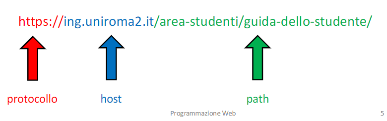
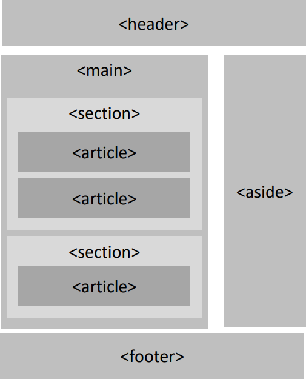

<!-- 
COLORI:
- ROSSO: #DF5452;
- GRIGIO: #252525;
- BLU: #379AD3;
- VERDE: #529E72;
- GIALLO: #FDDC5C.
-->

  

# **HTML**  

## Indice  

- [Esami](#esami)  
- [Introduzione](#introduzione)  
- [Struttura di documenti HTML](#struttura-di-documenti-html)  
- [Formulario HTML](#formulario-html)  
  - [HTML Links](#html-links)
- [Attributi HTML](#attributi-html)  
- [Bibliografia](#bibliografia)  
<br>

## Esami

- 25/06  
- 18/07  

## **Introduzione**  

Un file **HTML** utilizza dei **tag** (marcatori) per dire al browser come è strutturato; al loro interno vi sono gli **elementi** da mostrare, che possono anche essere ulteriori tag annidati. Il codice HTML viene quindi interpretato per generare la pagina visualizzabile dall'utente.  

<details>  
<summary style="margin-bottom:0.5em;">Internet e HTML</summary>  
<div style="border: 1px solid #aaa; border-radius: 0 0 4px 4px; padding: 1em; margin-top: -1px; margin-bottom:0.5em;">  

L'<abbr title="HyperText Markup Language">HTML</abbr> fu sviluppato nel 1991 da Tim Berners-Lee e la sua sintassi è stabilita dal World Wide Web Consortium (W3C). È il linguaggio di markup più usato per la realizzazione di pagine web (documenti digitali identificati da un <abbr title ="Uniform Resource Locator">URL</abbr>).  

L'Internet è una serie di dispositivi elettronici interconnessi attraverso un indirizzo <abbr title="Internet Protocol">IP</abbr> univoco per ogni dispositivo connesso alla rete (scopri il tuo su [WhatsMyIP.org](https://www.whatsmyip.org/)). Solo chi è connesso è in grado di condividere informazioni e uno dei modi in cui è possibile farlo è attraverso il <abbr title="World Wide Web">WWW</abbr>, un insieme di pagine web e documenti collegati fra loro attraverso collegamenti ipertestuali (link).  



Il **web** è uno dei servizi che utilizzano che utilizzano l'infrastruttura internet, altri sono email e messaggistica istantanea.  

Per navigare nel WWW, gli utenti utilizzano un **browser** web (come Chrome, Firefox, Safari), che agisce da **client** web, ovvero un software che invia richieste ai **server web** (come Apache o nginx) e interpreta i linguaggi web, visualizzando le pagine ricevute.  

I protocolli di comunicazione principali per scambiare documenti sono <abbr title="HyperText Transfer Protocol">HTTP</abbr> e <abbr title="versione sicura di HTTP con crittografia SSL/TLS">HTTPS</abbr>: definiscono come devono essere formattati e trasmessi i messaggi.  

Il <abb title="Domain Name System">DNS</abbr> traduce i nomi di dominio (es. `www.google.com`) in indirizzi IP numerici, necessari per identificare univocamente i server su Internet (possiamo considerla come una rubrica). <u>Quando un utente inserisce un URL nel browser</u>, il browser contatta un server DNS per ottenere l'indirizzo IP corrispondente. Se l'indirizzo IP è già stato memorizzato nella cache locale, il browser lo utilizza direttamente, accelerando il caricamento della pagina.  

Nel concentro un Browser:  
1. Scopre dove si trova la pagina web, utilizzando il DNS per tradurre URL in indirizzo IP numerico;  
2. Richiede che la pagina venga inviata (GET verso il server);  
3. Controlla e verifica ciò che riceve;  
4. Mostra la pagina all'utente.  
</div></details>

<details>  
<summary style="margin-bottom:0.5em;">Origini di Internet</summary>  
<div style="border: 1px solid #aaa; border-radius: 0 0 4px 4px; padding: 1em; margin-top: -1px; margin-bottom:0.5em;">  

Ripercorrendo brevemente la storia di Internet, l'idea nacque negli Stati Uniti, anni Cinquata, durante la Guerra Fredda, quando si resero conto che sarebbe stato comodo avere un sistema di comunicazione che non potesse essere colpito da un attacco nucleare sovietico.  
Nel 1958, il presidente Eisenhower istituì la <abbr title="Defense Advanced Research Projects Agency">DARPA</abbr>, con l'obiettivo di sviluppare una rete di computer decentralizzata chiamata **ARPANET**. Nel 1969, Leonard Kleinrock riuscì a inviare il primo messaggio tra due computer situati presso l'Università della California e l'Università di Stanford, segnando l'inizio della comunicazione tra computer distanti.  

- **Sviluppo dei protocolli**:  
  Nel 1974, gli informatici Bob Kahn e Vint Cerf introdussero il **protocollo TCP/IP**, che suddivide i dati in pacchetti per una trasmissione efficiente e sicura, diventando la base della comunicazione su Internet.  
- **Nascita del World Wide Web**:  
  Il 6 agosto 1991, al CERN di Ginevra, Tim Berners-Lee sviluppò il primo sito web della storia: il [**World Wide Web**](https://info.cern.ch/hypertext/WWW/TheProject.html), introducendo strumenti fondamentali come **HTML**, **HTTP** e gli **URL** e rendendo accessibili informazioni a livello globale.  
  Nel 1992 poi i server web divennero 50 e con la nascita di NCSA Mosaic, il primo Browser grafico, il Web iniziò ad essere "di massa".  
  Approfondimenti su [W3C's History Archives](https://www.w3.org/History/).  
- **Diffusione in Italia**:  
  Il 30 aprile 1986, l'Italia si collegò per la prima volta ad ARPANET, segnando l'inizio dell'era di Internet nel paese.  
</div></details>  

## **Struttura di documenti HTML**

Come standard, si nomina `index.html` la pagina principale di ogni sito perché i server web lo cercano automaticamente nella cartella principale, quindi questo permetterebbe di accedere al sito senza dover digitare il <abbr title='Digiterebbero "https://www.miosito.com/" invece di "https://www.miosito.com/index.html".'>nome del file</abbr>, rendendo gli URL più puliti e migliorando l'esperienza utente.  

- `<!DOCTYPE> html`: ogni file HTML inizia con questa dichiarazione (NON è un tag e NON è <abbr title="L'unica versione corretta è `<!DOCTYPE> html`, tutte le altre non vanno bene (ad esempio: `<!DOCTYPE> HTML`, `<!doctype> html` e così via...).">case sensitive</abbr>), fondamentale per indicare al browser la versione dell'HTML da utilizzare.  

Gli elementi all'interno di un documento HTML vanno a formare un albero, la cui radice (che contiene tutti gli altri elementi) è `<html lang="it">`: tag che rappresenterà la radice della nostra pagina. L'attributo `lang` specifica la lingua del documento, per migliorare l'accessibilità.  

- `<head>`: contiene i metadati (dati sui dati). Tipicamente definisce:  
  - `<title>` (necessario e univoco): specifica il titolo della pagina HTML (visualizzato nella toolbar del browser, usato dai motori di ricerca e quando si memorizza nei preferiti una pagina).  
  - `<meta>` in genere specifica il set di caratteri, la descrizione della pagina, le parole chiavi, l'autore del documento e le impostazioni della finestra di visualizzazione.  
  - `<link>` collega la pagina HTML ad altri documenti o risorse esterno. In genere lo si usa per lo "style sheets" esterno o per aggiungere la **favicon** al sito web (una piccola immagine mostrata vicino al titolo nella toolbar del browser)
  - [`<base>`](https://www.w3schools.com/tags/tag_base.asp) specifica un URL di default e un target per ogni link nella pagina.  
  - `<style>`, definisce informazioni sulle stile (CSS) senza dover ricorrere ad un file esterno.  
  - `<script>` incorpora un client-side script (JavaScript).  
  - `<noscript>` mostra un messaggio all'utente se il suo browser non supporta script JavaScript.  

HTML5 introduce il concetto di **markup semantico**, che consiste nel scegliere l'elemento HTML che meglio descrive il contenuto. Questa distinzione è nata perché Google così possa indicizzare al meglio il nostro sito.  



Il `<body>` contiene la parte visibile della pagina ed è diviso nelle sezioni:  
- `<header>`: elementi introduttivi come il logo e il menu di navigazione.  
  - `<nav>`: insieme di collegamenti per la navigazione del sito. Tipicamente vi si mettono delle liste, ma non è detto che tutte le liste debbano andare qui. Nei siti responsivi spesso viene compressa per i dispositivi mobile.  
- `<main>`: Contenuto principale della pagina.  
  - `<section>`: raggruppa contenuti correlati all'interno della pagina, come argomenti diversi all'interno di un articolo.  
  - `<article>`: contenuto indipendente, come un post di blog o un articolo di giornale.  
  - `<figure>`: raggruppa immagine (``) e didascalia (`<figcaption>`). Esempio [qui](https://www.w3schools.com/html/tryit.asp?filename=tryhtml_figcaption).  
- `<aside>` (sidebar): elementi correlati ma "marginale" rispetto al contenuto, quindi senza necessità che vengano indicizzati da Google. Tipicamente usato per sondaggi, citazioni, informazioni aggiuntive, annunci, donazioni o link. Non ha un aspetto di default.  
- `<footer>`: Include informazioni di chiusura, come copyright o link ai social.  

<details>
<summary style="font-weight:bold;"><span style="color:#529E72; padding:1px; border-radius:4px;">Esempio</span> di una pagina conforme agli standard:</summary>

```html  
<!DOCTYPE html>
<html lang="it">
<head>
  <title>Titolo della pagina</title>
  <meta charset="UTF-8">
  <meta name="viewport" content="width=device-width, initial-scale=1.0">
  <meta name="description" content="Free Web tutorials">
  <meta name="keywords" content="HTML, CSS, JavaScript">
  <meta name="author" content="Simone">
  <link rel="icon" type="image/gif" href="../img/Web/favicon.gif">
  <link rel="stylesheet" href="styles.css">
  <script defer src="script.js"></script>
  <noscript>Your browser does not support JavaScript!</noscript>
</head>
<body>
  <header>
    
    <h1>Intestazione principale</h1>
    <nav>
      <ul>
        <li><a href="#">Home</a></li>
        <li><a href="#">Chi siamo</a></li>
        <li><a href="#">Contatti</a></li>
      </ul>
    </nav>
  </header>
  <main>
    <section>
      <h2>Sottotitolo</h2>
      <p>Testo del contenuto.</p>
    </section>
    <article>
      <h2>Articolo</h2>
      <p>Testo dell’articolo.</p>
    </article>
  </main>
  <footer>
    <p><small>Copyright &copy;2025 Nome Sito/Nome autore</small></p>
    <nav>
      <ul>
        <li><a href="">Previous</a></li>
        <li><a href="">Next</a></li>
      </ul>
    </nav>
  </footer>
</body>
</html>
```  
</details>

## **Formulario HTML**  

Le tabelle possono essere definite con il tag `<table>` come container, `<th>` per i titoli, `<tr>` per le righe e `<td>` per le colonne.  
Si possono migliorare con i tag presenti [qui](https://www.w3schools.com/html/html_tables.asp) (inutile riportarli ora).  

<details style="margin-top:-1rem; margin-bottom:1rem;">
<summary>Vediamone subito un <span style="font-weight:bold; color:#529E72; border-radius:4px;">esempio:</span></summary>

```html  
<!DOCTYPE html>
<html>
<head>
<style>
table {
  font-family: arial, sans-serif;
  border-collapse: collapse;
  width: 100%;
}

td, th {
  border: 1px solid #dddddd;
  text-align: left;
  padding: 8px;
}

tr:nth-child(even) {
  background-color: #dddddd;
}
</style>
</head>
<body>

<h2>HTML Table</h2>

<table>
  <tr>
    <th>Company</th>
    <th>Contact</th>
    <th>Country</th>
  </tr>
  <tr>
    <td>Alfreds Futterkiste</td>
    <td>Maria Anders</td>
    <td>Germany</td>
  </tr>
  <tr>
    <td>Centro comercial Moctezuma</td>
    <td>Francisco Chang</td>
    <td>Mexico</td>
  </tr>
  <tr>
    <td>Ernst Handel</td>
    <td>Roland Mendel</td>
    <td>Austria</td>
  </tr>
  <tr>
    <td>Island Trading</td>
    <td>Helen Bennett</td>
    <td>UK</td>
  </tr>
  <tr>
    <td>Laughing Bacchus Winecellars</td>
    <td>Yoshi Tannamuri</td>
    <td>Canada</td>
  </tr>
  <tr>
    <td>Magazzini Alimentari Riuniti</td>
    <td>Giovanni Rovelli</td>
    <td>Italy</td>
  </tr>
</table>

</body>
</html>
```  
</details>

| Tag            | Sezione (Dove va usato) | Descrizione                                                                     |
|:--------------:|:-----------------------:|:--------------------------------------------------------------------------------|
| `<hgroup>`     |   Dentro `<body>`       |  Indica che il titolo e il paragrafo che segue sono correlati                   |
| `<code>`       |   Dentro `<body>`       |  Mostra del testo come "codice" in *monospace*, ma non è preformattato          |
| `<pre>`        |   Dentro `<body>`       |  Preformatta un testo, mostrando gli spazi e gli accapo presenti in *monospace* |
| `<video>`      |   Dentro `<body>`       |  Incorpora i contenuti visivi     |
| `<audio>`      |   Dentro `<body>`       |  Incorpora i contenuti sonori     |
| `<div>`        |   Dentro `<body>`       |  container per altri tag, nessuno significato speciale |
| `<time>`       |   Dentro `<body>`       |  Rappresenta una data e/o un orario specifico; l'attributo `datetime` lo rende "machine-readable" per calendari, promemoria e motori di ricerca |
| `<blockquote>` |   Dentro `<body>`       |  Indica una sezione (come un articolo) presa (citata) da un sito esterno, indicato con l'attributo `cite="#"`  |
| `<q>`          |   Dentro `<p>`          |  Per brevi citazioni inline, integrabile con l'attributo `cite="#"` |
| `<strong>`     |   Dentro `<p>`          |  Grassetto    |
| `<b>`          |   Dentro `<p>`          |  Grassetto    |
| `<i>`          |   Dentro `<p>`          |  Corsivo      |
| `<em>`         |   Dentro `<p>`          |  Enfatizza il testo, normalmente visualizzato in corsivo |
| `<u>`          |   Dentro `<p>`          |  Sottolineato |
| `<s>`          |   Dentro `<p>`          |  Barrato      |
| `<del>`        |   Dentro `<p>`          |  Barrato      |
| `<mark>`       |   Dentro `<p>`          |  Indica del testo che dovrebbe essere evidenziato      |
| `<span>`       |   Dentro `<p>`          |  inline containter facilmente manipolabile con CSS     |
| `<sup>`        |   Dentro `<p>`          |  Definisce del testo in apice       |
| `<sub>`        |   Dentro `<p>`          |  Definisce del testo in pedice      |
| `<small>`      |   Dentro `<p>`          |  testo più piccolo                  |
| `<kbd>`        |   Dentro `<p>`          |  definisce keyboard input (per documenti tecnici) in *monospace*                    |
| `<wbr>`        |   Dentro `<p>`          |  In parole troppo lunghe definisce quando il browser la può spezzare (vedi esempio) |

Da integrare con quello nel [pdf](./FormularioPW.pdf).  

Il browser ignora gli spazi extra e le interruzioni di linea multiple, considerandoli come un singolo spazio.  
Invece, inserisce in automatico un accapo e uno spazio intorno ai tag di titoli e paragrafi.  

Unica accortezza per i titoli è quella di rispettare l'ordine logico: se usiamo un `<h3>` ci si aspetta che nel sito vi sia almeno un `<h2>` e un `<h1>`.  
Inoltre, `<p>` può contenere altri tag, ma generalmente meglio inserirci solo del testo.  
Infine, `<blockquote>` e `<q>` sono fondamentali se si prendono pezzi da altri articoli sul web per indicare la fonte poiché se si copia e basta si rischia che il nostro sito finisca in una black list di siti che copiano, con ovvi svantaggi per l'indicizzazione del sito.  

```html  
<!-- Questo è un commento in HTML. -->
```  

Le **LISTE** HTML possono essere di tre tipi:  
- *Unordered* combinano i tag `<ul>` (esterno) e `<li>`.  
- *Ordered* combinano i tag [`<ol>`](https://www.w3schools.com/tags/tag_ol.asp) (esterno) e `<li>`. I Browser le numera in automatico, ma è possibile cambiare il tipo di numerazione o specificare da che numero partire (`<ol start="50" style="list-style-type:upper-roman;">`).  
- *Descrittive*: definiti da coppie nome-descrizione, combinano i tag `<dl>` (esterno), `<dt>` (termine/nome) e `<dd>` (descrizione/valore).  

Ogni lista può contenere altre liste annidate.  

<details>
<summary style="font-weight:bold;"><span style="color:#529E72; padding:1px; border-radius:4px;">Esempi</span>:</summary>

```html  
<hgroup>
  <h2>Norway</h2>
  <p>The land with the midnight sun.</p>
</hgroup>
```  
```html  
<pre>
  My Bonnie lies over the ocean.
      My Bonnie lies over the sea.
    My Bonnie lies over the ocean.
    Oh, bring back my Bonnie to me.
</pre>  
```  
```html  
<p>
  HTML is <em>really</em>,
  <strong>REALLY</strong> fun!
</p>
```  
```html  
<pre><code class="python">
print("Hello World!")
</code></pre>
```  
```html  
<ul>
  <li>Coffee</li>
  <li>Tea</li>
  <li>Milk</li>
</ul>

<ol>
  <li>Coffee</li>
  <li>Tea</li>
  <li>Milk</li>
</ol>

<dl>
  <dt>Coffee</dt>
  <dd>Black hot drink</dd>
  <dt>Milk</dt>
  <dd>White cold drink</dd>
</dl>
```  
```html
<h1>The wbr element</h1>

<p>Try to shrink the browser window, to view how the very long word in 
the paragraph below will break:</p>

<p>This is a veryveryveryveryveryveryveryveryveryveryveryveryveryveryveryveryveryvery<wbr>longwordthatwillbreakatspecific<wbr>placeswhenthebrowserwindowisresized.</p>
```  
```html  
<p>Press <kbd>Ctrl</kbd> + <kbd>C</kbd> to copy text (Windows).</p>

<p>Press <kbd>Cmd</kbd> + <kbd>C</kbd> to copy text (Mac OS).</p>
```  
```html  
<p>Open from <time>10:00</time> to <time>21:00</time> every weekday.</p>
<p>I have a date on <time datetime="2008-02-14 20:00">Valentines day</time>.</p>
<p><b>Note:</b> The time element does not render as anything special in any of the major browsers.</p>
```  
```html  
<!-- Horizontal List with CSS for a navigation menu -->
<!DOCTYPE html>
<html>
<head>
<style>
ul {
  list-style-type: none;
  margin: 0;
  padding: 0;
  overflow: hidden;
  background-color: #333333;
}

li {
  float: left;
}

li a {
  display: block;
  color: white;
  text-align: center;
  padding: 16px;
  text-decoration: none;
}

li a:hover {
  background-color: #111111;
}
</style>
</head>
<body>

<ul>
  <li><a href="#home">Home</a></li>
  <li><a href="#news">News</a></li>
  <li><a href="#contact">Contact</a></li>
  <li><a href="#about">About</a></li>
</ul>

</body>
</html>
```  
</details>

---

|   Character reference     | Equivalente a |                          Descrizione                           |
|:-------------------------:|:-------------:|:---------------------------------------------------------------|
| `&lt;`                    | <             | Named reference per il simbolo "meno di"                       |
| `&gt;`                    | >             | Named reference per il simbolo "maggiore di"                   |
| `&amp;`                   | &             | Named reference per l'"e commerciale" (ampersand)              |
| `&quot;`                  | "             | Named reference per la virgoletta doppia                       |
| `&apos;`                  | '             | Named reference per la virgoletta singola (HTML5)              |
| `&nbsp;`                  | (spazio)      | Named reference per lo spazio non separabile (non-breaking)    |
| `&copy;`                  | ©             | Named reference per il simbolo di copyright                    |
| `&reg;`                   | ®             | Named reference per il simbolo di marchio registrato           |
| `&#34;`                   | "             | Numeric reference decimale per la virgoletta doppia            |
| `&hellip;`                | …             | Named reference per l'ellissi (puntini di sospensione)         |
| `&larr;`                  | ←             | Named reference per la freccia verso sinistra                  |
| `&uarr;`                  | ↑             | Named reference per la freccia verso l'alto                    |
| `&rarr;`                  | →             | Named reference per la freccia verso destra                    |
| `&darr;`                  | ↓             | Named reference per la freccia verso il basso                  |
| `&times;`                 | ×             | Named reference per il simbolo di moltiplicazione              |
| `&divide;`                | ÷             | Named reference per il simbolo di divisione                    |
| `&plusmn;`                | ±             | Named reference per il simbolo "più/meno" (plus-minus)         |

### **HTML Links**  

Con [`<a>`](https://www.w3schools.com/tags/tag_a.asp) si indicano i collegamenti ipertestuali (o link).  
Se omettiamo l'attributo `href` il browser non saprà dove puntare il link e quindi lo ignorerà, trattandolo come fosse semplice testo. Infine, sebbene non sia necessario, quando si crea un link verso la home page di un sito è opportuno terminare sempre l'indirizzo indicato da `href` con lo slash (`/`). Ad esempio: `href="http://www.alessandrostella.it/"`.  

Invece, con il <abbr title="un tag che non contiene alcun elemento e non necessita di un tag di chiusura (`</img>`)">tag vuoto</abbr> `` si possono gestire le immagini, che non vengono inserite direttamente nella pagina ma solo linkate ad essa. Questo tag richiede due attributi per funzionare:  
- `src`, che specifica il link o percorso dell'immagine;  
- `alt`, che mostra un testo alternativo all'immagine nel caso, per qualche ragione, non venga mostrata.  

Inoltre, è buona norma specificare anche `width` e `height` (se non presente potrebbe far sfarfallare la pagina nel caricamento iniziale).  

Con l'attributo `target` si specifica dove aprire il link. Può avere uno dei seguenti valori:  
- `_self` - Default. Opens the document in the same window/tab as it was clicked;  
- `_blank` - Opens the document in a new window or tab;  
- `_parent` - Opens the document in the parent frame;  
- `_top` - Opens the document in the full body of the window.  

<details style="margin-bottom:1rem;">
<summary style="font-weight:bold;"><span style="color:#529E72; padding:1px; border-radius:4px;">Esempi</span> vari sui link:</summary>

```html  
<!-- How to use an image as a link: -->
<a href="https://www.w3schools.com">
  
</a>

<!-- How to open a link in a new browser window: -->
<a href="https://www.w3schools.com" target="_blank">Visit W3Schools.com!</a>

<!-- How to link to an email address: -->
<a href="mailto:someone@example.com">Send email</a>

<!-- How to link to a phone number: -->
<a href="tel:+4733378901">+47 333 78 901</a>

<!-- How to link to another section on the same page: -->
<a href="#section2">Go to Section 2</a>

<!-- How to link to a JavaScript: -->
<a href="javascript:alert('Hello World!');">Execute JavaScript</a>

<!-- To use an HTML button as a link, you have to add some JavaScript code. -->
<button onclick="document.location='default.asp'">HTML Tutorial</button>

<!-- How to create an image map, with clickable regions. Each region is a hyperlink: -->


<map name="workmap">
  <area shape="rect" coords="34,44,270,350" alt="Computer" href="computer.htm">
  <area shape="rect" coords="290,172,333,250" alt="Phone" href="phone.htm">
  <area shape="circle" coords="337,300,44" alt="Cup of coffee" href="coffee.htm">
</map>
```  
</details>

### **HTML Forms**  

I forms sono containter per diversi tipi di `**[[[(((TODO)))]]]...**`

-	`<form>` creazione di form
  -	`<label>` rappresenta un’etichetta per la scrittura di etichetta (con br per andare a capo)
  -	`<input type>` per la parte di ciò che vogliamo inserire.
    -	text, password, radio, checkbox, submit, reset, button
  -	`<fieldset>` creare un gruppo logico, simile al form, 
      -	`<legend>` scrittura di una leggenda dentro il bordo alto.

https://www.w3schools.com/html/html_forms.asp

<details style="margin-bottom:1rem;">
<summary style="font-weight:bold;"><span style="color:#529E72; padding:1px; border-radius:4px;">Esempio</span>:</summary>

```html  
<!DOCTYPE html>
<html>
<body>

<h2>HTML Forms</h2>

<form action="/action_page.php">
  <label for="fname">First name:</label><br>
  <input type="text" id="fname" name="fname" value="John"><br>
  <label for="lname">Last name:</label><br>
  <input type="text" id="lname" name="lname" value="Doe"><br><br>
  <input type="submit" value="Submit">
</form> 

<p>If you click the "Submit" button, the form-data will be sent to a page called "/action_page.php".</p>

</body>
</html>
```  
</details>

## **Attributi HTML**

Ogni tag può avere <b>attributi</b>, che forniscono informazioni aggiuntive sugli elementi. Gli attributi sono definiti nei tag di apertura e seguono la sintassi <code>chiave="valore"</code>. Se il valore contiene gli apici doppi si usano i singoli, e viceversa. Per standard, si scrivono in minuscolo, nonostante tutti possano essere scritti anche in maiuscolo.  

L'attributo `title` mostra informazioni aggiuntive su un elemento quando ci si passa sopra col mouse. È un **attributo GLOBALE**, dunque può essere usato in ogni tag HTML. Alcuni degli altri attributi globali sono:  

- `lang` definisce la lingua di un tag, usato principalmente in `<html>` e in blocchi di testo scritti in lingue diverse da quella principale.  
- [`class`](https://www.w3schools.com/html/html_classes.asp) e [`id`](https://www.w3schools.com/html/html_id.asp), usati come riferimenti negli style sheet CSS e persino con JavaScript.  
  Particolarità di `id` è che <u>deve essere univoco</u> e non deve contenere caratteri di spazio.  

<!-- Unità di misura rem ecc. -->

## Bibliografia  

- [W3CSchools HTML](#https://www.w3schools.com/html/default.asp);  
- [Mozilla Web Docs](#https://developer.mozilla.org/en-US/docs/Learn/HTML);  
- Programmazione Web, Pierpaolo **Loreti**, 2024-2025.  
  <details style="background-color: #252525; color:white; border-radius: 10px; padding: 15px; box-shadow: 0.5px 0.5px 2px black; margin-bottom: 1em;">
    <summary style="cursor:pointer; font-weight:bold;">Testi e siti di riferimento</summary>

    <div style="display:flex; align-items:flex-start; gap:20px;">
      
      <p style="font-size: 0.75rem;"><a href="https://amzn.eu/d/7e6HZ2H"><i>The Definitive Guide to HTML5</i></a> - Adam Freeman</p>
    </div>
    <div style="display:flex; align-items:flex-start; gap:20px;">
      
      <p style="font-size: 0.75rem;"><a href="https://amzn.eu/d/cbg9eA1"><i>Javascript - The Definitive Guide 6th Edition</a></i> - David Flanagan</p>
    </div>
    <div style="display:flex; align-items:flex-start; gap:20px;">
        
        <p style="font-size: 0.75rem;"><a href="https://learningwebdesign.com/"><i>Learning Web Design - A Beginner's Guide to HTML, CSS, JavaScript, and Web Graphics</i></a></p>
    </div>
    <div style="display:flex; align-items:flex-start; gap:20px;">
      
      <p style="font-size: 0.75rem;"><a href="https://womengovtcollegevisakha.ac.in/departments/Learning%20PHP,%20MySQL,%20JavaScript,%20CSS%20&%20HTML5_%20A%20Step-by-Step%20Guide%20to%20Creating%20Dynamic%20Websites%20(%20PDFDrive%20).pdf"><i>Learning PHP, MySQL, JavaScript, CSS & HTML5</i></a> - Robin Nixon</p>
    </div>
    <div style="display:flex; align-items:flex-start; gap:20px;">
      
      <p style="font-size: 0.75rem;"><a href="https://amzn.eu/d/adcmSWw"><i>Full-Stack Web Development with Vue.js and Node</i></a> - Aneeta Sharma</p>
    </div>
  </details>

Javascript:  
- [W3CSchools JavaScript](https://www.w3schools.com/js/default.asp);  
- [javascript.info](https://javascript.info/).  

MongoDB:  
- <https://www.javatpoint.com/mongodb-tutorial>.  

Node JS:  
- <https://nodejs.org/en/docs/guides/>.  