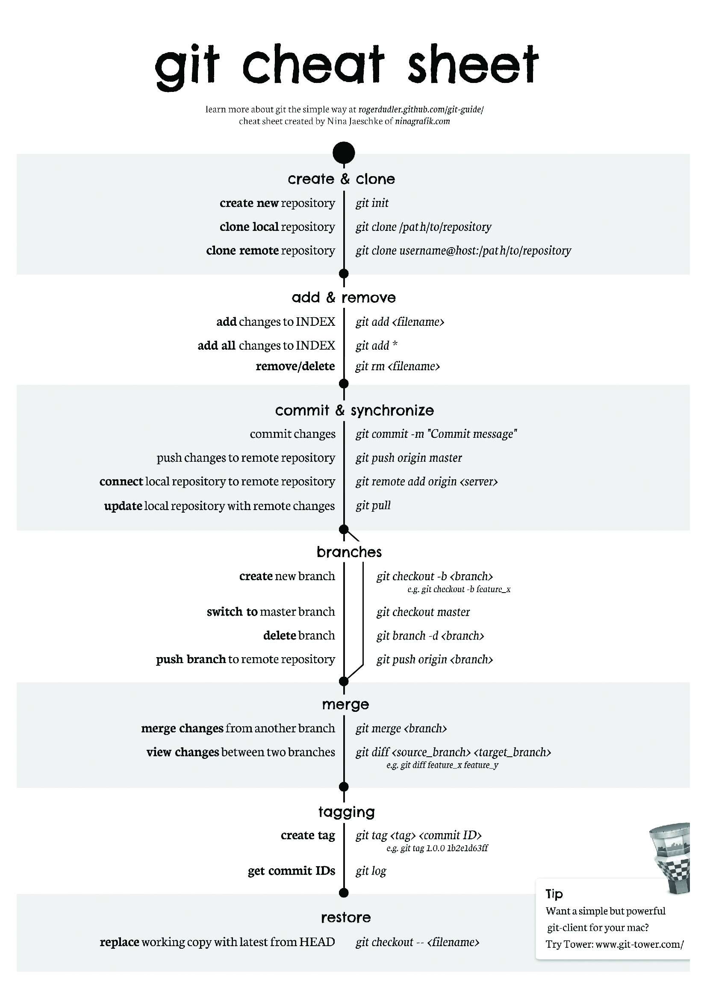

# Indice

- [Introduzione](#introduzione)
  - [I Tre Stati](#i-tre-stati)
  - [Distinzione tra Git e GitHub](#distinzione-tra-git-e-github)
  - [Configurazione Iniziale di Git](#configurazione-iniziale-di-git)
- [Elenco comandi utili](#elenco-comandi-utili)
  - [init](#init)
  - [add](#add)
  - [status](#status)
  - [diff](#diff)
  - [commit](#commit)
  - [log](#log)
  - [tag](#tag)
  - [show](#show)
  - [.gitignore](#.gitignore)
  - [checkout](#checkout)
  - [restore](#restore)
  - [rm](#rm)
  - [mv](#mv)
  - [help](#help)
  - [rebase](#rebase)
- [Connect to a `remote` server](#connect-to-a-remote-server)
  - [remote](#remote)
  - [clone](#clone)
  - [push](#push)
  - [pull](pull)
  - [fetch](#fetch)
- [Alias in Git](#alias-in-git)
- [Git Branching](#git-branching)
  - [merge](#merge)
- [Riassunto](#riassunto)
- [Bibliografia](#bibliografia)

<!-- Completare Indice -->


# Introduzione

Un Sistema di Controllo Versione (**VCS**, _Version Control System_) registra nel tempo le modifiche apportate a un file o a un insieme di file, permettendo di ripristinare versioni precedenti in qualsiasi momento. Utilizzarne uno è fondamentale per mantenere la cronologia completa delle modifiche e garantire un recupero rapido in caso di errori.  
Tra questi, **Git**, creato da Linus Torvalds nel 2005, è ad oggi lo standard de facto. È un sistema di controllo versione <u>distribuito</u>, il che significa che ogni sviluppatore possiede una copia completa del progetto, comprensiva della sua cronologia. Questa caratteristica offre:  
- <u>Flessibilità</u>, perché ogni sviluppatore può lavorare indipendentemente;  
- <u>Sicurezza</u>, perché la perdita di un server centrale non compromette il progetto;  
- <u>Efficienza</u>, grazie alla gestione rapida di versioni e modifiche.  
  Git considera i propri dati più come una sequenza di istantanee (**snapshot**) in un mini filesystem. Ogni volta che si registra (commit) lo stato del progetto, Git fondamentalmente fa un’immagine di tutti i file in quel momento e per essere efficiente, se alcuni file non sono cambiati, non li risalva, ma crea semplicemente un collegamento al file già precedente salvato.  
La maggior parte delle operazioni in Git sono _in locale_, con pochissima latenza dovuta al fatto che l'intera storia del progetto (e tutto ciò che serve a farlo funzionare) è sul disco locale. Inoltre, l'_integrità_ dei progetti è garantita dal fatto che Git aggiunge solo dati e ogni azione è controllata da un checksum, con meccanismo di hash SHA-1, impedendo ogni possibilità di perdita o corruzione di file senza che Git non se ne accorga.  

## I Tre Stati  

In Git, i file possono trovarsi in tre stati principali:  
- ***modified*** (*modificati*): il file è stato modificato, ma non ancora committato nel database.  
- ***staged*** (_in stage_): il file, modificato nella versione corrente, è stato selezionato per essere incluso nel prossimo snapshot (commit).    
- ***committed*** (*committati*): il file è stato salvato in modo sicuro nel database locale di Git.

Questi stati si collegano a tre concetti fondamentali:  
- **Working Tree** (*albero di lavoro*): una copia di una versione specifica del progetto. I file vengono estratti dal database compresso di Git e resi disponibili sul disco locale per essere consultati o modificati.  
- **Staging Area** (*area di stage*): un file, situato generalmente nella directory di Git, che registra le informazioni sui cambiamenti destinati al prossimo commit. È anche chiamato **indice** (*index*). 
- **Git Directory** (*directory di Git*): luogo dove Git archivia i metadati e il database degli oggetti del progetto. È la parte più importante di Git ed è ciò che viene effettivamente copiato quando si clona un repository.  

> Il flusso di lavoro (***workflow***) è più o meno il seguente:  
> 1. Modifica i file nel tuo albero di lavoro.  
> 2. Aggiungi all'area di stage solo le modifiche che desideri includere nel prossimo commit.  
> 3. Committa, i file presenti nell'area di stage, creando un’istantanea (**_snapshot_**) permanente nella directory di Git.  

Se una particolare versione di un file è presente nella directory Git, è considerata **committata** (*committed*). Se il file è stato modificato e aggiunto all’area di stage, è **in stage** (*staged*). Se il file è stato modificato, da quando è stato estratto, ma non ancora aggiunto all’area di stage, è semplicemente **modificato** (*modified*).  


## Distinzione tra Git e GitHub

Prima di proseguire con la configurazione pratica di Git, è utile chiarire la differenza tra **Git** e **GitHub**.  
**Git** è uno strumento locale per il controllo di versione, che ti permette di gestire lo sviluppo di un progetto in modo distribuito.  
**GitHub** è una piattaforma web che offre servizi di hosting per repository Git, oltre a funzionalità aggiuntive come la collaborazione tra sviluppatori, la gestione delle modifiche tramite pull request e l’integrazione continua (CI/CD).  

Git è indipendente da GitHub: puoi usare Git in locale senza mai utilizzare GitHub, ma non puoi utilizzare GitHub senza Git.  

## Configurazione Iniziale di Git

Passando alla pratica, l'unico posto che ci consente di poter sfruttare tutte il potenziale di Git è la riga di comando (“**<span style="color: skyblue;">Git</span> <span style="color: #FDDC5C;">Ba</span><span style="color: green;">sh</span>**”). Molte interfaccie grafiche implementano solo una parte delle funzionalità per semplificarne l’uso.  

Prima di iniziare ad usarlo, dobbiamo installarlo sul nostro device. Per farlo riferirsi al [sito ufficiale](https://git-scm.com/downloads). Su Android è possibile farlo utilizzando un emulatore del terminale Linux, come [Termux](https://play.google.com/store/apps/details?id=com.termux&hl=it).  

Successivamente dobbiamo inserire le nostre **credenziali** ed è conveniente utilizzare le stesse sia su Git (locale) che su GitHub (remoto) in modo che ogni interazione, come *push* o *pull*, avvengano senza problemi e ogni *commit* in locale sia correttamente associato al nostro repository remoto predefinito.  
```powershell  
git config --global user.name "IlTuoNomeUtente"
git config --global user.email "la.tua.email@example.com"
```  
Con l’opzione `--global`, la configurazione viene salvata per **tutti i repository Git** nel sistema. Se invece vuoi specificare un nome o un’email diversa solo per un repository specifico, puoi **omettere `--global`**.  

Puoi controllare tutte le configurazioni correnti (globali e locali) con:  
```powershell  
git config --list     # Elenco completo
git config user.name  # Singola voce specifica
```  

Puoi anche personalizzare altri aspetti, come l’**editor di testo predefinito** (per scrivere messaggi di commit), abilitare la **colorazione automatica dell’output** (per rendere più leggibili i comandi) oppure dichiarare una directory come sicura, evitando problemi di permessi in ambienti particolari (es. Android o WSL):  
```powershell  
git config --global core.editor "nano"
git config --global core.editor "code --wait"   # Per vscode
git config --global color.ui auto
git config --global --add safe.directory /storage/emulated/0/Download/uni
```  

Quando lavori con repository remoti su GitHub via HTTPS, potresti voler evitare di inserire le credenziali ad ogni operazione. In tal caso, puoi configurare un *credential helper* per salvare (o memorizzare temporaneamente) le tue credenziali.  
```powershell  
git config --global credential.helper cache        # Memorizza temporaneamente
git config --global credential.helper wincred      # Salva in modo permanente su Windows
git config --global credential.helper osxkeychain  # Salva in modo permanente su MacOS
```

# Elenco comandi utili

> **PREMESSA**: Posizionarsi nella cartella dove lavorerai con Git, usando `cd`.

- **<span id="init" style="font-size: 16px;">`git init`</span>**: comando iniziale per avviare il monitoraggio di un progetto con Git. Deve essere eseguito nella directory del progetto e crea una nuova subdirectory denominata `.git`, contenente tutti i file necessari per il repository. Con questo solo comando preliminare non viene ancora tracciato alcun file.
  ```powershell
  git init
  ```

- **<span id="add" style="font-size: 16px;">`git add`</span>**: è un comando multiuso, lo si usa per: iniziare a tracciare nuovi file; mettere in staging i file e per contrassegnare i file in conflitto di merge come risolti.
  ```powershell
  git add README.py   # Aggiunge un singolo file specificato all'area di stage
  git add .           # Aggiunge tutti i file nella directory corrente e nelle subdirectory
  git add *.txt       # Aggiunge tutti i file con estensione .txt (o qualche essa sia) nella directory corrente
  ```

- **<span id="status" style="font-size: 16px;">`git status`</span>**: mostra informazioni dettagliate sullo stato dei file nel repository e determina quali file sono modificati (_modified_), tracciati (_tracked_) o non tracciati (_untracked_).
  ```powershell
  git status
  git status -s       # Visualizzazione più sintetica
  git status --short  # Visualizzazione più sintetica (alternativa)
  ```
  Esempio di output:
	```powershell
  U  README.md		    # U	 : file non tracciato, non in stage
  A  snake.c		      # A	 : file, nuovo, aggiunto all'area di stage
	M  test.py		      # M	 : file modificato, ma non ancora aggiunto all'area di stage
	?? LICENSE.txt		  # ?? : file nuovo, non tracciato
	```

  

- **<span id="diff" style="font-size: 16px;">`git diff`</span>**: se `status` fosse un po’ troppo vago per i tuoi standard e tu volessi sapere esattamente cosa è cambiato, questo comando mostra le differenze, riga per riga, tra i file modificati e l’ultima versione tracciata (HEAD o staging area). Serve per vedere *cosa* cambierà prima di committare.  
  ```powershell  
  git diff            # mostra le modifiche non ancora aggiunte
  git diff --staged   # mostra le modifiche che hai già aggiunto con `git add` e che finiranno nel prossimo commit
  ```  
  
- **<span id="commit" style="font-size: 16px;">`git commit`</span>**: salva uno snapshot permanente dei file che si trovano *nell'area di stage* registrandoli nel repository locale. Non include automaticamente *tutti* i cambiamenti presenti nella working directory (*directory di lavoro*), ma solo quelli aggiunti esplicitamente attraverso `git add`.  
  ```powershell  
	git commit -m "Titolo: Ciao" -m "Descrizione: Messaggio descrittivo"
	git commit -a -m "Messaggio" 	# Aggiunge automaticamente tutti i file tracciati modificati e poi committa (equivalente a `git add` + `git commit`)
  ```  
  L'opzione `-m`, non necessaria, permette di scrivere direttamente un messaggio di fianco ad ogni commit, per documentare le modifiche effettuate.  

  Se ti fossi dimenticato di includere un file o volessi correggere il messaggio del commit precedente, senza dover creare un secondo commit, puoi usare `--amend.`. Questo comando **non modifica** il vecchio commit, ma ne crea uno nuovo che lo sostituisce con un hash diverso. Git "rigioca" l’ultima snapshot (in stage) e ci applica il nuovo contenuto o messaggio. Ciò significa che se non cambi nulla, ma premi "salva", Git riscrive il commit identico a quello precedente, ma con un hash diverso.  
  ```powershell  
  git commit -m "Initial commit"
  git add forgotten_file.txt
  git commit --amend 			# Modifica l'ultimo commit, utile per correggere il messaggio o aggiungere altri file dimenticati.
	```  
  Se eseguito **dopo un `push`**, Git rileva che la tua cronologia è diversa da quella del branch remoto, a causa del fatto che il commit modificato ha un hash diverso da quello già presente nel remoto, quindi se provi a fare un normale `git push`, ricevi un errore simile:  
  ```powershell  
  ! [rejected]        master -> master (non-fast-forward)
  ```  
  In quel caso Git non ha creato un nuovo branch, ma ti ha messo in una situazione divergente: il tuo branch locale punta a un commit che non esiste nel remoto. Per allinearti forzatamente devi fare:
  ```powershell  
  git push --force
  ```  
  Ma attenzione: forzare il push sovrascrive la cronologia remota. Va fatto solo se sei l’unico a lavorare su quel branch.  

- **<span id="log" style="font-size: 16px;">`git log`</span>**: mostra la cronologia di tutti i commit effettuati, in ordine dal più recente al più vecchio, con dettagli su autore, data, messaggio ed ID del commit. È un comando di solo lettura.  
	```powershell  
  git log
	git log -n										# Mostra gli ultimi n commit.
	git log --oneline  								# Mostra ogni commit su una singola riga, molto più compatto.
  git log --graph --oneline 						# Aggiunge anche un piccolo grafico ad albero, utile per visualizzare i rami.
  git log -p 										# Mostra le modifiche effettive (diff) apportate da ogni commit.
  git log --stat                                  # Fornisce: un elenco dei file modificati; quante linee in quei file sono state aggiunge e rimosse; un riassunto delle informazioni.
  git log --shortstat                             # Come prima, ma con solo il riassunto delle informazioni.
  ```  
  L'output è simile a:  
  ```powershell  
  commit 3f9c1bfae3f2d7b123456789abcdef123456789			# È l'hash identificativo del commit, unico per ogni cambiamento.
  Author: Simone <simone@example.com>									# Chi ha fatto il commit.
  Date:   Sat Apr 6 10:00 2025 +0200									# Quando è stato fatto.

      Fix: corretto bug nel calcolo del fattoriale		# Descrizione data al commit.
  ```  

- **<span id="tag" style="font-size: 16px;">`git tag`</span>**: è un'etichetta che viene assegnata a un commit specifico per indicare un <u>commit è importante</u> ed è usato spesso per segnare versioni stabili (esempio: `v1.0`, `v2.1.5`, ecc.).  
  Usando semplicemente `git tag` andremo ad <u>elencare</u> tutti i tag, ordinati alfabeticamente. Non indica a quale commit puntano a meno che non si usi `git show`. Per <u>filtrarli</u> si usa `-l`. Ad esempio, `git tag -l 'v1.8.5*'` elencherà solo i tag che iniziano con `v1.8.5`.  

  1. **Lightweight Tag** (tag leggero): un semplice riferimento, un puntatore, ad un commit. Non contiene informazioni extra come data, autore, messaggio. È praticamente come un **segnalibro**.
		```powershell
		git tag nome-tag
		```  
  2. **Annotated Tag** (tag annotato): questo tipo di tag viene salvato nel database Git come oggetto completo. È la <u>forma raccomandata</u> quando si rilasciano versioni ufficiali di un progetto perché conserva più informazioni.  
		```powershell
		git tag -a v1.4 -m 'my version 1.4'
		```
		Include:  
		- Nome del tagger;  
		- Email del tagger;  
		- Data e ora;  
		- Messaggio di tag;  
		- Possibilità di firma con <abbr title="GNU Privacy Guard">GPG</abbr>.  
	
  Quando si va a creare localmente un tag, Git lo memorizza solo nella nostra repository locale e per inviarlo ad server remoto dobbiamo eseguire, in ordine, i seguenti comandi:  
	```powershell  
	git push <shortname> <nome-branch>    # Classico comando
	git push <tagname>                    # IMPORTANTE: per inviare un SINGOLO tag, <tagname>
	git push --tags                       # IMPORTANTE: per inviare PIÙ tag assieme
	```  

- **<span id="show" style="font-size: 16px;">`git show`</span>**: mostra le informazioni salvate nel tag annotato e il commit a cui punta.  
  ```powershell
  git show v1.4
  ```

- **<span id=".gitignore" style="font-size: 16px;">`.gitignore`</span>**: file di testo usato per dire a Git quali file o cartelle non tracciare. Si crea nella root del repository.  
  ```powershell  
  echo "*.log" >> .gitignore
  echo "build/" >> .gitignore
  echo "*~" >> .gitignore
  git add .gitignore
  git commit -m "Aggiunto file .gitignore"
  ```
	Ogni riga rappresenta un pattern, ad esempio `*.log` ignora tutti i file `.log`, `build/` ignora tutta la cartella `build`. La terza riga dice a Git di ignorare tutti i file che terminano con una tilde (`~`), utilizzata da molti editor di testo, come Emacs, per contrassegnare i file temporanei.  
	Le regole per i patterns che puoi inserire nel file `.gitignore` sono le seguenti:  
  - Le righe vuote o le righe che iniziano con `#` vengono ignorate;  
  - È possibile specificare una directory con una barra obliqua ( `/`);  
  - Puoi negare una riga iniziandola con un punto esclamativo ( `!`);  
  - I _modelli glob standard_ funzionano.  
  	Essi sono come espressioni regolari semplificate utilizzate dalle shell. Un asterisco ( `*`) corrisponde a zero o più caratteri; `[abc]`corrisponde a qualsiasi carattere all'interno delle parentesi (in questo caso a, b o c); un punto interrogativo ( `?`) corrisponde a un singolo carattere; e le parentesi che racchiudono caratteri separati da un trattino( `[0-9]`) corrispondono a qualsiasi carattere tra di loro (in questo caso da 0 a 9). Puoi anche utilizzare due asterischi per abbinare le directory nidificate; `a/**/z`corrisponderebbe a `a/z`, `a/b/z`, `a/b/c/z`, e così via.  
  
  Esempio pratico di un file `.gitignore`:  
  ```powershell  
  # no .a files
  *.a

  # but do track lib.a, even though you're ignoring .a file above
  !lib.a

  # only ignore the root TODO file, not subdir/TODO
  /TODO

  # ignore all files in the build/ directory
  build/

  # ignore doc/notes.txt, but not doc/server/arch.txt
  doc/*.txt

  # ignore all .txt files in the doc/ directory
  doc/**/*.txt
  ```  
  GitHub mantiene un elenco abbastanza completo di buoni esempi di file `.gitignore` per dozzine di progetti e linguaggi su https://github.com/github/gitignore se vuoi un punto di partenza per il tuo progetto.  

- **<span id="checkout" style="font-size: 16px;">`git checkout -- <file>`</span>**: **sostituisce** `<file>` con la sua versione del commit precedente. Serve ad annullare le modifiche fatte rispetto all'ultimo commit. **Attenzione**: sostituisce, non modifica. Usalo solo se ne sei davvero convinto perché poi non si può più tornare indietro.  
  ```powershell  
  git status
  git checkout -- CONTRIBUTING.md
  git status
  ```  
  Se hai bisogno di entrambe le versioni del file, puoi aprire una nuova ramificazione (**Branch**).  
  <!-- RICORDARMI DI METTERE ANCHE QUI IL LINK DI QUANDO PARLERÒ del BRANCH. -->

- **<span id="restore" style="font-size: 14px;">`git restore`</span>**: **ripristina** file nella working directory o nell’area di staging, scartando modifiche indesiderate senza alterare la cronologia del repository (quindi senza creare commit).  
  ```powershell
  git restore <file>                      # RIPRISTINA la versione nell’ultimo commit (HEAD) o dall'area di staging, ANNULLANDO le modifiche locali al file.
  git restore --staged <file>             # RIMUOVE il file dall'area di staging, riportandolo nello stato di "modificato ma non in stage". È utile se hai aggiunto un file con `git add` ma ti sei accorto di aver sbagliato.
  git restore --source <commit> <file>    # RIPRISTINA il file a una versione specifica indicata da un commit passato, senza influenzare altri file.
  git restore --worktree <file>           # RIPRISTINA il file solo nella working directory, mantenendo invariata la versione in stage.
  ```
  Senza opzioni aggiuntive, `git restore` opera sulla **working directory**. Con `--staged`, opera sull'**area di staging**; usando entrambe le opzioni contemporaneamente, puoi ripristinare file in entrambi i luoghi con un solo comando.
  **Attenzione**: `git restore` elimina le modifiche locali **senza chiedere conferma**, quindi è importante usarlo solo quando sei certo di voler scartare i cambiamenti.

- **<span id="rm" style="font-size: 16px;">`git rm`</span>**: rimuove file sia dalla working directory che dall’indice (staging area).  
  ```powershell  
  git rm file.txt
  git commit -m "Rimosso file.txt"
  ```  
  Se vuoi solo smettere di tracciarlo ma lasciandolo sul disco, devi usare l’opzione `--cached`:  
  ```powershell  
  git rm --cached file.txt
  echo "file.txt" >> .gitignore
  git commit -m "Ignora file.txt"
  ```  
	Per forzare la rimozione di un file si usa l'opzione `-f`. Questa è una funzionalità di sicurezza per impedire la rimozione accidentale di dati che non sono stati ancora registrati in uno snapshot e che non possono essere recuperati da Git.
  
- **<span id="mv" style="font-size: 16px;">`git mv`</span>**: comando che sposta o rinomina un file o una cartella e automaticamente aggiorna l’indice.  
  ```powershell  
  git mv vecchio_nome.txt nuovo_nome.txt
  git commit -m "Rinominato file"
  ```  
	È equivalente a fare manualmente `mv` e poi `git add` e `git rm`.  
	```powershell  
  mv vecchio_nome.txt nuovo_nome.txt
	git rm vecchio_nome.txt
	git add nuovo_nome.txt
	git commit -m "Rinominato file"
  ```  
  
- **<span id="help" style="font-size: 16px;">`git help`</span>**: per accedere alla documentazione dettagliata di ogni comando ci sono tre metodi principali:  
  ```powershell  
  git help <comando>
  git <comando> --help
  man git-<comando>
  ```  

- **<span id="rebase" style="font-size: 16px;">`git rebase`</span>** **sposta i commit del branch corrente** su un nuovo punto della storia, riscrivendo la cronologia dei commit, per pulirla ed ottimizzarla. Invece di unire i branch con un commit di merge, li “rigioca” come se fossero stati creati dopo l’ultimo commit del branch di destinazione. Il risultato è una cronologia **più lineare, leggibile e pulita**.  
  *Esempio concreto*: supponiamo che tu stia lavorando nel branch `feature`, ma nel frattempo qualcuno ha aggiornato `master`. Se fai `merge`, otterrai un commit extra che indica il merge. Se fai `rebase`, i tuoi commit verranno spostati sopra `master` e sembrerà che tu abbia lavorato su una base aggiornata fin dall’inizio.  
  ```powershell  
  git rebase master                           # SPOSTA i commit del branch attuale sopra l'ultimo commit di master
  git rebase -i HEAD~3                        # APRE un'interfaccia interattiva per modificare, unire, riordinare gli ultimi 3 commit
  git rebase origin/main                      # RIGIOCA i tuoi commit sopra l’ultimo stato remoto di main
  git pull --rebase                           # Fa pull ma invece di merge applica rebase, per una cronologia più pulita
  git rebase --onto main featureA featureB    # Applica i commit di featureB (che derivano da featureA) su main, escludendo featureA
  git rebase --continue                       # Dopo aver risolto un conflitto, continua il rebase
  git rebase --abort                          # ANNULLA COMPLETAMENTE IL rebase E TORNA ALLO STATO PRIMA DEL COMANDO
  git rebase --skip                           # Salta un commit che ha causato conflitti durante il rebase
  ```  
  Le opzioni più usate sono `-i` per fare pulizia dei commit locali (modificare messaggi, unirli, ecc.), `--continue` per proseguire dopo un conflitto, e `--abort` per tornare indietro in caso di errori. `--onto` è più avanzata ma potente per cambiare completamente la base di uno o più commit.  
  Il rebase è molto utile **prima di fare push**, ma non va usato su branch già condivisi con altri, perché **riscrive la cronologia** e può creare conflitti nei repository remoti.  
  ***Esempio concreto*** di come correggere i messaggi, unire o riorganizzare i tuoi commit locali e poi aggiornare il remoto (se sei l’unico a lavorarci):  
  1. Scegli i commit da rivedere, ad esempio gli ultimi 4: `git rebase -i HEAD~4`.  
  2. Nell’editor che si apre, vedrai una lista simile a:
      ```powershell  
      pick a1b2c3f Messaggio primo commit
      pick d4e5f6a Messaggio secondo commit
      pick 1234abc Messaggio terzo commit
      pick 7890def Messaggio quarto commit
      ```  
      - Sostituisci `pick` con `reword` per cambiare il messaggio.  
      - Usa `squash` (o `s`) per unire quel commit con il precedente.  
  3. Salva ed esci; Git ti guiderà nel riscrivere i messaggi o risolvere conflitti. In particolare, se hai modificato un solo file e ti interessano solo le sue modifiche: copiale ed incollale; fai un `git add <file>`; poi per due volte `git rebase --continue` per confermare tutte le operazioni.  
  4. Alla fine avrai una serie di nuovi commit con nuovi hash. Per applicare queste modifiche al remoto usa `git push --force`.  

# Connect to a `remote` server  

Come [accennato prima](#distinzione-tra-git-e-github), per collaborare a qualsiasi progetto necessitiamo di piattaforme di hosting dei repository, come GitHub. I **repository remoti** sono quindi versioni del progetto ospitate da queste piattafome.  

Nei remoti si possono eseguire comandi come:  
- **<span id="remote" style="font-size: 16px;">`git remote`</span>**: gestisce i collegamenti ai repository remoti.
  ```powershell
  git remote                                                # ELENCA [...] associati ai remoti
  git remote -v                                             # ELENCA gli URL associati ai remoti (fetch e push)
  git remote show <shortname>                               # VISUALIZZARE informazioni più specifiche sul remoto
  git remote add <shortname> <url>                          # AGGIUNGE un nuovo remoto
  git remote rename <vecchio-shortname> <nuovo-shortname>   # RINOMINA un remoto
  git remote set-url <shortname> <url>                      # SOVRASCRIVE l'URL di un remoto
  git remote remove <shortname>                             # RIMUOVE un remoto
  ```

  Esempi pratici:  
  1. Vedere quali server remoti hai configurato.
      Puoi eseguire `git remote`, che elenca i nomi abbreviati (_shortname_) associati ad ogni repository remoto specificato. Se hai clonato il tuo repository, attraverso [`git clone`](#clone), dovresti almeno vedere `origin`, ovvero il nome predefinito che Git assegna al server da cui hai clonato, che punta all’URL da cui è stato clonato il progetto. Questo collegamento può essere visualizzato con `git remote -v`, che mostra per ogni shortname l’URL usato sia per il fetch che per il push:  
      ```powershell  
      git remote
      origin
      git remote -v
      origin  https://github.com/utente/vecchio-nome-repo.git (fetch)
      origin  https://github.com/utente/vecchio-nome-repo.git (push)
      ```  
  2. Cambiare il nome dello shortname da da `origin` a `uni`.  
      ```powershell  
      git remote rename origin uni
      git remote -v
      uni  https://github.com/utente/nuovo-nome-repo.git (fetch)
      uni  https://github.com/utente/nuovo-nome-repo.git (push)
      git push uni master
      ```  
  3. Sovrascrivere l’URL associato al remote `origin`: nel caso in cui si rinomini un repository su GitHub, Git locale **non sa nulla di questo cambiamento**, quindi continuerà a usare l’URL originario finché non lo aggiornerai manualmente:  
      ```powershell  
      git remote set-url origin https://github.com/utente/nuovo-nome-repo.git
      ```  
  4. Aggiungere più remoti contemporaneamente (ad esempio, `uni` e `backup`).  
      Potrai scegliere a quale pushare o da quale prendere i dati. Git non impedisce di avere più remoti; al contrario, è una pratica comune in ambienti distribuiti o quando si vuole avere una copia di backup da qualche altra parte:  
      ```powershell  
      git remote add uni https://github.com/utente/uni.git
      git remote add backup https://gitlab.com/utente/copia.git
      ```  

- **<span id="clone" style="font-size: 16px;">`git clone <url>`</span>**: ottieni una copia di un repository Git esistente, incluso lo storico dei commit, i rami, i tag, e la configurazione interna del progetto.
	```powershell
	git clone <url>                     # CLONA il repository nella directory corrente
  git clone <url> <nome-cartella>     # RINOMINA il repository in `<nome-cartella>`, con contenuto invariato
  git clone --depth 1 <url>           # Clona solo l’ultimo commit (clone “superficiale”, utile per risparmiare spazio)
	git clone --branch <nome-branch>    # Clona un branch specifico, rinominandolo anche in `<nome-branch>`
  ```

  *`git remote add origin <URL>` e `git clone <URL>` sono la stessa cosa?* **No**, partendo da **zero** devi usare `clone`, mentre `remote add origin` lo si usa **dopo** un `git init` (tipicamente quando hai creato un progetto in locale e vuoi poi collegarlo a GitHub).  
  - `git clone <URL>` esegue **più operazioni in un solo comando**:  
    1. inizializza un repository locale (`git init`);  
    2. configura il remoto come `origin`;  
    3. scarica tutti i file, i commit, i branch e la cronologia completa;  
    4. effettua automaticamente il primo checkout nel branch principale.  
  - `git remote add origin <URL>`, invece, **si limita ad aggiungere un riferimento al remoto** in un repository locale già esistente. Non inizializza nulla, non scarica file e non fa né fetch né checkout.  
    Puoi replicare il comportamento di `git clone`, ma solo per il branch specificato (es. master), non per tutti gli altri del repository remoto:  
    ```powershell  
    git init
    git remote add origin <URL>
    git pull origin master
    ```  

- **<span id="push" style="font-size: 16px;">`git push`</span>**: invia i commit dal repository locale a quello remoto.  
  ```powershell  
  git push origin <nome-branch>       # INVIA uno specifico branch a uno specifico remoto
  git push -u <shortname> <nome-branch>    # IMPOSTA il branch remoto come tracciato (upstream), per evitare di dover sempre ripetere <shortname> e <nome-branch>
  git push                            # INVIA le modifiche al branch remoto TRACCIATO
  git push --tags                     # Invia tutti i tag locali al repository remoto
  git push origin :nome-branch        # Elimina un branch remoto
  ```  

- **<span id="pull" style="font-size: 16px;">`git pull`</span>**: scarica e unisce in un colpo solo le modifiche dal remoto nel branch corrente.  
  ```powershell  
  git pull                        # Equivalente a `git fetch` seguito da `git merge`
  git pull --rebase               # Esegue `git fetch` seguito da `git rebase` anziché `merge`
  git pull origin <nome-branch>   # Preleva e unisce un branch remoto specifico
  ```  

- **<span id="fetch">`git fetch`</span>**: scarica gli oggetti dal remoto ma **NON** li unisce nel branch attuale.  
  ```powershell
  git fetch                         # Scarica tutti i branch remoti e gli aggiornamenti
  git fetch origin                  # Scarica solo dal remoto `origin`
  git fetch origin <nome-branch>    # Scarica un branch specifico
  git fetch --all                   # Scarica da tutti i remoti configurati
  ```  

# **Alias** in Git  

Gli alias in Git permettono di abbreviare i comandi più utilizzati, rendendo il lavoro più rapido ed efficiente. Invece di digitare l'intero comando, puoi configurare una scorciatoia personalizzata. Gli alias non modificano il comportamento di Git, ma semplicemente sostituiscono il comando originale con quello abbreviato. 

```powershell  
git config --global alias.unstage 'reset HEAD --'
git unstage <file>    # Equivalente a `git reset HEAD <file>`
``` 
```powershell 
git config --global alias.last 'log -1 HEAD'
git last
``` 
```powershell 
git config --global --unset alias.<nome_alias>    # Per eliminare un alias
``` 

# Git Branching 

I **branch** (rami) in Git sono fondamentali per gestire lo sviluppo parallelo di un progetto. Ogni branch rappresenta una linea di sviluppo indipendente, permettendo di lavorare su nuove funzionalità, correzioni di bug o esperimenti senza influenzare il codice principale.  
Il branch `master` (o `main`) è quello di default quando crei un repository.  

```powershell 
git branch                      # ELENCA i branch locali
git branch -r                   # ELENCA i branch remoti
git branch -v                   # ELENCA gli ultimi commit di ogni branch
git branch <nome-branch>        # CREA un nuovo branch
git checkout <nome_branch>      # PASSA ad un branch esistente
git checkout -b <nome_branch>   # CREA e PASSA ad un branch in unico comando
git branch -d <nome_branch>     # ELIMINA un branch
```  

- **<span id="merge">`git merge`</span>**: unisce un branch nel branch corrente. Puoi usare altri branch per lo sviluppo ed infine incorporarli nel branch principale una volta completati.    
  ```powershell  
  git checkout master
  git merge <nome_branch>
  ```
  ```powershell  
  git merge --no-ff                   # Forza la creazione di un commit di merge anche se è possibile un fast-forward
  git merge --abort                   # ANNULLA un merge in corso in caso di conflitti
  git merge --squash <nome-branch>    # Combina tutte le modifiche in un unico commit (non automatico)
  ```  


I branch a lunga durata sono utili per gestire diverse fasi del ciclo di sviluppo. Una buona strategia può essere:  
1. **`master`** (o **`main`**): contiene solo codice stabile, pronto per il rilascio e contrassegnato da un [tag annotato](#tag).  
2. **`develop`**: branch parallelo utilizzato per testare nuove funzionalità o integrare branch secondari ([topic branches](#topic-branches)). Non sempre è stabile, ma quando lo diventa, viene unito a `master`.  

Questo tipo di workflow ha il vantaggio di mantenere una chiara separazione tra codice stabile e codice in sviluppo, facilitano l'integrazione di modifiche da branch secondari.  

Ad **<span style="color: #529E72;">esempio</span>**, immagina un progetto con i seguenti branch:  
- `master`: contiene solo versioni stabili.  
- `develop`: raccoglie modifiche da branch secondari come `feature/login` o `bugfix/issue-123`.  
  Quando una funzionalità o un bug fix è pronto, viene testato e unito a `develop`. Una volta che `develop` è stabile, viene unito a `master`.

# Workflow dei Branch in Git

## **Branch Tematici (Topic Branches)**

I branch tematici sono branch a breve durata creati per lavorare su una singola funzionalità o correzione. Sono ideali per:
- Separare il lavoro in corso da altre modifiche.
- Facilitare il code review e la collaborazione.

### Vantaggi:
- Consentono di passare rapidamente da un'attività all'altra.
- Rendono più semplice tracciare e gestire le modifiche.

### Esempio:
1. Crei un branch per una nuova funzionalità:
   ```bash
   git checkout -b feature/login
   ```
2. Lavori sul branch e fai commit:
   ```bash
   git add .
   git commit -m "Aggiunta funzionalità di login"
   ```
3. Una volta completato, unisci il branch a `develop`:
   ```bash
   git checkout develop
   git merge feature/login
   ```
4. Elimini il branch locale:
   ```bash
   git branch -d feature/login
   ```

---

## **Branch Remoti**

I branch remoti rappresentano lo stato dei branch su un repository remoto. Non possono essere modificati direttamente, ma vengono aggiornati automaticamente durante la comunicazione con il server remoto.

### Esempio:
- **`origin/master`**: rappresenta il branch `master` sul remoto.
- **`origin/feature/login`**: rappresenta il branch `feature/login` sul remoto.

Per sincronizzare il tuo repository locale con il remoto:
1. **Fetch**: scarica gli aggiornamenti senza unirli:
   ```bash
   git fetch origin
   ```
2. **Merge**: unisci le modifiche al tuo branch corrente:
   ```bash
   git merge origin/master
   ```
3. **Checkout di un branch remoto**: crea un branch locale basato su un branch remoto:
   ```bash
   git checkout -b feature/login origin/feature/login
   ```

---

## **Push dei Branch**

Per condividere un branch con altri, devi eseguire un push verso il repository remoto:
```bash
git push origin <nome-branch>
```

### Esempio:
1. Crei un branch locale:
   ```bash
   git checkout -b serverfix
   ```
2. Fai delle modifiche e le committi:
   ```bash
   git add .
   git commit -m "Fix del server"
   ```
3. Esegui il push del branch verso il remoto:
   ```bash
   git push origin serverfix
   ```

Se vuoi rinominare il branch remoto durante il push:
```bash
git push origin serverfix:nuovo-nome
```

---

## **Nota sui Branch Privati**
I branch locali non vengono sincronizzati automaticamente con il remoto. Questo ti permette di mantenere branch privati per lavoro personale e condividere solo quelli necessari.

---

## **Caching delle Credenziali**
Se utilizzi un URL HTTPS per il push, Git ti chiederà username e password. Per evitare di inserirli ogni volta, puoi configurare una cache delle credenziali:
```bash
git config --global credential.helper cache
```

---

## **Conclusione**
I branch in Git offrono flessibilità e controllo sullo sviluppo del progetto. Scegliere il workflow giusto dipende dalle esigenze del team e dalla complessità del progetto. Utilizza branch a lunga durata per gestire la stabilità del codice e branch tematici per lavorare su funzionalità specifiche.

Se hai bisogno di ulteriori chiarimenti o esempi, fammi sapere!

# Branching Workflows

Now that you have the basics of branching and merging down, what can or should you do with them? In this section, we’ll cover some common workflows that this lightweight branching makes possible, so you can decide if you would like to incorporate it into your own development cycle.

## Long-Running Branches

Because Git uses a simple three-way merge, merging from one branch into another multiple times over a long period is generally easy to do. This means you can have several branches that are always open and that you use for different stages of your development cycle; you can merge regularly from some of them into others.

Many Git developers have a workflow that embraces this approach, such as having only code that is entirely stable in their master branch – possibly only code that has been or will be released. They have another parallel branch named develop or next that they work from or use to test stability – it isn’t necessarily always stable, but whenever it gets to a stable state, it can be merged into master. It’s used to pull in topic branches (short-lived branches, like your earlier iss53 branch) when they’re ready, to make sure they pass all the tests and don’t introduce bugs.

In reality, we’re talking about pointers moving up the line of commits you’re making. The stable branches are farther down the line in your commit history, and the bleeding-edge branches are farther up the history.

It’s generally easier to think about them as work silos, where sets of commits graduate to a more stable silo when they’re fully tested.

You can keep doing this for several levels of stability. Some larger projects also have a proposed or pu (proposed updates) branch that has integrated branches that may not be ready to go into the next or master branch. The idea is that your branches are at various levels of stability; when they reach a more stable level, they’re merged into the branch above them. Again, having multiple long-running branches isn’t necessary, but it’s often helpful, especially when you’re dealing with very large or complex projects.

## Topic Branches

Topic branches, however, are useful in projects of any size. A topic branch is a short-
lived branch that you create and use for a single particular feature or related work.
This is something you’ve likely never done with a VCS before because it’s generally too
expensive to create and merge branches. But in Git it’s common to create, work on,
merge, and delete branches several times a day.

You saw this in the last section with the iss53 and hotfix branches you created. You
did a few commits on them and deleted them directly after merging them into your
main branch. This technique allows you to context-switch quickly and completely –
because your work is separated into silos where all the changes in that branch have to
do with that topic, it’s easier to see what has happened during code review and such.
You can keep the changes there for minutes, days, or months, and merge them in when
they’re ready, regardless of the order in which they were created or worked on.

Consider an example of doing some work (on master), branching off for an issue (iss91),
working on it for a bit, branching off the second branch to try another way of
handling the same thing (iss91v2), going back to your master branch and working there
for a while, and then branching off there to do some work that you’re not sure is a
good idea (dumbidea branch). Your commit history will look something like this:

Now, let’s say you decide you like the second solution to your issue best (iss91v2); and
you showed the dumbidea branch to your coworkers, and it turns out to be genius. You
can throw away the original iss91 branch (losing commits C5 and C6) and merge in the
other two. Your history then looks like this:

We will go into more detail about the various possible workflows for your Git
project in Distributed Git, so before you decide which branching scheme your next
project will use, be sure to read that chapter.

It’s important to remember when you’re doing all this that these branches are
completely local. When you’re branching and merging, everything is being done only in
your Git repository – no server communication is happening.

## Remote Branches
Remote branches are references (pointers) to the state of branches in your remote repositories. They’re local branches that you can’t move; they’re moved automatically for you whenever you do any network communication. Remote branches act as bookmarks
to remind you where the branches on your remote repositories were the last time you
connected to them.

They take the form (remote)/(branch). For instance, if you wanted to see what the
master branch on your origin remote looked like as of the last time you communicated
with it, you would check the origin/master branch. If you were working on an issue
with a partner and they pushed up an iss53 branch, you might have your own local
iss53 branch; but the branch on the server would point to the commit at origin/iss53.

This may be a bit confusing, so let’s look at an example. Let’s say you have a Git
server on your network at git.ourcompany.com. If you clone from this, Git’s clone
command automatically names it origin for you, pulls down all its data, creates a
pointer to where its master branch is, and names it origin/master locally. Git also
gives you your own local master branch starting at the same place as origin’s master
branch, so you have something to work from.

NOTA: “origin” is not special
Just like the branch name “master” does not have any special meaning in
Git, neither does “origin”. While “master” is the default name for a
starting branch when you run git init which is the only reason it’s
widely used, “origin” is the default name for a remote when you run git
clone. If you run git clone -o booyah instead, then you will have
booyah/master as your default remote branch.

If you do some work on your local master branch, and, in the meantime, someone else
pushes to git.ourcompany.com and updates its master branch, then your histories move
forward differently. Also, as long as you stay out of contact with your origin server,
your origin/master pointer doesn’t move

To synchronize your work, you run a git  fetch  origin command. This command looks
up which server “origin” is (in this case, it’s git.ourcompany.com), fetches any data from
it that you don’t yet have, and updates your local database, moving your origin/master
pointer to its new, more up-to-date position

To demonstrate having multiple remote servers and what remote branches for those
remote projects look like, let’s assume you have another internal Git server that is
used only for development by one of your sprint teams. This server is at
git.team1.ourcompany.com. You can add it as a new remote reference to the project you’re
currently working on by running the git  remote  add command as we covered in Git
Basics. Name this remote teamone, which will be your shortname for that whole URL.

Now, you can run git  fetch  teamone to fetch everything the remote teamone server has
that you don’t have yet. Because that server has a subset of the data your origin
server has right now, Git fetches no data but sets a remote branch called
teamone/master to point to the commit that teamone has as its master branch. 

## Pushing

When you want to share a branch with the world, you need to push it up to a
remote that you have write access to. Your local branches aren’t automatically
synchronized to the remotes you write to – you have to explicitly push the branches
you want to share. That way, you can use private branches for work you don’t want to
share, and push up only the topic branches you want to collaborate on.

If you have a branch named serverfix that you want to work on with others, you can
push it up the same way you pushed your first branch. Run git push (remote) (branch):
```
$ git push origin serverfix
Counting objects: 24, done.
Delta compression using up to 8 threads.
Compressing objects: 100% (15/15), done.
Writing objects: 100% (24/24), 1.91 KiB | 0 bytes/s, done.
Total 24 (delta 2), reused 0 (delta 0)
To https://github.com/schacon/simplegit
 * [new branch]      serverfix -> serverfix
```

This is a bit of a shortcut. Git automatically expands the serverfix branchname out
to refs/heads/serverfix:refs/heads/serverfix, which means, “Take my serverfix local branch
and push it to update the remote’s serverfix branch.” We’ll go over the refs/heads/ part
in detail in Git Internals, but you can generally leave it off. You can also do git
push  origin  serverfix:serverfix, which does the same thing – it says, “Take my serverfix
and make it the remote’s serverfix.” You can use this format to push a local branch
into a remote branch that is named differently. If you didn’t want it to be called
serverfix on the remote, you could instead run git  push  origin  serverfix:awesomebranch to
push your local serverfix branch to the awesomebranch branch on the remote project.

[NOTA: Don’t type your password every time
If you’re using an HTTPS URL to push over, the Git server will ask
you for your username and password for authentication. By default it will
prompt you on the terminal for this information so the server can tell if
you’re allowed to push.

If you don’t want to type it every single time you push, you can set up
a “credential cache”. The simplest is just to keep it in memory for a few
mintues, which you can easily set up by running git config --global
credential.helper cache.

For more information on the various credential caching options available,
see Credential Storage.]

The next time one of your collaborators fetches from the server, they will get a
reference to where the server’s version of serverfix is under the remote branch
origin/serverfix:

```
$ git fetch origin
remote: Counting objects: 7, done.
remote: Compressing objects: 100% (2/2), done.
remote: Total 3 (delta 0), reused 3 (delta 0)
Unpacking objects: 100% (3/3), done.
From https://github.com/schacon/simplegit
 * [new branch]      serverfix    -> origin/serverfix
```

It’s important to note that when you do a fetch that brings down new remote branches,
you don’t automatically have local, editable copies of them. In other words, in this case,
you don’t have a new serverfix branch – you only have an origin/serverfix pointer
that you can’t modify.

To merge this work into your current working branch, you can run git merge
origin/serverfix. If you want your own serverfix branch that you can work on, you
can base it off your remote branch:

```
$ git checkout -b serverfix origin/serverfix
Branch serverfix set up to track remote branch serverfix from origin.
Switched to a new branch 'serverfix'
```

This gives you a local branch that you can work on that starts where origin/serverfix is.

---

Reflog
Utilizzo di `git reflog` per recuperare commit persi o annullare errori.
1. Reset, Revert e Restore
Differenze tra `git reset`, `git revert` e `git restore`.
Quando e come usarli per modificare la cronologia o ripristinare file.
1. Stash Avanzato
Utilizzo di `git stash` con opzioni avanzate, come `--include-untracked` o `--patch`.
Applicazione selettiva di stashes.

What is git stash?
Stashing takes the Temporary stored state of your working directory.
# git stash save "<message>" ------> to store the data into stash
# git stash list ------> to see the stash list
# git stash apply <stash#> ------> to copy the data into branches
# git stash pop <stash#> ------> to move the data into branches
# git stash drop <stash#> ------> to delete the particular stash
# git stash clear ------> delete the entire stash list

When we use git Stash?
- If you are checking out from one branch to another branch but you have uncommitted file that you don't want to move then keep that file in stash area.
- When you are merging two branches and you don't want some files to merge, then we move that files to stash area.
- When you are pulling (fetch + merge) a branch/file and you don't want some files to merge, then we move that files to stash area.

How do you undo the last commit?
# git revert <commit_id>

---

## Git Parameters:

<!-- TODO -->

*** Mostra la cronologia e lo stato ***

      bisect     Use binary search to find the commit that introduced a bug
      grep       Print lines matching a pattern
      log        Mostra i commit log
      status     stato del contenuto di un progetto
      show       Show various types of objects
   
*** Grow, mark and tweak your common history ***

      branch     Visualizza, crea e elimina ramo (branches)
      checkout   Cambia ramo (branches) o ripristina la strotura dell'area di lavoro 
      commit     Registra le modifiche del repository
      diff       Confronta i commit (esp: commit e area di lovoro)
      merge      Unisce una o più cronologie di sviluppo
      rebase     Reapply commits on top of another base tip
      tag        Crea, visualizza la lista, elimina o verifica il tag della versione del progetto

<!-- Cosa fa `git add -i`? Utilizza l'aggiunta interattiva. -->
<!-- git bisect: trova il commit che ha introdotto un bug usando la ricerca binaria. -->
<!-- git reset to get back to a previous commit. -->



# Riassunto  

<!-- Elencare qui quindi le azioni da fare per instanziare un progetto in Git. -->

Se l'intenzione è quella di collegarci ad un remoto, e potenzialmente collaborare con altri sviluppatori, [configurare](#configurazione-iniziale-di-git) le credenziali di Git in modo che corrispondano a quelle dove è hostato il remoto:  
```powershell  
git config --global user.name "IlTuoNomeUtente"
git config --global user.email "la.tua.email@example.com"
git config --global --add safe.directory /storage/emulated/0/Download/uni
```  

- Se vogliamo partire da un progetto esistente, impostando lo *shortname* come **origin**, usare:  
  ```powershell  
  git clone <URL>
  ```  
  Poi continuare dal punto 3.  

1. Inizializziamo un progetto non esistente muovendoci nella _working directory_ con `cd` o aprendo vscode in quella cartella, usando [`git init`](#init).  
2. Collegare il nostro repository locale ad uno remoto usando:  
  ```powershell  
  git remote add <nome> <URL>
  ```  
1. Aggiungere file usare [`git add`](#add).  
2. Verificare che non ci siano problemi usando [`git status`](#status).  
3. Salvare le modifiche usando [`git commit`](#commit).  
4. Inviare le modifiche al remoto usando [`git push -u <shortname> <nome-branch>`](#push). `-u` per rendere di default le opzioni che seguono, in modo da dover fare poi solo `git push`.  
5. Allinearsi col remoto, nel caso lavorassimo da più di un device o condividessimo il progetto con altri sviluppatori, usando [`git pull <shortname> <nome-branch>`](#pull).   

# Bibliografia

- **[Pro Git - Scott Chacon, Ben Straub (until pag. 91)](https://git-scm.com/book/it/v2)**;
- **[Introduction to Git in VS Code](https://code.visualstudio.com/docs/sourcecontrol/intro-to-git)**;
- [Edoardo Midali](https://www.youtube.com/watch?v=wPAE9-DdMtI);
- [tesseslol, guida git](https://gist.github.com/tesseslol/da62aabec74c4fed889ea39c95efc6cc);
- [Version control in VS Code](https://code.visualstudio.com/docs/introvideos/versioncontrol);
- [Working with GitHub in VS Code](https://code.visualstudio.com/docs/sourcecontrol/github);
- [git - la guida tascabile](https://rogerdudler.github.io/git-guide/index.it.html);
- [git cheat sheet](https://rogerdudler.github.io/git-guide/files/git_cheat_sheet.pdf).

<!-- Nel libro ProGit sono arrivato a pagina 45 -->  
https://www.instagram.com/p/C_K4qfnI2Ga/?igsh=MW0ya3kyZnMwbGJsdA==