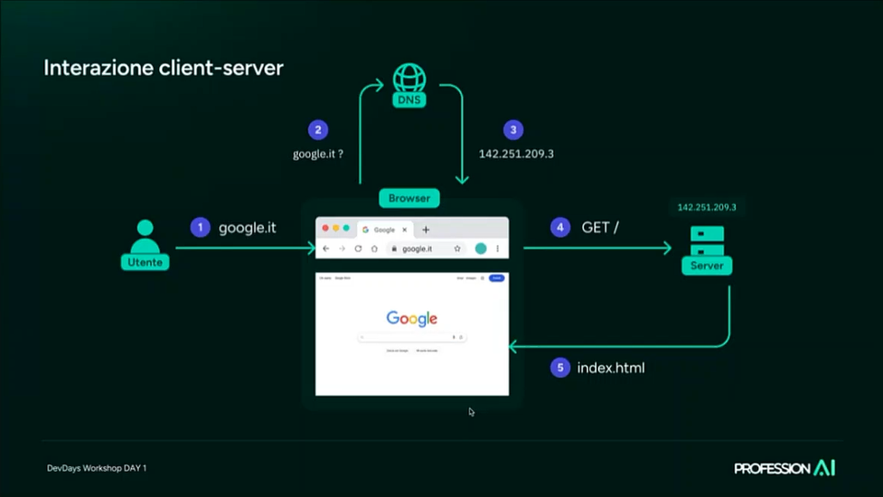

<!-- 
COLORI:
- ROSSO: #DF5452;
- GRIGIO: #252525;
- BLU: #379AD3;
- VERDE: #529E72;
- GIALLO: #FDDC5C.
-->

  

# HTML  

## Indice  

- [Introduzione](#introduzione)
- [Bibliografia](#bibliografia)
<br>

## Introduzione  

L'<abbr title="HyperText Markup Language" style="font-weight:bold;">HTML</abbr>, sviluppato nel 1991 da Tim Berners-Lee, è il linguaggio di markup più usato per la realizzazione di pagine web. Un file HTML utilizza dei **tag** (marcatori) per dire al browser come è strutturato; al loro interno vi sono gli **elementi** da mostrare, che possono anche essere ulteriori tag annidati. Il codice HTML viene quindi interpretato per generare la pagina visualizzabile dall'utente.

<summary style="margin-bottom:0.5em;">Cosa c'è dietro una pagina web?</summary>  
<div style="border: 1px solid #aaa; border-radius: 0 0 4px 4px; padding: 1em; margin-top: -1px;">  
  
Quando si digita un <abbr title ="Uniform Resource Locator">URL</abbr> si attivano una serie di processi che permetto di visualizzare la pagina desiderata.  


L'Internet è una serie di dispositivi elettronici interconnessi attraverso un indirizzo <abbr title="Internet Protocol">IP</abbr> univoco per ogni dispositivo connesso alla rete. Solo chi è connesso è in grado di condividere informazioni e uno dei modi in cui è possibile farlo è attraverso il <abbr title="World Wide Web">WWW</abbr>, un insieme di pagine web e documenti collegati fra loro attraverso collegamenti ipertestuali (link).  

Il '**web**' è uno dei servizi che utilizzano che utilizzano l'infrastruttura internet, altri servizi includono email e messaggistica istantanea.  

<u>Per navigare nel WWW</u>, gli utenti utilizzano un browser web (come Chrome, Firefox, Safari), che agisce da <b>client</b> web, ovvero un software che invia richieste ai <b>server</b> web (come Apache o nginx) e interpreta i linguaggi web, visualizzando le pagine ricevute.  

  
  
Il protocollo di comunicazione principale per scambiare documenti è <abbr title="HyperText Transfer Protocol">HTTP</abbr> o <abbr title="versione sicura di HTTP con crittografia SSL/TLS">HTTPS</abbr>; definiscono come devono essere formattati e trasmessi i messaggi.  

Il <abb title="Domain Name System">DNS</abbr> traduce i nomi di dominio (es. `www.google.com`) in indirizzi IP numerici, necessari per identificare univocamente i server su Internet (possiamo considerla come una rubrica). <u>Quando un utente inserisce un URL nel browser</u>, il browser contatta un server DNS per ottenere l'indirizzo IP corrispondente. Questo processo, chiamato **risoluzione DNS**, permette di connettersi al sito richiesto senza dover memorizzare indirizzi numerici complessi. Se l'indirizzo IP è già stato memorizzato nella cache locale, il browser lo utilizza direttamente, accelerando il caricamento della pagina.  

<dt><b>Origini di Internet</b>:</dt>
<dd>
    Ripercorrendo la storia di Internet, l'idea nacque negli Stati Uniti, anni Cinquata, durante la Guerra Fredda, quando si resero conto che sarebbe stato comodo avere un sistema di comunicazione che non potesse essere colpito da un attacco nucleare sovietico.<br>
    Nel 1958, il presidente Eisenhower istituì la <abbr title="Defense Advanced Research Projects Agency">DARPA</abbr>, con l'obiettivo di sviluppare una rete di computer decentralizzata chiamata <b>ARPANET</b>. Nel 1969, Leonard Kleinrock riuscì a inviare il primo messaggio tra due computer situati presso l'Università della California (UCLA) e l'Università di Stanford, segnando l'inizio della comunicazione tra computer distanti.
</dd>
<dt><b>Sviluppo dei protocolli</b>:</dt>
<dd>
    Nel 1974, gli informatici Bob Kahn e Vint Cerf introdussero il <b>protocollo TCP/IP</b>, che suddivide i dati in pacchetti per una trasmissione efficiente e sicura, diventando la base della comunicazione su Internet.
</dd>
<dt><b>Nascita del World Wide Web</b>:</dt>
<dd>
    Nel 1991, al CERN di Ginevra, Tim Berners-Lee sviluppò il <b>World Wide Web</b>, introducendo strumenti fondamentali come <b>HTML</b>, <b>HTTP</b> e gli <b>URL</b>. Il 6 agosto 1991, il CERN pubblicò il primo sito web della storia, rendendo accessibili informazioni a livello globale.
</dd>
<dt><b>Diffusione in Italia</b>:</dt>
<dd>
    Il 30 aprile 1986, l'Italia si collegò per la prima volta ad ARPANET, segnando l'inizio dell'era di Internet nel paese.
</dd>  
</div></details>  

## Struttura di documenti HTML

HTML5 ha introdotto nuovi elementi semantici, come <code>&lt;header&gt;</code>, <code>&lt;nav&gt;</code>, <code>&lt;main&gt;</code>, <code>&lt;article&gt;</code> e <code>&lt;footer&gt;</code>, che aiutano a strutturare il contenuto in modo più significativo. Inoltre, HTML5 supporta nuove funzionalità come la geolocalizzazione, il supporto per video e audio nativi, e l'API Canvas per la grafica 2D.

Come standard, si nomina `index.html` la pagina principale di ogni sito perché i server web lo cercano automaticamente nella cartella principale, permettendo agli utenti di accedere al sito senza dover digitare il <abbr title="(es. https://www.miosito.com/ invece di https://www.miosito.com/index.html)">nome del file</abbr>. Questo rende quindi gli URL più puliti e migliora l'esperienza utente.  

Google ha introdotto delle best practices per la scrittura di file HTML5, mirate a promuovere un codice pulito, ben strutturato e semanticamente corretto.  

- `<!DOCTYPE>`: ogni file HTML inizia con questa dichiarazione, che indica al browser la versione dell'HTML da utilizzare. Questa dichiarazione è fondamentale affinchè il documento venga interpretato correttamente.  
- `<html lang="it">`: tag che rappresenterà la radice della nostra pagina. L'attributo `lang` specifica la lingua del documento, per miglirare l'accessibilità.  
- `<head>`: fornisce info sul documento e deve contenere almeno `<meta charset="UTF-8">`, che definisce la codifica dei caratteri e con `<UTF-8>` si supportano anche simboli e lettere accentate.  
- `<body>`: contiene il contenuto visibile.  

**TODO ChatGPT**  
```html  
<body> - Contenuto principale
    <header> → Contiene elementi introduttivi come il logo e il menu di navigazione.
    <nav> → Insieme di collegamenti per la navigazione del sito.
    <main> → Contenuto principale della pagina (usato per migliorare accessibilità e SEO).
    <section> → Raggruppa contenuti correlati all'interno della pagina.
    <article> → Contenuto indipendente, come un post di blog o un articolo di giornale.
    <footer> → Include informazioni di chiusura, come copyright o link ai social.  
```  

📌 Perché seguire lo standard di Google?  
✔ Migliora il SEO → L’uso corretto dei tag semantici aiuta i motori di ricerca a interpretare il contenuto.  
✔ Ottimizza la performance → Il caricamento asincrono di JavaScript (defer) e la gestione del viewport migliorano la velocità.  
✔ Accessibilità migliorata → I tag semantici (`<main>`, `<nav>`, `<header>`) aiutano gli screen reader e utenti con disabilità.  
✔ Manutenibilità → Un codice più pulito e ben organizzato facilita le modifiche future.  

Se vuoi approfondire un aspetto specifico, dimmelo! 🚀  

**Dunque, ecco un esempio di pagina conforme agli standard di Google.**  
```html  
<!DOCTYPE html>
<html lang="it">
<head>
    <meta charset="UTF-8">
    <meta name="viewport" content="width=device-width, initial-scale=1.0">
    <title>Titolo della pagina</title>
    <link rel="stylesheet" href="styles.css">
    <script defer src="script.js"></script>
</head>
<body>
  <header>
    <h1>Intestazione principale</h1>
    <nav>
      <ul>
        <li><a href="#">Home</a></li>
        <li><a href="#">Chi siamo</a></li>
        <li><a href="#">Contatti</a></li>
      </ul>
    </nav>
  </header>
  <main>
      <section>
        <h2>Sottotitolo</h2>
        <p>Testo del contenuto.</p>
      </section>
      <article>
        <h2>Articolo</h2>
        <p>Testo dell’articolo.</p>
      </article>
  </main>
  <footer>
    <p>&copy; 2025 Nome Sito</p>
  </footer>
</body>
</html>
```  

I tag importanti sono:

- (<code>&lt;HTML&gt;&lt;/HTML&gt;</code>): container per tutti gli altri elementi e definisce la radice dell'albero del documento.  
- (<code>&lt;HEAD&gt;&lt;/HEAD&gt;</code>): container per metadata.  
- (<code>&lt;TITLE&gt;&lt;/TITLE&gt;</code>): definisce il titolo (solo testo) per un documento ed è visibile nel titolo del browser o nella page's tab.  
- (<code>&lt;BODY&gt;&lt;/BODY&gt;</code>): contiene il contenuto visibile della pagina.  
- HEADING (<code>&lt;H1&gt;</code> to <code>&lt;H6&gt;</code>).  
- LINE BREAK (<code>&lt;br&gt;</code>): aggiunge una linea di spazio fra un paragrafo e l'altro.  
- (<code>&lt;center&gt;&lt;/center&gt;</code>).  

Ogni tag può avere <b>attributi</b>, che forniscono informazioni aggiuntive sugli elementi. Gli attributi sono definiti nei tag di apertura e seguono la sintassi <code>chiave="valore"</code>. Se il valore contiene gli apici doppi si usano i singoli, e viceversa.  

- `class`: ...  
- `id`: ...  
- `title`: specifica informazioni extra sull'argomento.  
  <pre><code>&lt;abbr title="HyperText Markup Language"&gt;HTML&lt;/abbr&gt;</code></pre>  
lang

<!-- Questo è un commento in HTML. Toglierlo e parlarne mettendo un qualsiasi codice e scriverci vicino: -->
<!-- Commento -->

## TODO

Converrebbe in futuro realizzare il mio sito web in modo da renderlo più inclusivo e accessibile, rispettando quindi l’AGID e dando la possibilità di far scegliere all’utente le dimensioni degli elementi a schermo (come il testo), il contrasto e i colori a schermo (per le persone con un handicap visivo), la possibilità di scegliere se avere uno schermo bianco o nero, rendere evidenti i link (magari sottolineandoli) e poi la possibilità di caratteri ata-leggibili.

> Chiedere a ChatGPT come migliorerebbe questa pagina e perché farebbe queste modifiche seguendo lo standard dettato da Google  
> Ricontrollare le estensioni di vscode e riscriverle su Notion.  
> Su ChatGPT ho esplorato come mettere la modalità notte e impedire la copia-screen del testo sulla mia pagina. Dovrò esplorare meglio l'argomento.  
> Capire come funzione sto sito: https://www.codegrind.it/documentazione.  
> La linea orizzonale in HTMl si fa con il tag "`<hr>`".  

---

## Bibliografia  

- Programmazione Web, Pierpaolo **Loreti**, 2024-2025.
<details style="background-color:gray; padding:10px; border-radius:5px; border: 1px solid #aaa; border-radius:4px; color:black;">
<summary style="cursor:pointer; font-weight:bold;">Testi e siti di riferimento</summary>

<div style="display:flex; align-items:flex-start; gap:20px;">
  
  <p style="font-size: 0.75rem;"><a href="https://amzn.eu/d/7e6HZ2H"><i>The Definitive Guide to HTML5</i></a> - Adam Freeman</p>
</div>
<div style="display:flex; align-items:flex-start; gap:20px;">
  
  <p style="font-size: 0.75rem;"><a href="https://amzn.eu/d/cbg9eA1"><i>Javascript - The Definitive Guide 6th Edition</a></i> - David Flanagan</p>
</div>
<div style="display:flex; align-items:flex-start; gap:20px;">
    
    <p style="font-size: 0.75rem;"><a href="https://learningwebdesign.com/"><i>Learning Web Design - A Beginner's Guide to HTML, CSS, JavaScript, and Web Graphics</i></a></p>
</div>
<div style="display:flex; align-items:flex-start; gap:20px;">
  
  <p style="font-size: 0.75rem;"><a href="https://womengovtcollegevisakha.ac.in/departments/Learning%20PHP,%20MySQL,%20JavaScript,%20CSS%20&%20HTML5_%20A%20Step-by-Step%20Guide%20to%20Creating%20Dynamic%20Websites%20(%20PDFDrive%20).pdf"><i>Learning PHP, MySQL, JavaScript, CSS & HTML5</i></a> - Robin Nixon</p>
</div>
<div style="display:flex; align-items:flex-start; gap:20px;">
  
  <p style="font-size: 0.75rem;"><a href="https://amzn.eu/d/adcmSWw"><i>Full-Stack Web Development with Vue.js and Node</i></a> - Aneeta Sharma</p>
</div>
<p>
  HTML CSS:
  <ul>
  <li><a href="https://www.w3schools.com/html/default.asp">w3schools</a></li>
  <li>https://developer.mozilla.org/en-US/docs/Learn/HTML</li>
  <li>https://www.w3schools.com/css/default.asp</li>
  <li>https://www.w3.org/standards/techs/html#w3c_all</li>
  </ul>
  Javascript
  <ul>
  <li><a href="https://www.w3schools.com/js/default.asp">w3schools</a></li>
  <li><a href="https://javascript.info/">javascript.info</a></li>
  </ul>
  MongoDB
  <ul>
  <li>https://www.javatpoint.com/mongodb-tutorial</li>
  Node JS
  <li>https://nodejs.org/en/docs/guides/</li>
  </ul>
</p>
</details>

Per lavorare come Web Developer consigliano di imparare:
- HTML
- CSS
- JavaScript
Framework:
- Bootstrap
- React js
- Tailwind css
Design:
- Figma
- Adobe XD
- Photoshop
Backend:
- Node js
- MangoDB
- Express js
Extra:
- Git
- Github
- Gsap js